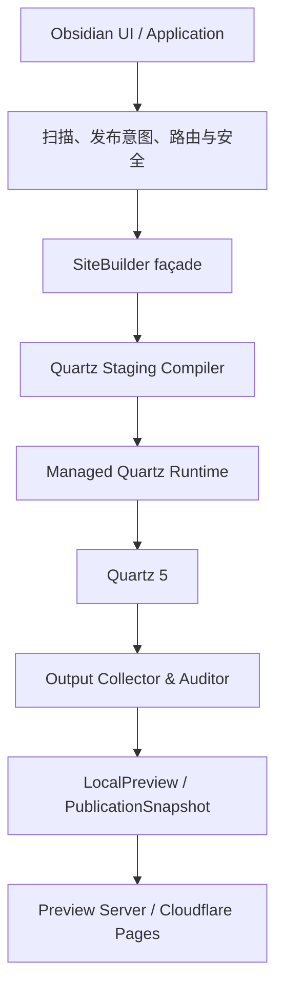

# Pages Publish Quartz 5 改造规格

> 文档状态：实现完成 / Quartz HAT 已准备 / 候选发布人工验收待执行
>
> 适用产品：Pages Publish Obsidian Community Plugin
>
> 目标引擎：Quartz 5（实现时锁定精确版本、源码归档和依赖锁文件）
>
> 目标平台：macOS Obsidian 桌面端
>
> 更新日期：2026-08-03

## 1. 文档目的与效力

本规格定义 Pages Publish 从当前自研 Markdown/HTML/主题渲染实现迁移到 Quartz 5 的架构边界、运行时安装、输入隔离、配置映射、输出契约、安全约束、迁移步骤和验收标准。

本规格是 [`PRODUCT-SPEC.md`](./PRODUCT-SPEC.md) 的增量改造规格：

- 若两者在站点构建器、站点主题或 Node/发布引擎分发方式上冲突，以本规格为准。
- 发布意图、可见性、路由、资源安全、发布快照、Cloudflare 原子部署和失败恢复仍以 `PRODUCT-SPEC.md` 为准。
- [`DESIGN.md`](./DESIGN.md) 继续约束 Obsidian 插件界面；放弃的是当前生成站点的自研主题，不是插件 UI 对 Obsidian 主题的继承。
- [`TASK.md`](./TASK.md) 中 S07 的自研默认站点主题验收由本规格中的 Quartz 站点验收替代；S09 的引擎来源、安装、校验和回退未决项由本规格收敛。

## 2. 已确认决策

以下决策已经确认，不作为实现阶段的开放问题重新讨论：

1. Quartz 5 完整接管站点渲染，包括 HTML、CSS、布局、页面组件、搜索、图谱、目录页、标签页和前端资源。
2. 放弃当前自研站点主题及其视觉兼容，不要求 Quartz 输出与现有站点像素一致。
3. 主题渲染器以上的产品架构和行为契约不变。
4. Node.js 最低兼容主版本升级为 22。
5. Quartz 和生产依赖不打进 Obsidian 三文件插件包；首次需要预览或发布时，在用户机器的隔离目录中动态安装。
6. 动态安装必须使用固定 Quartz 版本、固定源码归档、固定 lockfile 和完整性校验，不允许安装 `latest` 或无锁依赖。
7. `.publish/site.yml` 仍是唯一用户站点配置源；Quartz 配置由插件生成，不成为第二份用户配置。
8. Quartz 不得直接读取 Vault。它只能读取由现有扫描、安全和路由层生成的不可变 staging 输入。
9. 现有 URL、可见性和隐私契约保持不变；不得因 Quartz 默认 slug、过滤器或插件行为发生静默变化。

## 3. 目标与非目标

### 3.1 目标

- 用 Quartz 5 替换当前 `markdown-it` 页面渲染、手写 HTML、手写站点 CSS、搜索页和图谱页生成。
- 保持上层发布流程、领域模型、失败语义和 Cloudflare 部署边界稳定。
- 保持 public、unlisted、private 的现有安全语义。
- 保持当前 Route Planner 生成的 canonical URL、栏目、系统页和 redirects 契约。
- 保持预览与正式发布使用同一 Quartz 构建链路。
- 保持 Obsidian 插件安装包轻量，不携带 Quartz 源码、`node_modules` 或 Node runtime。
- 让 Quartz/Node 环境可观察、可修复、可升级、可回滚且不修改系统工具链。
- 让相同站点输入、配置和引擎版本生成可审计、可重复的输出。

### 3.2 非目标

- 不保留当前生成站点的 CSS、DOM、视觉截图或像素级兼容。
- 不把 Vault 变成 Quartz 工程，不在 Vault 中创建 `quartz.config.yaml`、`quartz.layout.ts`、`package.json`、`node_modules` 或 Git 仓库。
- 不允许用户直接编辑生成的 Quartz 配置。
- 不在本次改造中开放主题市场、任意第三方 Quartz 插件或自定义 TypeScript 配置。
- 不改变插件 UI、发布中心信息架构、Cloudflare 授权或远端部署模型。
- 不改变现有 URL 作为默认迁移策略。
- 不用 Quartz 的 private/draft 过滤器替代 Pages Publish 的内容选择和隐私边界。
- 不在每次预览或构建前重复安装 npm 依赖。

## 4. 不可变的上层架构

### 4.1 必须保持的职责

| 上层能力 | 迁移后职责 | 是否允许由 Quartz 接管 |
| --- | --- | --- |
| `site.yml` 读取、校验与原子写入 | 继续作为唯一站点配置来源 | 否 |
| 内容扫描与稳定 digest | 决定当前候选、问题和构建一致性 | 否 |
| `publication.*` 元数据 | 决定发布意图和有效值 | 否 |
| public/unlisted/private | 决定输入成员、发现性和下线 | 否 |
| Route Planner | 决定 canonical URL、栏目、系统页、redirects 和冲突 | 否 |
| 笔记引用与嵌入安全 | 处理 private、范围外、缺失、歧义、循环和预算 | 否 |
| 本地资源安全 | 决定唯一允许进入构建的资源字节 | 否 |
| 发布中心与确认 | 决定下一版成员和用户确认 | 否 |
| 发布快照 | 冻结构建结果和文章清单 | 否 |
| 发布编排 | 保持准备、构建与检查、上传、激活四阶段 | 否 |
| Cloudflare Direct Upload | 上传完整静态站点并原子激活 | 否 |
| 部署事实与恢复收据 | 只在远端成功后更新，可重放恢复 | 否 |

### 4.2 兼容 façade

迁移期间允许重构站点构建器内部，但上层继续通过现有 façade 获取 `LocalPreview`，并继续通过 `createPublicationSnapshot` 形成 `PublicationSnapshot`。

以下行为必须保持：

- `prepareLocalPreviewFromDirectory(vaultRoot, options)` 的调用方不需要知道 Quartz 的工作目录、配置、CLI 或 npm 安装细节。
- `Application` 仍执行扫描、Blocker 门禁、构建、构建后 digest 复核和快照保存。
- `PublicationSnapshot` 仍向发布适配器提供完整文件、资源、文章清单和输出计数。
- `PublicationOrchestrator` 的四阶段和失败语义不变。
- Cloudflare adapter 不依赖 Quartz 类型或模块。

允许在 façade 以下引入新的内部边界：

```ts
interface SiteBuilder {
  build(input: ImmutableSiteBuildInput): Promise<BuiltSite>;
}

interface QuartzRuntime {
  ensureReady(): Promise<ReadyQuartzRuntime>;
  build(request: QuartzBuildRequest): Promise<QuartzBuildResult>;
}
```

这些接口是站点构建器内部实现细节，不得向应用层、发布编排器或 Cloudflare adapter 泄漏 Quartz 类型。

### 4.3 依赖方向



上层模块不得直接 import Quartz、Quartz community plugin 或其 AST/slug 类型。

## 5. 目标构建流程

每次预览或正式构建按以下顺序执行：

1. 上层完成 `site.yml`、内容、元数据、依赖、资源和路由扫描。
2. 存在 Blocker 时不启动 Quartz。
3. 从已扫描输入生成不可变 `ImmutableSiteBuildInput`。
4. 环境管理器确认 Node 22 和目标 Quartz 引擎已可用。
5. Staging Compiler 在 Vault 外创建唯一临时目录。
6. 只写入允许发布的 Markdown、允许发布的资源和生成的 Quartz 配置。
7. Quartz 在隔离子进程中从 staging 构建到唯一输出目录。
8. Output Collector 读取并规范化完整 Quartz 输出。
9. Output Auditor 验证路径、路由、可见性、私密负向规则、远程资源策略和输出预算。
10. 本地预览返回 `LocalPreview`；正式发布转换为既有 `PublicationSnapshot`。
11. 上层复核扫描 digest；源内容变化时丢弃结果并要求重试。
12. 临时 staging 和未采用输出按维护策略清理；已验证引擎缓存保留。

Quartz 子进程不得在构建过程中读取 staging 和引擎目录以外的 Vault 内容。

## 6. Node 22 与 Quartz 动态安装

### 6.1 运行时选择

1. 兼容 Node 版本修改为 `>=22.0.0`，实现可进一步锁定受测试的主/次版本范围。
2. 若 Obsidian 内嵌 Node 满足范围，优先复用。
3. 若内嵌 Node 不满足范围，使用插件受管理的 Node 22 runtime。
4. 不探测、修改或写入系统全局 npm、PATH、Node 安装或全局 package prefix。
5. 平台身份至少区分 `darwin-arm64` 和 `darwin-x64`，以支持 Quartz 原生依赖。

### 6.2 引擎清单

插件构建中必须内置一个小型、不可变的 engine manifest，至少包含：

```ts
interface QuartzEngineManifest {
  engineVersion: string;
  quartzVersion: string;
  sourceUrl: string;
  sourceSha256: string;
  lockfileSha256: string;
  nodeRange: string;
  npmVersionRange: string;
  platform: "darwin-arm64" | "darwin-x64";
  signature?: string;
  signingKeyId?: string;
}
```

不得从 `latest`、默认 branch、未固定 Git ref 或运行时解析的宽泛 semver 范围选择生产引擎。

### 6.3 安装位置与隔离

- Quartz 源码、`node_modules`、npm cache、构建缓存和日志存放在 Vault 外的 macOS Application Support/Cache 范围。
- 安装目录按引擎版本和平台分层，不覆盖当前已验证版本。
- 临时下载和安装目录使用随机唯一名称；只有全部校验和 smoke 成功后才原子切换为 active。
- Vault、`.publish`、Obsidian 插件目录和系统全局目录不得出现 `node_modules`。
- npm 子进程使用受控 working directory、受控 executable、最小环境变量和非全局安装参数。

### 6.4 首次安装流程

1. 用户首次触发预览或发布时调用 `ensureReady()`。
2. 已存在精确版本且完整性记录有效时直接复用，不访问网络。
3. 下载固定 Quartz source archive 和随版本固定的 lockfile/manifest。
4. 在解包前验证下载大小上限、SHA-256 和可用签名。
5. 拒绝绝对路径、`..`、符号链接、设备文件和越界归档成员。
6. 在隔离临时目录执行固定 npm 版本和固定 lockfile 的 `npm ci --include=dev`。Quartz v5 CLI 每次构建直接使用上游列在 `devDependencies` 中的 `esbuild`，因此不可使用 `--omit=dev`；这些依赖只进入 Vault 外的引擎缓存，不进入插件发布包。
7. `npm ci` 必须使用 lockfile；lockfile 不匹配或 registry 完整性失败即安装失败。
8. 安装过程不得写全局 package，不执行 `npx ...@latest`，不动态添加 Quartz community plugin。
9. 执行引擎 smoke：版本、CLI 入口、最小离线构建和输出读取。
10. 写入已验证环境记录，并原子激活新版本。
11. 保留最后一个已验证可用版本；新版本失败不得破坏旧版本。

安装网络失败、校验失败或 npm 失败只影响本地预览/发布可用性，不得修改站点配置、发布意图、线上部署或当前已验证引擎。

### 6.5 构建时网络策略

- npm 网络只允许发生在用户可见的环境准备、修复或更新阶段。
- Quartz 安装完成后，普通扫描、预览和构建必须可在断网状态完成。
- 构建阶段禁止插件安装、字体下载、Tweet oEmbed、远程图片代理和隐式外链检查。
- Quartz 更新不与站点发布隐式串联；更新失败继续使用旧的已验证版本。

### 6.6 插件包体积

Obsidian 发布包继续只包含：

- `main.js`
- `manifest.json`
- `styles.css`

Quartz 源码、Node runtime、`node_modules`、npm cache 和构建输出不得进入插件发布 staging。engine manifest 和公钥等小型元数据应编译进 `main.js` 或使用现有三文件范围内的形式。

## 7. Quartz staging 安全边界

### 7.1 总原则

Quartz 只能看到 staging。即使 Quartz 默认过滤器、Assets emitter 或第三方插件行为发生变化，也不能获得未被 Pages Publish 上层明确选择的数据。

### 7.2 staging 内容

每个 staging 目录只允许包含：

- public 和 unlisted 文章的安全化 Markdown。
- 已通过现有资源策略且被下一版文章引用的资源副本。
- 插件生成的 Quartz 配置、layout override 和受控内部插件。
- Route Planner 生成的不可变 route manifest。
- 构建所需且已随引擎验证的本地静态资源。

禁止包含：

- private、范围外、缺失、不可读或未选择文章的文件、路径、标题、Frontmatter 或正文。
- 完整 Vault 文件索引。
- 原始 `.obsidian` 配置或其他 Vault 元数据。
- `publication.deployment`、deployment ID、receipt、Cloudflare credential 或本地绝对路径。
- 未经资源白名单选择的图片、PDF、音频、视频或任意非 Markdown 文件。
- 符号链接、硬链接到 Vault 内容、socket、device 或其他特殊文件。

### 7.3 Frontmatter 映射

不得原样复制文章 Frontmatter。Staging Compiler 按白名单生成 Quartz frontmatter：

| Pages Publish 有效值 | Quartz staging 字段 | 规则 |
| --- | --- | --- |
| `publication.visibility = public` | 无 `unlisted` 标记 | 页面可发现 |
| `publication.visibility = unlisted` | `unlisted: true` | 页面可直链但不可发现，并生成 `noindex` |
| `publication.visibility = private` | 无文件 | 任何形式都不得进入 staging |
| `publication.title` / 回退标题 | `title` | 使用已解析有效值 |
| `publication.summary` / 安全摘要 | `description` | 使用安全渲染后的文本，不复制原始 HTML |
| `publication.tags` | `tags` | 使用规范化后的有效值 |
| `publication.date` | `date` | 只使用冻结值 |
| `publication.updated` | `modified` | 只使用冻结值 |
| `publication.cover` | `cover` | 只指向已进入 staging 的允许资源 |
| `publication.redirects` | route manifest | 由现有 Route Planner 决定，不直接信任 Quartz alias 规范化 |
| 规划后的 canonical URL | route manifest | Quartz Route Bridge 必须服从 |

所有系统维护字段和未列入白名单的 Frontmatter 都不得进入 Quartz 输入。

### 7.4 正文转换

在写入 staging 前继续执行现有上层安全语义：

- raw HTML 按现有策略移除或转义，并保留可定位 Warning。
- 指向 private、范围外、缺失或歧义笔记的 Wiki 链接降级为作者显示文本。
- private 嵌入不得展开，且不得泄露目标路径、标题或正文。
- public → unlisted 普通链接可以保留，但 public 页的可搜索文本、图谱和站点发现数据不得吸收 unlisted 内容。
- 嵌入循环、深度、扇出和源字符预算保持现有上限。
- Obsidian comments 按现有策略移除。
- Mermaid 源在进入 Quartz 前通过现有危险 directive、规模和协议检查；Quartz 可以负责最终显示，但不能绕过上层检查。
- 外部 HTTP(S) 链接保持外链；普通构建不下载、不代理、不探测。

## 8. 生成的 Quartz 配置

### 8.1 配置所有权

- `.publish/site.yml` 是唯一用户配置。
- 每次构建由插件把 `site.yml` 和冻结域状态编译成 Quartz 配置。
- 生成配置写入 Vault 外的 staging/workspace，不回写 Vault。
- 用户不能通过放置自己的 `quartz.config.yaml`、layout 或插件源码绕过产品安全策略。

### 8.2 首版启用能力

Quartz 首版至少负责：

- Content Page、Folder Page、Tag Page 和 404。
- Quartz 页面 layout、样式、响应式和暗色模式。
- Obsidian Flavored Markdown 中经本规格允许的语法。
- GFM、代码高亮、Callout、受控 Mermaid。
- Explorer、Backlinks、Table of Contents。
- `features.search` 控制的 Quartz Search。
- `features.graph` 控制的 Quartz Graph。
- public-only sitemap。
- unlisted 过滤。
- 受 Route Planner 控制的 redirect 输出。

### 8.3 必须覆盖的 Quartz 默认值

生成配置必须显式：

- `analytics: null`。
- 禁止构建时或运行时远程字体请求；使用系统字体或随已验证引擎安装的本地字体。
- 关闭 Comments。
- 关闭 Tweet embed、YouTube embed、video embed 和 Obsidian URI 增强。
- 关闭 Encrypted Pages；它不能替代本产品的 private 语义。
- 首版关闭不属于现有契约的 OG image、Canvas、Bases、RSS、Stacked Pages 等输出，除非后续规格明确开放。
- 禁止构建时自动安装、发现或更新 community plugin。
- 只加载引擎 lockfile 中已经固定且通过审计的 plugin。

### 8.4 主题

- 不迁移 `default-theme.ts` 的 CSS、DOM 或视觉 token。
- Quartz 默认主题和 layout 是新站点视觉基线。
- 首版不向 `site.yml` 新增主题字段。
- 后续如开放主题，只允许选择产品批准、版本固定的 Quartz theme/plugin；不得允许任意 GitHub 地址或代码执行。
- 旧自研站点主题截图和视觉 HAT 不再作为发布门槛，必须为 Quartz 新基线重新执行视觉验收。

## 9. 路由与页面契约

### 9.1 Route Planner 继续权威

Quartz 的默认 slugification、文件夹页、alias 或 permalink 行为不得覆盖现有规划结果。

Quartz Route Bridge 必须消费 route manifest，并满足：

- 中文和 Unicode URL 保持现有 NFC canonical 形式。
- 大小写敏感行为保持现有契约。
- 显式 slug 中被现有规划器允许的空格不得被静默改为连字符。
- canonical 页面继续使用尾斜杠目录语义。
- `_index.md` 与 `index.md` 的现有优先级保持不变；只把规划器选中的 winner 写入 staging。
- 系统页继续占用 `/`、`/404/`、`/privacy/`、`/sitemap.xml`，以及启用时的 `/search/`、`/graph/`。
- Redirect Planner 已压平并验证的 redirect 才能生成；Quartz 不重新解释原始 redirect Frontmatter。
- 任一实际输出 route 与 route manifest 不一致时，构建产生 Blocker，不得上传。

若 Quartz 公共 plugin hook 无法表达上述契约，允许维护一个最小、版本锁定的内部 Quartz patch/adapter；不允许以改变现有 URL 作为静默降级方案。

### 9.2 Quartz 页面能力适配

- `/search/` 和 `/graph/` 的现有系统路由必须保留，可由受控 Quartz Page Type 或兼容 emitter 实现。
- `/privacy/` 和 `/404/` 使用 Quartz layout，但路径和 HTTP 语义保持现有契约。
- `site.home_layout = sections/latest` 继续有效，由 Quartz home Page Type 映射实现。
- `publication.order` 继续影响首页和栏目列表排序。
- 自动栏目页包含现有契约规定的后代文章，并排除 unlisted/private。

## 10. 可见性与发现性

| 行为 | public | unlisted | private |
| --- | --- | --- | --- |
| 进入 staging | 是 | 是 | 否 |
| 生成 HTML | 是 | 是 | 否 |
| 可直链访问 | 是 | 是 | 否 |
| `noindex` | 否 | 是 | 不适用 |
| 首页/栏目/Explorer | 是 | 否 | 否 |
| Search | 是 | 否 | 否 |
| Graph | 是 | 否 | 否 |
| Sitemap | 是 | 否 | 否 |
| Backlinks/Tag listing 的发现入口 | 是 | 否 | 否 |

输出审计必须对最终文件树而非仅对 Quartz 内部索引执行 private/unlisted 负向检查。

## 11. Quartz 输出收集与审计

### 11.1 Output Collector

Output Collector 递归读取 Quartz 输出目录并转换为现有构建产物：

- HTML、CSS、JavaScript、JSON、XML、文本和 manifest 可作为文本文件进入 `LocalPreview.files`。
- 图片、字体、图标和其他二进制文件进入 `LocalPreview.assets`。
- 读取时拒绝符号链接、路径逃逸、重复规范路径、特殊文件和超出预算的文件。
- MIME 至少覆盖 Quartz 可能生成的 HTML、CSS、JS、JSON、XML、SVG、PNG、JPEG、GIF、WebP、ICO、Web Manifest、WOFF、WOFF2 和 source map。
- Cloudflare upload path 仍以 `/` 开始，且不得包含反斜杠、NUL 或 `..` segment。

### 11.2 Output Auditor

正式发布前必须验证：

1. route manifest 中所有页面、系统页和 redirects 都存在且唯一。
2. 不存在 Quartz 额外生成且与产品契约冲突的页面。
3. canonical URL、redirect 目标和站内链接符合规划结果。
4. public 页面、搜索、图谱、sitemap、导航和客户端 JSON 不包含 unlisted/private 发现数据。
5. 完整输出不包含 private/范围外目标的标题、路径、正文、标签、关系或资源。
6. 输出不包含未批准的 analytics、comment、remote font、Tweet/YouTube embed 或外部脚本。
7. 输出文件数、单文件大小和总字节数满足现有 Cloudflare 与本地预算。
8. HTML 中不存在由源 Markdown 注入的可执行 raw HTML。
9. 生成文件不包含 Vault 绝对路径、staging 路径、凭据或 deployment receipt。

审计失败是 Blocker，不能通过 Warning 或强制发布绕过。

### 11.3 本地预览

- Preview Server 继续只服务收集后的构建产物，不服务 staging、引擎目录或 Vault。
- URL 解析必须匹配 Cloudflare Pages 的目录式路径和 404 行为。
- Content-Type 来自 Output Collector 的可信映射，始终发送 `X-Content-Type-Options: nosniff`。
- 单篇预览和整站预览都使用同一个 Quartz build adapter；不得保留第二套自研页面渲染器。

## 12. 确定性、并发与生命周期

### 12.1 确定性

相同 `ImmutableSiteBuildInput`、引擎版本和平台必须产生等价站点语义。实现至少要控制：

- Quartz、community plugin、Node、npm 和 lockfile 的精确版本。
- 由 `site.yml` 固化的 locale/timezone。
- 文章日期只来自冻结有效元数据，不回退到 staging filesystem mtime、当前 Git 状态或构建时间。
- 构建阶段不访问网络。
- 生成配置和 route manifest 使用稳定排序。
- 不把随机 staging 路径、临时绝对路径或不稳定 build ID 写入最终产物。

若 Quartz 生成的纯内容 hash 文件名发生变化，只要输入相同则必须稳定；升级引擎允许发生受审阅的输出变化。

### 12.2 并发

- 同一 Vault 的活跃站点构建保持串行或 latest-wins，旧结果不得覆盖新扫描状态。
- 同一引擎版本的并发 `ensureReady()` 合并为一个安装操作。
- 显式 Repair 在活跃 Prepare/Install 后排队，不与其并发写同一目录。
- 不同版本安装使用不同临时目录；active 指针只在验证成功后切换。
- 发布上传开始后继续遵循既有不可取消事务和恢复收据语义。

### 12.3 取消与清理

- 扫描、staging 和 Quartz 构建在上传前可响应取消。
- 取消时终止 Quartz 子进程并删除未采用 staging/output。
- 插件卸载时停止 preview server 和活跃本地子进程，但不得破坏已验证 runtime。
- 构建缓存可由现有维护入口安全删除并自动重建。
- active 和上一已验证引擎不得被普通保留策略同时删除。

## 13. 错误模型与可观察性

至少定义以下稳定错误码：

| 错误码 | 严重性 | 用户影响 |
| --- | --- | --- |
| `node-runtime-incompatible` | 环境失败 | 不能预览/发布，可准备受管理 Node 22 |
| `quartz-engine-unavailable` | 环境失败 | 需要首次安装或修复 |
| `quartz-engine-download-failed` | 环境失败 | 保留旧版本；可重试 |
| `quartz-engine-integrity-failed` | 环境失败 | 拒绝安装；不能绕过 |
| `quartz-engine-install-failed` | 环境失败 | 清理临时安装；保留旧版本 |
| `quartz-engine-smoke-failed` | 环境失败 | 不激活新版本 |
| `quartz-build-failed` | 构建 Blocker | 不上传；提供脱敏日志入口 |
| `quartz-output-invalid` | 构建 Blocker | 输出不满足文件/路径/MIME 契约 |
| `quartz-route-mismatch` | 构建 Blocker | 实际 URL 与 Route Planner 不一致 |
| `quartz-discovery-leak` | 安全 Blocker | unlisted/private 进入发现产物 |
| `quartz-private-leak` | 安全 Blocker | 输出包含不允许公开的数据 |
| `quartz-unexpected-network` | 安全 Blocker | 构建尝试未授权网络请求 |

日志可记录阶段、耗时、退出码、引擎版本、Node 版本、文件数量和脱敏相对位置；不得记录 npm credential、Authorization header、Vault 绝对路径、文章正文或 private 标题/路径。

## 14. 代码改造范围

### 14.1 预期保留

- `src/config/site-config.ts`
- `src/publication/article-metadata.ts`
- `src/content/site-scanner.ts`
- `src/routing/route-planner.ts`
- `src/content/note-references.ts`
- `src/content/local-assets.ts`
- `src/publication/publish-center.ts`
- `src/publication/publish-orchestrator.ts`
- `src/publication/deployment-facts.ts`
- `src/cloudflare/pages-deployment.ts`
- 上述模块的领域测试与安全回归

允许为新 adapter 扩充类型或注入边界，但不得把 Quartz 逻辑反向写入这些领域模块。

### 14.2 预期替换或拆分

- `src/core/preview.ts`：保留 façade，移除手写站点渲染，委托 `SiteBuilder`。
- `src/site/default-theme.ts`：Quartz 切换完成后删除。
- 当前手写 `renderDocument`、首页、栏目、搜索、图谱、404、隐私页和 redirect renderer：删除。
- 当前 MarkdownIt 页面渲染规则：安全扫描/转换所需部分上移为 staging policy，其余由 Quartz 替代。
- `src/site/discovery.ts`：由 Quartz discovery 输出和 Output Auditor 替代，或仅保留上层预期投影用于审计。
- `src/preview/server.ts`：扩充 Quartz 输出的 MIME 和 pretty-URL 解析，但保持生命周期接口。
- `src/plugin/bundled-environment.ts`：替换为真实 `ManagedQuartzEnvironment`。
- `src/main.ts`：只调整 composition root 接线，不改变上层应用流程。

### 14.3 建议新增

```text
src/site-builder/site-builder.ts
src/site-builder/immutable-build-input.ts
src/site-builder/quartz/quartz-site-builder.ts
src/site-builder/quartz/quartz-staging.ts
src/site-builder/quartz/quartz-config.ts
src/site-builder/quartz/quartz-route-manifest.ts
src/site-builder/quartz/quartz-process.ts
src/site-builder/quartz/quartz-output-collector.ts
src/site-builder/quartz/quartz-output-auditor.ts
src/runtime/managed-quartz-environment.ts
src/runtime/npm-installer.ts
```

文件名可以按实现调整，但职责和依赖方向必须保持。

## 15. 迁移顺序

### M1 — 固化边界与特征测试

- 为 `LocalPreview`、`PublicationSnapshot`、Route Plan、visibility matrix 和 Cloudflare 输入建立行为特征测试。
- 抽出 `SiteBuilder`，让现有 renderer 先实现该接口。
- 不改变用户可见输出。

### M2 — Node 22 与动态 Quartz 环境

- 升级 Node compatibility。
- 增加平台架构识别。
- 实现固定 manifest、下载、校验、`npm ci`、smoke、原子激活和回退。
- 保持插件三文件发布包。

### M3 — Immutable Staging Compiler

- 生成白名单 Frontmatter、安全正文、允许资源和 route manifest。
- 建立 private/unlisted/asset/raw HTML 负向 fixture。
- 证明 Quartz 无法看到 Vault 其他文件。

### M4 — Quartz Builder

- 生成受控 Quartz config/layout。
- 接入 Quartz 页面、主题、搜索、图谱和目录能力。
- 禁止默认 analytics、远程字体和外部 embed。

### M5 — 路由桥接与输出收集

- 让 Quartz 输出严格服从现有 Route Planner。
- 支持现有系统页、redirects、canonical 和目录式 URL。
- 扩充 preview server、MIME 和 Cloudflare output collection。

### M6 — 安全与发现性等价

- 对最终 Quartz 输出执行 public/unlisted/private、链接、嵌入、资源和原始 HTML 矩阵。
- 验证 Search、Graph、Explorer、Backlinks、Tag、Sitemap 不发现 unlisted/private。
- 验证普通构建断网可完成。

### M7 — 切换与删除旧 renderer

- 开发期间允许用内部 feature flag 双构建对比。
- Quartz 通过全部门禁后成为唯一 renderer。
- 删除 `default-theme.ts`、手写 HTML/CSS、手写搜索/图谱和旧 renderer feature flag。
- 不长期保留用户可选的“旧主题模式”。

### M8 — HAT 与候选发布

- 在干净 Obsidian/Vault 完成首次安装、环境修复、预览、首次发布、更新、下线和失败恢复。
- 重建 Quartz 站点视觉基线，不复用旧主题截图。
- 记录安装体积、首次安装耗时、离线构建耗时、360 篇 Vault 构建和内存数据。

## 16. 验收标准

### AC-QZ-01 上层架构稳定

- `Application`、发布中心、发布编排器和 Cloudflare adapter 不直接依赖 Quartz 类型。
- prepare → build/check → upload → activate 的阶段、失败和 receipt 语义保持现有测试通过。
- `LocalPreview` 与 `PublicationSnapshot` 的上层消费者不需要 Quartz 专用分支。

### AC-QZ-02 轻量安装包

- `npm run package` 仍只产生 `main.js`、`manifest.json`、`styles.css`。
- 插件包不包含 Quartz source、Node runtime、`node_modules` 或构建缓存。

### AC-QZ-03 Node 22

- Node 22 环境可完成安装、smoke、预览和正式构建。
- Node 20 被明确判定不兼容，并能进入受管理 Node 22 准备流程。
- arm64/x64 原生依赖不会复用错误平台缓存。

### AC-QZ-04 动态安装与回退

- 干净环境首次使用可在 UI 可观察状态下完成固定 Quartz 安装。
- checksum、签名、lockfile、npm 或 smoke 任一步失败都不激活新版本。
- 安装成功后断网可重复构建。
- 更新失败继续使用上一已验证版本。
- Repair 不修改系统 Node、npm、PATH 或全局包。

### AC-QZ-05 Vault 隔离

- Quartz 进程输入只包含 staging 和受控引擎目录。
- 在 Vault 放置未引用图片、PDF、私密 Markdown、恶意 symlink 和敏感 canary 后，最终输出中均不存在相应内容或路径。
- staging 和构建产物不包含完整 Vault 索引或绝对路径。

### AC-QZ-06 路由等价

- 现有中文、Unicode、空格、大小写、多个 public root、`_index.md`、`index.md`、系统页和 redirect fixture 的输出 route 与现有 Route Planner 完全一致。
- Quartz 默认 slugification 不得造成 URL 变化。
- 所有 route mismatch 都在上传前阻塞。

### AC-QZ-07 可见性等价

- public 正常生成并进入允许的发现入口。
- unlisted 可直链、带 `noindex`，不进入首页、栏目、Search、Graph、Explorer、Backlinks、Tag listing 和 Sitemap。
- private 不生成文件，也不进入任何 HTML、JSON、XML、JS、CSS、source map 或资源。
- public → unlisted embed 不得把 unlisted 正文带入 public 搜索或图谱数据。

### AC-QZ-08 内容安全

- raw HTML、script、event handler、危险 SVG、危险 Mermaid directive 和不允许的 embed 不能成为可执行输出。
- private、缺失、范围外和歧义 Wiki target 保持现有安全降级。
- 构建阶段未发生未经授权的网络请求。

### AC-QZ-09 Quartz 完整接管渲染

- 最终页面 DOM、CSS、布局、暗色模式、Explorer、Backlinks、TOC、Search 和 Graph 来自 Quartz。
- 最终产物不再引用 `/assets/default-theme.css`。
- 生产代码中不再保留旧手写页面 renderer 或旧主题切换入口。

### AC-QZ-10 预览与发布同源

- 同一冻结输入的本地预览和发布构建使用相同 Quartz engine、配置、staging compiler 和 output auditor。
- Preview Server 正确服务 Quartz 文本和二进制资源、目录式 URL、HEAD 和 404。
- 发布期间 Vault 编辑不会污染已确认构建；digest 不一致时丢弃并重试。

### AC-QZ-11 Cloudflare 兼容

- Quartz 全部输出可转换为现有 Direct Upload 输入。
- MIME、路径、单文件大小、文件数和 batch 限制在上传前验证。
- 上传或激活失败保持旧站点和部署事实不变。

### AC-QZ-12 工程门禁

- `npm test`
- `npm run typecheck`
- `npm run lint`
- `npm run build`
- `git diff --check`
- 生产依赖 audit 在可用官方 registry 上无未处置 high/critical finding。
- Quartz engine lockfile、source archive 和运行时安装单独产生可审计 SBOM/依赖清单。

### 16.1 实现与验收证据矩阵

| AC | 自动化实现证据 | 当前结论 | 候选发布前仍需人工确认 |
| --- | --- | --- | --- |
| AC-QZ-01 | `QuartzSiteBuilder` 保持 `SiteBuilder`/`LocalPreview` façade；架构边界测试锁定 Application、core、publication、Cloudflare 无 Quartz import；快照/receipt/恢复测试全量通过 | 自动门禁通过 | 真实首发、失败恢复旅程 |
| AC-QZ-02 | `release-package` 与 clean-Vault install smoke；实际 release staging 严格三文件 | 通过 | Obsidian GUI 干净安装 |
| AC-QZ-03 | 固定 Node 22.23.1 arm64/x64 manifest、Node 20 拒绝、真实 Node 22 + Quartz install/smoke/build | 通过 | 在候选 Obsidian 内确认 embedded/managed 两条实际路径 |
| AC-QZ-04 | 固定 archive/lock SHA、受控 `npm ci`、原子激活、离线 cache hit、fallback、Repair、磁盘预算、阶段通知、取消与缓存保留测试 | 自动门禁通过 | UI 首装/取消/失败/Repair 的可理解性与真实网络切换 |
| AC-QZ-05 | staging 负向 fixture、symlink/archive 防护、macOS sandbox Vault canary、output canary 审计 | 通过 | 干净 Vault 放置真实 canary 后复验 |
| AC-QZ-06 | Unicode、中文、空格、大小写、case collision、多个 root、index/custom index、redirect、`home_layout`、`publication.order`、扁平 HTML 相对引用与动态 Tag 尾斜杠的 Route Bridge/真实 build 测试 | 通过 | 线上 redirect 响应 |
| AC-QZ-07 | public/unlisted/private staging 与最终 HTML/JSON/XML/binary 负向检查；受控 canonical/noindex；真实 content index/sitemap/navigation smoke；同前缀 public/unlisted route 回归测试 | 通过 | 浏览器 Search/Graph/Explorer/Backlinks/Tag/Sitemap 人工抽查 |
| AC-QZ-08 | raw HTML、事件属性、危险资源、Obsidian comment、Mermaid、Wiki/embed 降级、远程运行时 URL、临时绝对路径与缺失站内目标审计；Quartz build 网络 sandbox | 通过 | 浏览器执行面与网络面板抽查 |
| AC-QZ-09 | 生产旧 renderer/theme 已删除；真实 Quartz DOM/CSS/静态资源构建；旧主题仅在 tests/support 保留 | 自动门禁通过 | Quartz 新视觉基线、暗色、窄屏、200% 与键盘 |
| AC-QZ-10 | 预览/发布共用注入的 `SiteBuilder`；digest 前后复核、冻结快照、二进制/MIME/HEAD/404 测试；构建取消和 shutdown drain | 通过 | Obsidian 中编辑源文件时的预览/发布旅程 |
| AC-QZ-11 | Direct Upload MIME/路径/大小/文件数/40 MiB/2,000 文件 batch、upload/activate 失败与部署事实测试 | 自动门禁通过 | 隔离 Cloudflare 项目的首发、更新、激活失败与下线 |
| AC-QZ-12 | 全量测试、typecheck、lint、build、package、diff-check、插件生产 audit；真实 engine 依赖清单与安全处置复核 | 通过 | engine 升级时重新审计；完成 HAT 后作候选发布决策 |

自动证据不能替代人工 HAT。尤其 AC-QZ-04、09、11 中明确列出的 UI、视觉和真实 Cloudflare 场景，在 [`hats/20260803-quartz-migration/guide.md`](./hats/20260803-quartz-migration/guide.md) 完成并留证前不得声称候选发布验收通过。

## 17. 测试策略

### 17.1 Characterization

迁移前冻结以下现有契约，不冻结旧站点视觉：

- Route Planner 输出。
- public/unlisted/private 矩阵。
- Wiki link/embed 降级。
- 资源选择与路径安全。
- canonical、redirect、404、search、graph、sitemap 的 URL 和发现性。
- `LocalPreview`、`PublicationSnapshot` 和 Cloudflare upload 输入。

### 17.2 Runtime installer

使用可控 HTTP/npm 边界覆盖：

- 首次安装、缓存命中、断点失败、离线、hash/signature 失败。
- lockfile 漂移、registry integrity 失败、安装脚本失败、smoke 失败。
- 同版本并发、不同版本更新、Repair 排队、原子切换和旧版本回退。
- 恶意 archive 路径、symlink、超大文件和平台不匹配。

### 17.3 Quartz integration

至少覆盖：

- 空站点、单篇、多内容根、Unicode/空格/大小写 route。
- public、unlisted、private 及互相链接/嵌入矩阵。
- `sections/latest`、order/date、custom index、generated folder page。
- Callout、GFM、代码块、受控 Mermaid、Obsidian comment。
- raw HTML、SVG、脚本、外部 embed 和 canary 泄漏 fixture。
- Search、Graph、Explorer、Backlinks、Tag、Sitemap 的最终产物负向检查。
- 300 public + 30 unlisted + 30 private 的现有大 Vault smoke。

### 17.4 HAT

HAT 至少包含：

- 干净三文件插件安装。
- 首次 Quartz npm 安装的进度、取消、失败、重试和磁盘占用。
- 兼容 Node 22 与受管理 Node 22 两条路径。
- 安装后断网预览和构建。
- Quartz 浅色、深色、窄屏、200% 缩放和键盘可用性。
- 首次发布、更新、URL redirect、unlisted、private 下线。
- Quartz build、Cloudflare upload、activate 和本地事实回写的失败恢复。
- 插件升级、Quartz 更新失败回退、Repair、卸载和重装。

## 18. 发布与回滚策略

- 开发和验证阶段允许保留旧 renderer，仅用于自动化双构建和问题定位，不作为用户设置。
- Quartz 尚未通过 AC-QZ-01 至 AC-QZ-12 前，不替换生产默认 renderer。
- Quartz 通过全部门禁并完成 HAT 后，删除旧 renderer 和旧站点主题。
- 发布后的引擎回滚单位是“固定 Quartz engine 版本”，不是回退到旧自研 renderer。
- 插件升级不得自动删除上一已验证引擎；新引擎安装或 smoke 失败继续使用旧引擎。
- 若新插件代码与旧引擎不兼容，必须在发布前声明兼容矩阵，不能在运行时猜测。

## 19. 已固化的实现参数

1. Quartz 固定为 `5.0.0`、commit `74b3fc9efd0caafea3dbcd846ddf1f06855b6d2a`，source archive SHA-256 为 `69380b2e3acf3590ad144304e4e97be621562b1ab14512c2537ad348d707c3aa`，上游 lockfile SHA-256 为 `bca1aff728d3257b8ca6989f9a4d9913836ab1f1a034505d3e3c481b3dab3e05`。
2. v1 的 trust origin 是随三文件插件发布、编译进 `main.js` 的不可变 manifest；运行时不下载或接受第二份 manifest。归档来自 GitHub 固定 commit URL，并按内置 SHA-256 校验。v1 不使用 detached signature；trust rotation 只能随经过现有插件发布链的新版本发生。
3. managed runtime 固定 npm `10.9.8`；兼容内嵌 runtime 要求 npm `>=10.9.2`。`npm ci` 只使用 `https://registry.npmjs.org/`、隔离 user/global npmrc 和隔离 cache，不继承用户 npm 配置。
4. managed Node 固定为 Node `22.23.1` 官方 `nodejs.org` 归档；darwin-arm64 SHA-256 为 `ef28d8fab2c0e4314522d4bb1b7173270aa3937e93b92cb7de79c112ac1fa953`，darwin-x64 为 `b8da981b8a0b1241b70249204916da76c63573ddf5814dbd2d1e41069105cb81`。内嵌 Node 支持范围为 `>=22.0.0`。
5. 共享 runtime/engine/cache 位于 `~/Library/Application Support/pages-publish/environment`；每个 Vault 的临时构建位于以 Vault 路径 SHA-256 标识的 `vault-state/<identity>/quartz`。arm64 实测 Node 约 187 MiB、裁剪后 engine 约 249 MiB、首次 npm cache 约 85 MiB。
6. Route Bridge 位于 Output Collector/Auditor 边界：使用稳定内部 staging slug 避免 Quartz 小写/空格归一化冲突；先按 Quartz 原始扁平 HTML 位置把相对 CSS/JS/Breadcrumb 解析为站内绝对路径，再恢复 Route Planner canonical 文件路径、尾斜杠和引用，并注入受控 canonical/unlisted noindex。Pinned compatibility patch 处理 Quartz workspace Sass 路径、动态 cache import、禁用 serve 依赖的懒加载，以及关闭 `@quartz-community/folder-page@0.1.0` 自带的重复日期列表；栏目成员和顺序由 Route Manifest 生成的 Markdown 列表控制，Quartz 仍负责页面布局与渲染，不改变产品 URL 规则。
7. 单次下载上限为 64 MiB；2026-08-03 三次首次完整安装复测为 58.24 秒、43.96 秒和 48.71 秒。自动重试次数为 0，失败后保留 active engine，由用户显式 Repair 重试。候选发布 HAT 门槛为 120 秒、总环境占用不超过 1.5 GiB、开始前至少 2 GiB 可用空间；实现会在安装前检查可用空间、激活前检查总预算，并通过稳定错误进入 UI failed/Repair 状态。UI 显示离散阶段，不承诺 `requestUrl` 无法可靠提供的字节级百分比。
8. 300 public + 30 unlisted + 30 private 的真实 Quartz 构建于 2026-08-03 最新复测为扫描 133 ms、构建 2.89 秒、heap 增量 29.0 MiB。候选门槛为构建不超过 10 秒、heap 增量不超过 256 MiB；最终门槛需在 HAT 指定机器复测。

供应链审计对上游 lockfile 报告的两个 high 已有运行时处置：未启用的 OG image/favicon 插件及 `sharp`/libvips 在 smoke 前从已安装 engine 删除；只服务 Quartz serve 模式的 `serve-handler` 改为懒加载并删除，其传递依赖 `brace-expansion` 不进入受控 build runtime。处置项和 advisory ID 写入 `.pages-publish-dependencies.json`，缓存复用也会验证这些包继续缺席。

## Source Manifest

### Sources

- 当前 Codex task 中用户于 2026-08-03 明确确认：放弃现有站点主题、完整接入 Quartz、主题渲染器上层架构不动、Node 可升级至 22、Quartz 使用用户机器上的动态 npm 安装以控制插件包体积。
- [`PRODUCT-SPEC.md`](./PRODUCT-SPEC.md)：产品原则、可见性、路由、安全、环境管理、站点构建器、预览和发布事务契约。
- [`DESIGN.md`](./DESIGN.md)：Obsidian 插件 UI 的主题、可访问性和交互约束；与生成站点主题区分。
- [`TASK.md`](./TASK.md)：S04–S09、S12–S17 的实现状态、测试证据和遗留风险，尤其是 S09 引擎来源/签名未决项与 S17 三文件包约束。
- [`src/core/preview.ts`](./src/core/preview.ts)：当前自研站点构建、手写页面和 `LocalPreview` façade。
- [`tests/support/legacy-default-theme.ts`](./tests/support/legacy-default-theme.ts)：只供迁移特征测试保留的旧主题基线；生产源码已删除。
- [`src/config/site-config.ts`](./src/config/site-config.ts)：`site.yml` v1 配置契约。
- [`src/routing/route-planner.ts`](./src/routing/route-planner.ts)：现有 canonical URL、栏目、系统页、redirect 和冲突契约。
- [`src/content/note-references.ts`](./src/content/note-references.ts)、[`src/content/local-assets.ts`](./src/content/local-assets.ts) 与 [`src/content/raw-html.ts`](./src/content/raw-html.ts)：必须保留的引用、资源和原始 HTML 安全语义。
- [`src/runtime/quartz-engine-store.ts`](./src/runtime/quartz-engine-store.ts)、[`src/runtime/quartz-compatibility-patch.ts`](./src/runtime/quartz-compatibility-patch.ts)、[`src/runtime/managed-node-runtime.ts`](./src/runtime/managed-node-runtime.ts) 与 [`src/plugin/quartz-publication-environment.ts`](./src/plugin/quartz-publication-environment.ts)：固定运行时、动态安装、版本锁定 compatibility patch、修复、回退与生产环境接线。
- [`src/site-builder/quartz-listing.ts`](./src/site-builder/quartz-listing.ts)、[`src/site-builder/quartz-staging-compiler.ts`](./src/site-builder/quartz-staging-compiler.ts) 与 [`src/site-builder/quartz-output-auditor.ts`](./src/site-builder/quartz-output-auditor.ts)：`home_layout`、栏目排序、自定义 index、发现性清洗与精确 route 审计契约。
- [`tests/quartz-architecture-boundary.test.ts`](./tests/quartz-architecture-boundary.test.ts)、[`tests/quartz-output-auditor.test.ts`](./tests/quartz-output-auditor.test.ts) 与 [`tests/quartz-site-builder-real.test.ts`](./tests/quartz-site-builder-real.test.ts)：上层依赖方向、输出安全/路由负向规则和真实 Quartz 最终产物证据。
- [`src/runtime/environment-disk-budget.ts`](./src/runtime/environment-disk-budget.ts) 与 [`src/runtime/quartz-environment-progress.ts`](./src/runtime/quartz-environment-progress.ts)：环境磁盘门槛、安装阶段与 UI 可观察性契约。
- [`src/publication/publish-center.ts`](./src/publication/publish-center.ts)、[`src/publication/publish-orchestrator.ts`](./src/publication/publish-orchestrator.ts) 与 [`src/application.ts`](./src/application.ts)：不可变快照和四阶段发布边界。
- [`src/cloudflare/pages-deployment.ts`](./src/cloudflare/pages-deployment.ts)：必须保持的 Cloudflare Direct Upload 输出与限制。
- [Quartz Configuration](https://quartz.jzhao.xyz/configuration)、[Private Pages](https://quartz.jzhao.xyz/features/private-pages)、[Folder and Tag Listings](https://quartz.jzhao.xyz/features/folder-and-tag-listings) 与 [ObsidianFlavoredMarkdown](https://quartz.jzhao.xyz/plugins/ObsidianFlavoredMarkdown)：Quartz 5 官方配置、过滤、页面和 Obsidian 语法依据。
- [Quartz v5 `package.json`](https://github.com/jackyzha0/quartz/blob/v5/package.json)、[默认配置](https://github.com/jackyzha0/quartz/blob/v5/quartz.config.default.yaml)、[Markdown parser](https://github.com/jackyzha0/quartz/blob/v5/quartz/processors/parse.ts) 与 [Assets emitter](https://github.com/jackyzha0/quartz/blob/v5/quartz/plugins/emitters/assets.ts)：Node 22、依赖、默认插件、raw HTML 管线和非 Markdown 资源输出依据。
- `/Users/ivan/.agents/docs/agents/workflows.md` 与 `/Users/ivan/.agents/docs/agents/handoff-policy.md`：持久化规格的工作流和 Source Manifest 要求。

### Produced artifacts

- [`QUARTZ-MIGRATION-SPEC.md`](./QUARTZ-MIGRATION-SPEC.md)：本改造规格。
- [`hats/20260803-quartz-migration/guide.md`](./hats/20260803-quartz-migration/guide.md) 与 [`prepare.sh`](./hats/20260803-quartz-migration/prepare.sh)：Quartz 专项 blank HAT 指南、三文件候选包和专用 Vault 准备入口。

### Key decisions

- Quartz 5 成为唯一站点 renderer，但不成为内容选择、隐私、路由或部署事实的权威。
- 现有生成站点主题被删除，不做视觉兼容；Obsidian 插件 UI 设计不变。
- 上层通过既有 `LocalPreview`/`PublicationSnapshot` 契约消费结果，Quartz 类型不向上泄漏。
- Quartz 永远只读取安全 staging，不直接读取 Vault。
- Node 最低升级至 22；Quartz 使用首次使用时的隔离、锁定、可校验 npm 安装。
- Obsidian 插件发布包继续保持三文件，不包含 Quartz 或 `node_modules`。
- `.publish/site.yml` 仍是唯一用户配置；Quartz 配置由插件生成。
- 现有 URL 和 public/unlisted/private 契约必须保持，Quartz 默认行为不能静默覆盖。

### Verification evidence

- 2026-08-03 对照当前仓库 `PRODUCT-SPEC.md`、`DESIGN.md`、`TASK.md`、本规格和核心实现完成逐项架构审计。
- `npm test`：67 个 test files 通过、4 个按真实环境变量跳过；612 tests 通过、5 个跳过。
- 使用固定 source archive 与 Node 22.23.1 执行 `tests/quartz-engine-store-real.test.ts`：真实 `npm ci`、安全裁剪、四项 compatibility patch、smoke、原子激活和断网缓存复用通过；最新复验耗时 48.71 秒，先前两次为 58.24 秒和 43.96 秒。
- 使用裁剪后的固定 engine 执行 `tests/quartz-real-smoke.test.ts`、`tests/quartz-site-builder-real.test.ts` 与 `tests/release-benchmark.test.ts`：真实构建、Vault sandbox、Unicode/空格/大小写/冲突 route、扁平 HTML 相对资源、动态 Tag Page、canonical/noindex、redirect、`sections/latest`、order/date、custom index、同前缀 unlisted/public route、确定性和 360 篇基准全部通过；最新基准为扫描 133 ms、构建 2.89 秒、heap 增量 29.0 MiB。
- `npm run typecheck`、`npm run lint`、`npm run package` 和 `git diff --check` 通过；release staging 只有 `main.js`、`manifest.json`、`styles.css` 三个文件。
- `npm audit --omit=dev --audit-level=high --registry=https://registry.npmjs.org/`：插件生产依赖 0 finding。Quartz lock 的两个 high 按本节安全裁剪策略处置并进入引擎依赖清单。
- `bash -n hats/20260803-quartz-migration/prepare.sh` 与 `prepare.sh prepare` 通过；HAT 状态为 `prepared`。本机没有 `shellcheck`；`hat-run` 自动报告与人工 GUI/Cloudflare 执行尚未开始。

### Open questions / risks

- 尚未执行本迁移候选的干净 Obsidian 安装、浅色/深色/窄屏/键盘、Cloudflare 首发/更新/失败恢复等人工 HAT；因此当前状态是实现完成、HAT 已准备，不是候选发布验收完成。
- 首次安装已提供 runtime 下载/安装、engine 下载/安装和 smoke 离散阶段，以及取消与 Repair。Obsidian `requestUrl` 不提供可靠的流式字节百分比，当前取消会立即停止受控安装链和后续落盘，但底层已发出的 HTTP 请求可能在宿主内部结束后才释放。
- Quartz v5 上游 lock 当前仍包含两个 high advisory；本实现通过受控配置、代码可达性裁剪、物理删除、smoke 和缓存复核处置。升级 engine 时必须重新审计，不能自动沿用处置结论。
- 1.5 GiB 磁盘门槛已成为自动安装门禁；10 秒/256 MiB 性能门槛仍需在 HAT 指定机器复测。
- 旧主题视觉验收已经失效，Quartz 新基线必须重新完成 HAT 后才能发布。
