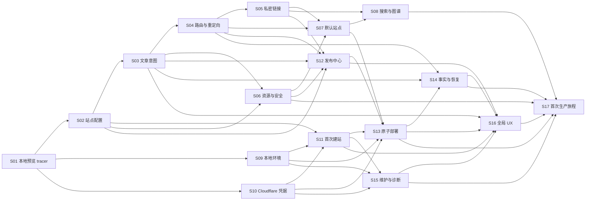

# Pages Publish 实现任务

> 状态：Ready for execution
>
> 组织方式：Tracer-bullet vertical slices
>
> 开发方式：每个 Slice 强制 TDD，并至少完成一轮独立 subagent review
>
> 更新日期：2026-08-01

## 1. 使用说明

本文件把 [`PRODUCT-SPEC.md`](./PRODUCT-SPEC.md) 拆成可以独立领取、实现、演示和验收的纵向 Slice。每个 Slice 都必须从用户可观察行为出发，贯穿所需的领域逻辑、边界适配、UI 和测试；不得把“先写所有底层、以后再接 UI”当成完成的 Slice。

状态约定：

- `[ ]` 未开始或未满足完成门禁。
- `[x]` 已完成，且 Slice Notes 中存在测试、review 与验收证据。
- `AFK`：实现与自动验证可以由 Agent 独立完成。
- `HITL`：Agent 可以完成实现，但指定的真实账号、视觉或人工验收需要用户参与。

执行约束：

1. 一个 Slice 使用一个独立分支/工作区和一个明确交付单元；默认分支前缀为 `codex/`。
2. 开始 Slice 前必须重读本文件、`PRODUCT-SPEC.md` 及其 Source Manifest 中与该 Slice 相关的原始来源。
3. 先实现一个最窄的端到端 tracer bullet，再逐个增加行为；禁止一次写完全部测试后再批量实现。
4. 测试通过公共接口验证行为，不测试私有方法或内部调用次数；只在 Cloudflare、Keychain、时间、文件系统等系统边界使用 fake/mock。
5. 每个 Slice 至少由一名未参与实现的 subagent 做一轮只读 review。reviewer 必须读取 Slice 目标、相关规格、实际 diff 和测试结果。
6. 所有 P0/P1 review 发现必须修复；P2 必须修复或记录明确处置理由。修复后重跑相关测试与回归测试。
7. 只有验收条件、TDD、subagent review 和证据记录全部完成后，才可勾选 Slice 总复选框。
8. Slice 若生成 PR、review 报告或 HAT 产物，必须重新读取工作流与交接策略，并保留 Source Manifest。

## 2. 全局 Definition of Done

以下清单适用于每个 Slice，不因 Slice 内重复的门禁而省略：

- [ ] 行为范围与公开接口在编码前明确，没有加入规格外能力。
- [ ] 第一个用户可观察行为先产生失败测试（RED），并记录失败命令/关键输出。
- [ ] 后续行为逐个执行 RED → GREEN，不进行横向批量测试/实现。
- [ ] 实现只满足当前失败测试，没有预先堆叠未来 Slice 能力。
- [ ] 所有测试为 GREEN 后才重构；每次重构后重跑相关测试。
- [ ] Slice 测试、受影响回归测试、类型检查和构建全部通过。
- [ ] 独立 subagent 完成至少一轮只读 review，记录 reviewer task/thread ID。
- [ ] P0/P1 finding 已清零，P2 finding 已修复或记录处置理由。
- [ ] AFK Slice 有自动验证证据；HITL Slice 同时记录待用户完成或已完成的人工步骤。
- [ ] 行为或决策变化已同步到产品/设计文档，且没有留下过期说明。
- [ ] Slice Notes 记录完成状态、验证命令、review 结论、未决风险和下一 Slice 入口。

## 3. Slice 总览

- [x] S01 — 插件壳与单篇本地预览 tracer bullet
- [x] S02 — 安全站点配置与内容范围
- [x] S03 — 文章发布意图与当前文章面板
- [x] S04 — URL、栏目索引与重定向
- [x] S05 — 私密安全的笔记链接与嵌入
- [x] S06 — 图片资源管线与内容安全
- [ ] S07 — 内置默认站点与核心 Markdown 体验
- [x] S08 — 搜索、知识图谱与可见性 SEO
- [ ] S09 — Node/发布引擎与预览生命周期
- [ ] S10 — Cloudflare OAuth、Token 与 SecretStorage
- [ ] S11 — 首次建站、项目绑定与域名
- [x] S12 — 发布中心、变化审阅与不可变快照
- [ ] S13 — Cloudflare 完整构建与原子部署
- [ ] S14 — 部署事实、下线与失败协调恢复
- [ ] S15 — 设置维护、日志与脱敏诊断
- [ ] S16 — 全局入口、反馈、响应式与可访问性
- [ ] S17 — 干净 Vault 到首次生产发布的候选版旅程

## 4. 依赖与执行波次



推荐执行波次：

| 波次 | 可并行 Slice | 说明 |
| --- | --- | --- |
| 0 | S01 | 建立唯一首条纵向链路 |
| 1 | S02、S09、S10 | 配置、环境与凭据边界可并行加深 |
| 2 | S03 | 完成文章发布意图与 Frontmatter 行为 |
| 3 | S04、S11 | 本地路由与远端首次建站可并行 |
| 4 | S05、S06、S15 | 链接、资源和维护能力可并行 |
| 5 | S07、S12 | 站点体验与发布审阅可并行 |
| 6 | S08、S13 | 搜索/图谱与首次真实部署可并行 |
| 7 | S14 | 完成跨本地/远端一致性与恢复 |
| 8 | S16 | 汇总全部领域状态到统一入口与反馈 |
| 9 | S17 | 运行干净 Vault 到首次生产发布的候选版旅程 |

## 5. Slice 详情

### S01 — 插件壳与单篇本地预览 tracer bullet

- Type：AFK
- Blocked by：None
- Covers：US-01、US-31、US-32；FR-1、FR-13、FR-16
- Outcome：用户可以安装开发版插件，从 Ribbon/命令进入 Pages Publish，并把真实 Test Vault 中一篇明确公开的 Markdown 通过最小完整链路渲染为本地预览。

#### Acceptance criteria

- [x] 建立可重复的安装、开发构建、类型检查和测试命令。
- [x] 插件加载/卸载不残留视图、命令或后台资源。
- [x] 未配置状态从 Ribbon 和命令面板进入首次设置空状态。
- [x] 一个真实 Test Vault 使用产品格式的最小 `site.yml` 和 public Markdown，即可从插件 UI 打开预览；不得依赖测试专用配置注入或 fixture 特判。
- [x] 核心领域逻辑不依赖 Obsidian 全局对象，可通过公开入口在测试中运行。
- [x] 预览明确标识为本地结果，且不会触发远端调用或 Frontmatter 写入。

#### TDD & review gate

- [x] TDD：为上方每条 Acceptance criterion 按顺序记录独立 RED → GREEN；当前 GREEN 后才开始下一条，最后在全绿状态重构。
- [x] TDD：先提交“未配置用户可进入设置”和“单篇可预览”的失败行为测试证据。
- [x] TDD：按一个测试一个最小实现推进，GREEN 后才整理宿主适配边界。
- [x] TDD：运行 Slice 测试、类型检查、插件构建和最小加载 smoke。
- [x] Review：独立 subagent 只读审查插件生命周期、核心/宿主边界、测试是否绑定实现细节。
- [x] Review：修复全部 P0/P1，记录 P2 处置并重跑验证。

#### Slice Notes

- [x] 记录分支/提交或 PR：分支 `codex/s01-local-preview`；S01 完成后创建本地提交，不创建远端 PR。
- [x] 记录 RED/GREEN/回归命令：逐行为 RED 证据包括缺失 preview/server/application/lifecycle/platform 模块、并发双端口、缺少本地标记、无效 schema 未拒绝和生命周期清理断言；最终 `npm test -- --run`（5 files / 8 tests）、`npm run lint`、`npm run build`、`npm audit --registry=https://registry.npmjs.org --omit=dev` 与 `npm pack --dry-run` 全部通过。
- [x] 记录 reviewer task/thread ID 与结论：独立 reviewer `/root/review_s01` 首轮发现 5 个 P1、1 个 P2；全部修复后复审为 `0 P0 / 0 P1 / 0 P2`，并独立重跑 8 tests、typecheck、lint 与生产构建。
- [x] 记录演示入口和遗留风险：Obsidian 1.13.4 隔离 Vault 中由 Ribbon/命令进入 `发布中心`，识别 `Smoke Wiki` 与 1 篇 public Markdown，浏览器预览显示“本地预览 · 尚未发布”；禁用插件后 Ribbon/View 消失，`127.0.0.1:60544` 立即拒绝连接。烟测 Vault 已移入废纸篓并从 Obsidian Vault 列表移除。S01 不包含远端部署、完整 schema 编辑 UI 或生产主题，这些由后续 Slice 交付。

### S02 — 安全站点配置与内容范围

- Type：AFK
- Blocked by：S01
- Covers：US-09、US-10、US-16、US-33、US-34；FR-2、FR-3、FR-4、FR-6；AC-2、AC-7
- Outcome：用户可以通过首次设置/设置页创建并安全编辑 `site.yml`，内容根与公开根的变化会经过校验、影响预览、原子保存和重新扫描。

#### Acceptance criteria

- [x] 支持 schema v1 的站点、首页布局、时区、内容根、资源排除、搜索/图谱和非密钥 Cloudflare 项目字段。
- [x] 拒绝重复/重叠内容根、冲突公开根、路径穿越和符号链接逃逸。
- [x] Vault 根选择显示强警告；内容根整体缺失产生防批量下线 Blocker。
- [x] 设置保存使用校验后的安全替换，失败时旧配置继续有效且用户输入不丢失。
- [x] 外部修改与未保存 UI 编辑冲突时禁止静默覆盖，并提供重载/比较入口。
- [x] 高于当前支持范围的 `site.yml` 版本可以只读展示，但必须阻止 UI 回写与发布。
- [x] 保存只重新扫描并刷新预览/状态，不自动发布。
- [x] 扫描覆盖插件加载、相关文件事件、配置保存、手动刷新、预览前和发布前触发；文件事件必须防抖并取消/丢弃过时任务。
- [x] 相同输入产生确定结果；扫描默认不联网、不写 Frontmatter，旧任务结果不得覆盖更新状态。

#### TDD & review gate

- [x] TDD：为上方每条 Acceptance criterion 按顺序记录独立 RED → GREEN；当前 GREEN 后才开始下一条，最后在全绿状态重构。
- [x] TDD：从“一个根映射一篇文章到公开路径”失败测试开始，再逐个加入冲突与故障行为。
- [x] TDD：文件系统只在边界替换；配置校验通过公开 load/validate/save 行为验证。
- [x] TDD：运行配置 fixture、原子写入故障、类型检查和 S01 回归。
- [x] Review：独立 subagent 只读审查 schema 契约、路径安全、冲突处理和配置/UI 双向一致性。
- [x] Review：修复全部 P0/P1，记录 P2 处置并重跑验证。

#### Slice Notes

- [x] 记录分支/提交或 PR：分支 `codex/s02-safe-site-config`；本地提交主题 `feat: add safe site configuration`，不创建远端 PR。
- [x] 记录 RED/GREEN/回归命令：按 schema、根映射、重叠/公开根冲突、穿越/symlink、缺失/不可读根、原子故障与晚到外部写入、dirty conflict/future readonly、全部扫描触发、防抖/取消/stale/dispose、确定性与无副作用逐项运行失败测试再最小实现；最终 `npm test -- --run`（10 files / 52 tests）、`npm run lint`、`npm run build`、`npm audit --registry=https://registry.npmjs.org --omit=dev` 与 `git diff --check` 全部通过。
- [x] 记录 reviewer task/thread ID 与结论：`/root/review_s02` 因服务流中断未形成结论；独立 reviewer `/root/review_s02_final` 首轮发现 5 个 P1、2 个 P2，连续复审补出 3 个及 1 个提交边界 P1；全部按 RED → GREEN 修复，最终复审为 `0 P0 / 0 P1 / 0 P2`。
- [x] 记录配置迁移/兼容风险：当前仅写 schema v1；高版本源文件保持原文只读并阻断回写/发布，不做隐式降级。原生 Setting Definitions API 将最低 Obsidian 版本提升到 1.13.0；文件系统 watcher 与 no-clobber 配置事务依赖首版限定的 macOS 本地文件系统。提交成功后的清理失败可能留下不影响权威 `site.yml` 的 `.previous-*`/`.tmp-*` 可恢复孤立文件，后续维护 Slice 负责诊断与清理。

### S03 — 文章发布意图与当前文章面板

- Type：AFK
- Blocked by：S01、S02
- Covers：US-11、US-12、US-17、US-18；FR-7、FR-8、FR-16；AC-3
- Outcome：用户可在当前文章上下文中查看有效发布属性及来源，编辑 public/unlisted/private 意图，并明确看到待发布状态与线上事实的区别。

#### Acceptance criteria

- [x] 读取 `publication` schema v1，并按 title/summary/date/tags 等回退规则展示有效值与来源。
- [x] 无显式可见性的新文章默认为 private；首次候选建议不自动写 Frontmatter。
- [x] 用户明确编辑可见性或覆盖字段时安全写入 Frontmatter，但不修改部署事实。
- [x] 已上线文章改为 private 前显示待下线确认。
- [x] 当前文章面板覆盖活动文件、固定文件、非 Markdown、范围外、配置错误和文件丢失状态。
- [x] 旧字段只读兼容并提供无损迁移预览；插件只写新 schema。

#### TDD & review gate

- [x] TDD：为上方每条 Acceptance criterion 按顺序记录独立 RED → GREEN；当前 GREEN 后才开始下一条，最后在全绿状态重构。
- [x] TDD：先验证“缺省 private”和“显式意图不等于线上事实”，再逐字段增加回退/覆盖测试。
- [x] TDD：通过文章元数据公开接口和临时 Vault 验证，不断言 YAML 库内部行为。
- [x] TDD：运行元数据 fixture、面板状态投影、类型检查和 S01–S02 回归。
- [x] Review：独立 subagent 只读审查 Frontmatter 数据安全、回退/覆盖边界与 UI 状态歧义。
- [x] Review：修复全部 P0/P1，记录 P2 处置并重跑验证。

#### Slice Notes

- [x] 记录分支/提交或 PR：分支 `codex/s03-publication-intent`；本地提交主题 `feat: add publication intent`，不创建远端 PR。
- [x] 记录 RED/GREEN/回归命令：依次为 schema/缺省 private/线上事实分离、逐字段回退与覆盖、显式提交与待下线确认、面板状态、旧字段迁移建立失败测试，再加入 CRLF/BOM、非 mapping Frontmatter、单字符串 tags、不可变 prepared intent、保存后扫描失败、异步 stale render、祖先 symlink 交换、Unicode/空格单篇预览及 Frontmatter 泄漏等审查回归；最终 `npm test -- --run`（13 files / 83 tests）、`npm run typecheck`、`npm run lint`（零告警）、`npm run build`、`npm audit --registry=https://registry.npmjs.org --omit=dev` 与 `git diff --check` 全部通过。
- [x] 记录 reviewer task/thread ID 与结论：独立 reviewer `/root/review_s03` 首轮发现 10 个 P1、4 个 P2，后续复审发现同 digest symlink 竞态、BOM/CRLF、Unicode/空格预览与 BOM Frontmatter 泄漏等问题；全部按 RED → GREEN 修复，最后一个未使用 import P2 也已移除并重跑零告警门禁，最终结论 `0 P0 / 0 P1 / 0 P2`。
- [x] 记录旧字段迁移决策：只识别顶层 boolean `publish`/`published`；冲突值阻断迁移。预览不写源文件，用户显式迁移时写入新 `publication.visibility`，保留旧字段以确保无损和可回退；插件后续只编辑新 schema。真实 Obsidian UI smoke 因“信任 Vault 作者并启用插件”属于运行未识别软件的确认门而未代用户点击，不计为自动验收；临时 Vault 已可恢复地移入 `/Users/ivan/.Trash/pages-publish-s03-smoke.Agcy9R`。

### S04 — URL、栏目索引与重定向

- Type：AFK
- Blocked by：S02、S03
- Covers：US-19、US-20；FR-9、FR-12；AC-4
- Outcome：文章与目录获得确定、唯一、支持 Unicode 的公开路由；用户修改已上线 URL 时可预见并保留正确重定向。

#### Acceptance criteria

- [x] URL 由公开根、相对目录和显式/派生 slug 确定生成。
- [x] 支持中文/Unicode，拒绝路径层级控制、穿越、查询和 fragment 字符。
- [x] 全站页面、系统页和重定向路由冲突产生可定位 Blocker。
- [x] `_index.md` 优先于 `index.md`；双文件时无额外 Warning，且不生成第二个目录索引页面。
- [x] UI 修改已上线 URL 时自动记录旧地址；重定向压平且循环/缺失目标被阻止。
- [x] 用户直接修改 slug 且无法可靠识别旧 URL 时产生 Warning，不自动猜测历史地址。
- [x] 当前文章面板和预览同时显示待发布 URL、线上 URL 与重定向结果。

#### TDD & review gate

- [x] TDD：为上方每条 Acceptance criterion 按顺序记录独立 RED → GREEN；当前 GREEN 后才开始下一条，最后在全绿状态重构。
- [x] TDD：先写单根/单文档路由失败测试，再逐个加入 Unicode、索引、冲突和重定向行为。
- [x] TDD：路由测试只依赖规划器公共结果，不快照内部中间对象。
- [x] TDD：运行路由性质/fixture 测试、预览集成、类型检查和上游回归。
- [x] Review：独立 subagent 只读审查 URL 规范化、路由安全、重定向循环和历史地址保留。
- [x] Review：修复全部 P0/P1，记录 P2 处置并重跑验证。

#### Slice Notes

- [x] 记录分支/提交或 PR：分支 `codex/s04-routing-redirects`；本地提交主题 `feat: add safe routing and redirects`，不创建远端 PR。
- [x] 记录 RED/GREEN/回归命令：从单根单文档 URL 开始，逐项为 Unicode/NFC、危险 slug/目录/public root、文章/栏目/系统页/重定向冲突定位、`_index.md` 优先级、unlisted 可访问但不发现、历史 redirect 压平/循环/缺失目标、直接 Frontmatter 改 slug Warning、面板/预览三类 URL 事实、全局单篇预览、public-root 影响确认与自动迁移、配置+多文章协调回滚及多类外部写入竞态建立公开 RED → GREEN；审查回归继续覆盖 redirect owner、无关坏 Frontmatter/缺失根容错、private issue 投影、unlisted index、canonical redirects、逐组/逐字段修复和 visibility/redirects 写前校验。最终 `npm test -- --run`（14 files / 138 tests）、`npm run typecheck`、`npm run lint`（零告警）、`npm run build`、`npm audit --registry=https://registry.npmjs.org --omit=dev`（0 vulnerabilities）与 `git diff --check` 全部通过。
- [x] 记录 reviewer task/thread ID 与结论：独立 reviewer `/root/review_s04` 多轮只读审查发现并推动修复 redirect/section owner 定位、配置与文章协调事务竞态、无关坏文件 fail-fast、unlisted index、canonical 持久化、route-aware slug/kind/redirects/visibility 编辑及旧 Blocker 增量修复等 P1；每项均按 RED → GREEN 修复。reviewer 独立重跑最终门禁，结论 `0 P0 / 0 P1 / 0 P2`。
- [x] 记录 URL 兼容风险：URL path 使用一次 percent decode 后的 NFC canonical 形式，Unicode 保持直写，尾斜杠统一，路由大小写敏感；残余 `%`、双重编码、路径层级控制、查询、fragment 与控制字符被拒绝。插件只对已知 deployment URL 自动建立历史地址；无法可靠推断的直接 Frontmatter 改动只告警。跨进程崩溃时配置+多文章迁移尚无耐久 journal/恢复收据，留给 S14；真实部署产物的 HTTP 永久重定向状态留给后续构建/部署 Slice 验证。

### S05 — 私密安全的笔记链接与嵌入

- Type：AFK
- Blocked by：S03、S04
- Covers：US-21、US-23、US-24；FR-8、FR-10、FR-12；AC-3
- Outcome：公开内容中的 Wiki 链接与 Markdown 嵌入按目标可见性安全解析，私密/范围外信息只保留作者写出的显示文本。

#### Acceptance criteria

- [x] 指向 public/unlisted 的内部链接生成正确线上 URL。
- [x] 指向 private、范围外或缺失文章的链接降级为不可点击显示文本。
- [x] 降级产物不包含目标路径、推导标题、URL、悬浮内容或反向链接。
- [x] private Markdown 嵌入降级为显示文本，不嵌入正文。
- [x] 缺失目标产生 Warning；普通循环链接允许，循环嵌入不会无限递归。
- [x] private 文章自身的内容问题降级为 dormant warning，不阻塞整站；被下一版内容依赖时重新按依赖规则判定。
- [x] 问题显示源文件、精确行号、影响和定位入口。

#### TDD & review gate

- [x] TDD：为上方每条 Acceptance criterion 按顺序记录独立 RED → GREEN；当前 GREEN 后才开始下一条，最后在全绿状态重构。
- [x] TDD：以 public → private 链接不泄露为首个失败安全测试，再展开组合矩阵。
- [x] TDD：使用完整渲染输出验证泄漏，不只检查内部依赖图标签。
- [x] TDD：运行链接/嵌入 fixture、私密信息负向搜索、类型检查和上游回归。
- [x] Review：独立 subagent 只读审查所有可见性组合、泄漏面与循环处理。
- [x] Review：修复全部 P0/P1，记录 P2 处置并重跑验证。

#### Slice Notes

- [x] 记录分支/提交或 PR：分支 `codex/s05-private-links`；本地提交主题 `feat: add private-safe note references`，不创建远端 PR。
- [x] 记录 RED/GREEN/回归命令：按 public→private 首个泄漏 RED 开始，逐项覆盖 public/unlisted URL、范围外/缺失/歧义降级、private embed、循环 link/embed、private dormant→unlisted active、精确行列与 UI 定位、Markdown code 语义、嵌套 Markdown label、同一行重复引用、6000 节点深链、300 扇出、正文顺序预算耗尽、超 1,000,000 源字符和 private root 预算 RED → GREEN。最终 `npm test -- --run`（15 files / 155 tests）、`npm run typecheck`、`npm run lint`（零告警）、`npm run build`、`git diff --check` 与 `npm audit --registry=https://registry.npmjs.org --omit=dev`（0 vulnerabilities）全部通过。
- [x] 记录 reviewer task/thread ID 与结论：独立 reviewer `/root/review_s05` 多轮只读审查发现并推动修复深链/指数扇出资源耗尽、扫描/渲染 code 语义差异、markdown-it silent 崩溃、扫描/预览字符预算差异、预算遍历顺序与实际渲染不一致、private root 缺 dormant 预算 Warning 等 6 个 P1；修复后独立重跑定向与全量门禁，最终结论 `0 P0 / 0 P1 / 0 P2`。
- [x] 记录隐私负向测试覆盖：最终渲染产物对 private/范围外/缺失目标路径、标题、URL 和正文做负向搜索；可见性、歧义、循环、code context 与嵌入资源预算均走同一 Markdown 解析规则。heading/block 引用在 S05 明确降级为作者显示文本并给出可定位 `unsupported-note-anchor` Warning，完整 fragment/block 支持交由 S07；共享预算为每根页面最大深度 32、最多 256 次展开及 1,000,000 个嵌入源字符。

### S06 — 图片资源管线与内容安全

- Type：AFK
- Blocked by：S02、S03
- Covers：US-22、US-23、US-24；FR-10、FR-11；AC-3
- Outcome：只有被下一版文章引用且安全的本地图片进入预览/构建；不安全资源与 HTML 在发布前得到确定处理。

#### Acceptance criteria

- [x] 支持 PNG、JPEG、WebP、GIF 与安全 SVG，并保持原文件内容/格式。
- [x] 缺失、被排除、不可读、Vault 外或不安全 SVG 图片产生不可忽略 Blocker。
- [x] 超过 5 MiB 的图片产生性能 Warning，但不阻塞。
- [x] 本地 PDF、音视频和其他附件降级为显示文本并产生 Warning，不进入产物。
- [x] 外部 HTTP(S) 资源保持外链且不被默认下载或探测。
- [x] 原始 HTML 与 SVG 内容经过安全策略，产物没有脚本、事件处理器或危险协议。
- [x] 外链默认只检查语法；用户主动运行外链检查时才访问网络，失败只产生临时 Warning。

#### TDD & review gate

- [x] TDD：为上方每条 Acceptance criterion 按顺序记录独立 RED → GREEN；当前 GREEN 后才开始下一条，最后在全绿状态重构。
- [x] TDD：以“只复制公开文章引用的一张图片”为 tracer test，再加入各类阻断/降级输入。
- [x] TDD：通过最终构建目录和报告验证行为，安全边界可使用恶意 fixture。
- [x] TDD：运行资源矩阵、安全 payload、私密信息负向搜索、类型检查和上游回归。
- [x] Review：独立 subagent 只读进行安全审查，重点检查路径逃逸、SVG/HTML 注入和资源泄漏。
- [x] Review：修复全部 P0/P1，记录 P2 处置并重跑验证。

#### Slice Notes

- [x] 记录分支/提交或 PR：分支 `codex/s06-safe-assets`；本地提交主题 `feat: add safe local asset pipeline`，不创建远端 PR。
- [x] 记录 RED/GREEN/回归命令：从“一篇公开文章只携带其一张本地图片”的 tracer RED 开始，逐项完成格式保持、路径/排除/不可读/缺失、5 MiB Warning、附件降级、外链默认零网络、HTML/SVG 策略与手动外链检查；review 后继续以真实/伪造/动画 WebP、DNS pinning/多地址/绝对截止时间、TOCTOU、资源预算和 Markdown 精确行列做 RED → GREEN。最终 `npm test`（17 files / 204 tests）、`npm run typecheck`、`npm run lint`（零告警）、`npm run build`、`git diff --check` 与官方 registry `npm audit --omit=dev`（0 vulnerabilities）全部通过。
- [x] 记录 reviewer task/thread ID 与结论：独立安全 reviewer `/root/review_s06` 多轮重放路径逃逸、资源耗尽、SSRF、注入与格式伪造；推动修复文件 TOCTOU/预算、DNS 到连接 IP pinning、重定向逐跳审计、IPv6 转换地址、Markdown 行列、完整 WebP 解码与取消、陈旧 WASM 供应链等问题。最终独立结论 `0 P0 / 0 P1 / 0 P2`，全量门禁重跑通过，reviewer 未修改文件。
- [x] 记录安全 fixture 与剩余攻击面：覆盖 `..`/绝对路径、symlink 与换 inode/size、超大/重复/海量引用、缺失和排除资源、伪 PNG/JPEG/GIF/WebP 头、静态 VP8/VP8L、标准动画 WebP、SVG script/event/style/xml:base/CSS escape/外部引用、原始 HTML、多种私网/映射 IPv6、DNS rebinding/redirect 与取消。生产 WebP 解码复用 Electron/Chromium 宿主异步解码器并保留像素/帧/总量上界；取消后后台单次宿主解码可能短暂收尾，但调用方立即退出并在结果到达时释放 bitmap。手动外链检查仍会按用户明确动作访问公网，但地址数、整条候选截止时间和跳转数均有上界。

### S07 — 内置默认站点与核心 Markdown 体验

- Type：HITL（默认站点视觉验收）
- Blocked by：S04、S05、S06
- Covers：US-25、US-31；FR-11、FR-13；AC-5、AC-8
- Outcome：完整 Vault 快照可以生成具有首页、栏目、文章、404 和隐私说明的可用默认站点，并可靠呈现首版支持的 Markdown。

#### Acceptance criteria

- [x] 内置主题生成首页、自动/自定义栏目页、文章页、404 和基础隐私说明。
- [x] 首页支持 `sections` 与 `latest`，栏目按 order/发布日期规则排序。
- [x] 支持 GFM 基础、表格、任务列表、代码块、Callout 和 Mermaid。
- [x] Mermaid 使用受控渲染与 URL 安全策略，不允许脚本或危险协议进入页面。
- [x] 不支持的 Obsidian 语法产生可定位 Warning，并可在预览中看到降级。
- [x] 站点在桌面与窄屏可读，中文、长标题、长代码和图片不破坏布局。
- [ ] 用户完成一次默认站点视觉验收并记录结论；未通过时不勾选 Slice。

#### TDD & review gate

- [x] TDD：为上方每条 Acceptance criterion 按顺序记录独立 RED → GREEN；当前 GREEN 后才开始下一条，最后在全绿状态重构。
- [x] TDD：先以一篇文章和一个自动栏目页的语义输出为失败测试，再逐个加入页面类型/语法。
- [x] TDD：断言可访问语义、路由和关键内容，不把整页像素快照作为唯一测试。
- [x] TDD：运行构建 fixture、HTML 语义检查、类型检查和上游回归。
- [x] Review：独立 subagent 只读审查站点信息架构、语法降级、可访问 HTML 和实现复杂度。
- [x] Review：修复全部 P0/P1，记录 P2 处置并重跑验证。

#### HITL & Slice Notes

- [x] 记录分支/提交或 PR：分支 `codex/s07-default-site`；等待用户视觉验收通过后创建 S07 本地提交，不创建远端 PR。
- [x] 记录 RED/GREEN/回归命令：依次从页面类型、custom section、`sections`/`latest` 与 order/date、GFM/Callout/Mermaid、安全 Mermaid、Obsidian 注释降级、响应式主题/CSS MIME 开始 RED → GREEN；review 后继续为跨块/未闭合注释、unlisted index、普通 Mermaid fallback、effective title/outline、真实 404、跨 block 反引号/转义、blockquote code、Markdown token.map 与 GFM table cell 隐私边界建立公开失败测试。最终 `npm test -- --run`（18 files / 215 tests）、`npm run typecheck`、`npm run lint`（零告警）、`npm run build`、`git diff --check` 与官方 registry `npm audit --omit=dev`（0 vulnerabilities）全部通过。
- [x] 记录 reviewer task/thread ID 与结论：独立 reviewer `/root/review_s07` 五轮只读审查先后发现 5、2、1、1 个 P1，推动修复跨块注释泄漏、unlisted 栏目发现性、Mermaid 降级漏报、文章 outline、404 状态，以及 Markdown block/table cell 词法边界；最终签字 `0 P0 / 0 P1 / 0 P2`，reviewer 未修改文件。
- [ ] 记录人工视觉验收设备、截图与结论：Agent 已在 Chromium 1280×900 桌面与 390×844 窄屏（实际 CSS viewport 375px）检查明暗模式、标题/导航/Callout/表格/任务列表/长代码/Mermaid/降级提示；均无页面级横向溢出或 console error，长代码独立横向滚动。截图：`/Users/ivan/.codex/visualizations/2026/07/31/019fb857-2600-7353-9f31-a9519017a003/s07-desktop-home-final.png`、`s07-mobile-article-final.png`、`s07-mobile-dark-final.png`。等待用户确认结论。

### S08 — 搜索、知识图谱与可见性 SEO

- Type：AFK
- Blocked by：S05、S07
- Covers：US-36；FR-8、FR-11；AC-3
- Outcome：默认站点为 public 内容提供搜索、知识图谱、导航和搜索引擎元数据，同时严格排除 unlisted/private 内容。

#### Acceptance criteria

- [x] public 内容进入全文搜索、知识图谱、导航和站点地图。
- [x] unlisted 页面可直链且带 `noindex`，不进入搜索、图谱、导航或站点地图。
- [x] private 内容不生成页面，也不进入任何客户端索引或构建元数据。
- [x] 搜索与图谱开关关闭后不生成对应入口和索引负载。
- [x] public 页面生成 canonical 与必要基础 metadata。
- [x] 构建测试对产物执行 private/unlisted 信息负向搜索。

#### TDD & review gate

- [x] TDD：为上方每条 Acceptance criterion 按顺序记录独立 RED → GREEN；当前 GREEN 后才开始下一条，最后在全绿状态重构。
- [x] TDD：先写三种可见性在搜索索引中的行为测试，再逐个增加图谱/SEO 输出。
- [x] TDD：通过用户可下载的最终产物验证，不能只检查构建器内存状态。
- [x] TDD：运行收录矩阵、负向泄漏、HTML metadata、类型检查和上游回归。
- [x] Review：独立 subagent 只读审查所有公开索引面、noindex 语义和客户端数据泄漏。
- [x] Review：修复全部 P0/P1，记录 P2 处置并重跑验证。

#### Slice Notes

- [x] 记录分支/提交或 PR：本地分支 `codex/s08-search-seo`；不创建远端 PR。
- [x] 记录 RED/GREEN/回归命令：先以缺失 `/search/index.html` 的失败测试建立 tracer；随后公开/未列出/私密矩阵、feature 关闭、custom-domain canonical 与 XML MIME 逐项 RED → GREEN。上游回归发现原始 summary 会进入 SEO description，改为安全渲染后恢复。独立审查又提出并以失败测试修复四项 P1：`/sitemap.xml` 文件路由冲突、public→unlisted embed 进入搜索、sitemap 遗漏可索引 canonical 页面、unlisted 根 `_index.md` 仍进入 sitemap。最终 `npm test -- --run`（19 files / 223 tests）、`npm run typecheck`、`npm run lint`、`npm run build`、`git diff --check` 与官方 registry `npm audit --omit=dev`（0 vulnerabilities）全部通过。
- [x] 记录 reviewer task/thread ID 与结论：独立 reviewer `/root/review_s08` 只读审查发现并复测上述 4 个 P1；修复后复审签字 `0 P0 / 0 P1 / 0 P2`，未修改文件。
- [x] 记录索引体积/隐私风险：搜索索引为可下载静态 HTML 中的 JSON，只包含 public 页的 title、URL 与经安全渲染且不展开嵌入的正文文本；unlisted/private 标题、正文、路径和图关系均以最终 `files` 产物作负向断言。索引随公开正文线性增长；首版无压缩/分片策略，性能门槛交由 S17 端到端旅程验证。

### S09 — Node/发布引擎与预览生命周期

- Type：AFK
- Blocked by：S01
- Covers：US-02、US-03、US-25、US-35；FR-1、FR-13、FR-17
- Outcome：普通用户无需管理工具链即可获得可修复、可观察且不影响系统 Node.js 的本地发布环境与预览服务。

#### Acceptance criteria

- [x] 兼容系统 Node 可复用；不兼容或缺失时使用插件受管理运行时。
- [ ] 下载的运行时/引擎验证来源、版本和校验值；失败保留最后已验证版本。
- [ ] 发行源提供签名时同时验证签名；离线、校验失败和无可用回退版本时显示准确影响与下一步。
- [x] 准备、修复和更新不修改系统 Node、npm、PATH 或全局包。
- [x] 环境准备/修复显示真实阶段、失败原因、重试和详情入口。
- [x] 预览服务可启动、停止、重启，插件卸载时安全释放资源。
- [x] 设置页展示实际使用的运行时与引擎状态，不回显敏感路径/参数。

#### TDD & review gate

- [ ] TDD：为上方每条 Acceptance criterion 按顺序记录独立 RED → GREEN；当前 GREEN 后才开始下一条，最后在全绿状态重构。
- [x] TDD：先验证“兼容则复用、否则选择受管理运行时”的失败决策测试，再接下载边界。
- [x] TDD：时间、下载和进程使用边界 fake；不要 mock 自有环境决策模块。
- [x] TDD：运行版本矩阵、校验失败、回退、进程生命周期、类型检查和 S01 回归。
- [x] Review：独立 subagent 只读审查供应链安全、系统环境不变性和进程清理。
- [x] Review：修复全部 P0/P1，记录 P2 处置并重跑验证。

#### Slice Notes

- [x] 记录分支/提交或 PR：`codex/s09-runtime`；`6d85d88 feat: add environment manager foundation`、`6c322f2 fix: serialize runtime preparation and repair`，不创建远端 PR。
- [x] 记录 RED/GREEN/回归命令：既有兼容系统 Node、已验证受管理运行时、下载/校验、签名失败、回退与离线失败测试之上，RED 为两个 prepare 并发重复检查、prepare 期间 repair 被吞掉；GREEN 将同类请求合并，显式 repair 在 prepare 后串行执行。最终 `npm test`（23 files / 270 tests）、`npm run typecheck`、`npm run lint`、`npm run build`、`git diff --check` 全部通过。
- [x] 记录 reviewer task/thread ID 与结论：有效 reviewer `/root/review_s09_final` 首轮为 `0 P0 / 1 P1 / 0 P2`，发现 repair 被 prepare 合并而消失；已按 RED → GREEN 改为排队。复核为 `0 P0 / 0 P1 / 1 P2`，再将第一份 release 设为 deferred，断言第二份不会提前启动并重跑全量门禁。
- [ ] 记录版本范围/发行源风险：兼容范围当前为 Node `>=20.19`；Node.js 官方发行页提供 `nodejs.org/dist` 的 SHA-256 与 PGP 签名材料，但发布引擎是否随插件构建打包、其实际发行源与公钥/签名根尚未由产品决策指定。当前 `releases.pages-publish.dev` 仅为测试契约占位，不能用于生产下载或勾选供应链验收。
- [x] 记录当前 Obsidian host 接线：首次设置和维护页现在共享真实环境边界，报告 Obsidian 内嵌 Node 版本与当前插件内置引擎版本；准备、失败、修复和重试均驱动 UI 门禁，不读取/修改系统 Node、npm、PATH 或全局包。该接线消除了“用 Cloudflare 连接冒充本地环境”的错误，但不替代上方尚未确定的独立引擎发行源/签名/回退决策。

### S10 — Cloudflare OAuth、Token 与 SecretStorage

- Type：HITL（真实授权验收）
- Blocked by：S01
- Covers：US-04、US-05、US-06、US-30；FR-5、FR-18；AC-6、AC-7
- Outcome：用户可以使用最小权限 OAuth 或高级 API Token 连接 Cloudflare，凭据只进入 Obsidian SecretStorage，连接失效时得到安全恢复入口。

#### Acceptance criteria

- [x] OAuth 是默认入口，申请范围仅覆盖首版 Pages 能力。（Authorization Code + S256 PKCE、一次性 state、点分 OAuth scopes、固定本机 HTTP 回调 `http://127.0.0.1:47931/oauth/callback`、OAuth 主按钮与 Token 高级备用 UI 均已实现；构建只接受 public client ID，回调地址固定编译，拒绝 client secret。2026-08-02 真实 Chrome consent、callback、只读 membership/Pages 校验和 Obsidian 完整进程重启恢复已通过；最终最小权限为 `memberships.read`、`page.read`、`page.write`。OAuth 不调用仅适用于 API Token 的 `/user/tokens/verify`。）
- [x] API Token 位于高级入口，并在保存前验证活跃凭据、可用账号与 Pages read；Pages Write 没有安全的无副作用 introspection，改在用户确认的新建项目/部署动作中验证，并对 403 给出重新授权指引。
- [x] OAuth/Token 只写 Obsidian SecretStorage；不进入 plugin data、`site.yml`、Markdown、普通日志、诊断包或 UI。SecretStorage 是当前 Vault 的本地存储，不声称等同于 macOS Keychain。
- [x] 支持多账号选择、连接状态、重新授权和更换账号。
- [x] 授权失效时本地内容编辑/预览仍可用，发布和远端动作暂停。
- [ ] 真实 Cloudflare 测试账号完成 OAuth 回调与撤销/重授权验收。（回调、只读校验和跨进程恢复已通过；撤销后重授权仍待验收。）

#### TDD & review gate

- [ ] TDD：为上方每条 Acceptance criterion 按顺序记录独立 RED → GREEN；当前 GREEN 后才开始下一条，最后在全绿状态重构。
- [x] TDD：先用 Cloudflare/SecretStorage 边界 fake 验证“成功连接但凭据不进入插件数据、配置或文章”行为。
- [x] TDD：逐个覆盖取消授权、过期、权限不足、SecretStorage 失败和账号切换。
- [x] TDD：运行凭据负向搜索、适配器契约、类型检查和上游回归。
- [x] Review：独立 subagent 只读安全审查权限范围、回调校验、Token 生命周期与脱敏。
- [x] Review：修复全部 P0/P1，记录 P2 处置并重跑验证。

#### HITL & Slice Notes

- [x] 记录分支/提交或 PR：`codex/s10-auth`；`8ec0c72 feat: add Cloudflare connection service`、`3f1bb23 fix: harden Cloudflare credential connection`。
- [x] 记录 RED/GREEN/回归命令：RED `npm test -- --run tests/cloudflare-connection.test.ts`（PKCE、权限能力、账号选择、回滚、脱敏与跨重启错配的新增断言失败）；GREEN 定向 15 tests；最终 `npm test`（21 files / 245 tests）、`npm run typecheck`、`npm run lint`、`npm run build`、`git diff --check` 均通过。`npm audit --omit=dev --audit-level=high` 未执行完成：当前 npm 镜像不实现 audit API，见 Source Manifest 风险。
- [x] 记录 reviewer task/thread ID 与结论：`/root/review_s10` 只读多轮安全复审；最终 `0 P0 / 0 P1 / 0 P2`。已处理 PKCE/state/replay、串行化与双记录补偿、错误脱敏、多账号选择、账号错配和过期恢复问题。
- [x] 记录 host-wiring reviewer task/thread ID 与结论：`/root/review_host_wiring` 对真实 Obsidian/Cloudflare host 接线做多轮只读复审；修复 Pages URL 后缀、无副作用权限验证、上传前不确定收据、Vault 外状态目录、403 重授权文案和 upload-uncertain UI 投影后，最终 `0 P0 / 0 P1`。OAuth client/回调缺失属于明确记录的外部 HITL blocker。
- [x] 记录 OAuth public-client host RED/GREEN：先以失败测试固定 Cloudflare Authorization Code + PKCE 授权 URL、无 secret 的 token exchange、一次性 callback 解析、点分最小 scope、应用层外部浏览器动作和 OAuth 主 UI；随后接入 build-time public client metadata、本机 loopback callback、回调后的全局状态刷新和原向导复用。最终确认事件层会在本地 review 前后重查真实环境/连接，并使用点击时冻结的同一计划，防止授权过期或返回编辑造成未展示计划的远端副作用。聚焦测试、全量 `46 files / 400 tests`、typecheck、lint、build、package 与 `git diff --check` 均通过；真实 OAuth Client/账号仍保留为 HITL。
- [x] 记录本轮 reviewer task/thread ID 与结论：独立 reviewer `/root/review_s14` 首轮 `0 P0 / 1 P1 / 2 P2`，推动修复最终确认的事件层授权复查、真实 bundled environment 失败回归和 OAuth 后草稿保留公共交互；复核又发现确认扫描期间草稿可变 P1，已用 `confirmedDraft` 冻结计划并在 review 后二次校验。最终复核 `0 P0 / 0 P1 / 0 P2`，reviewer 独立通过 2 files / 14 tests、typecheck、lint 与 `git diff --check`。
- [x] 记录 2026-08-02 真实 OAuth scope 拒绝恢复：public client ID 已编入候选包；旧代码在 consent 前依次以不获准的 `account.read` 与 `pages.read` 收到 `invalid_scope`，浏览器页不反射 provider detail，Obsidian 可直接重试。新增 loopback timer generation 回归覆盖“旧 timer 已排队”和“旧 timeout 异步收尾”两种重试竞态；独立 reviewer `/root/review_oauth_recovery` 先发现两个 P2，修复后最终 `0 P0 / 0 P1 / 0 P2`。TDD RED：loopback 7/8 失败（旧 timer 调用 timeout），再 7/8 失败（旧 async timeout 关闭重试 listener）；GREEN：聚焦 80 tests。最终 `npm test` 51 files / 496 tests、typecheck、lint、package、diff-check 均通过。
- [x] 记录 OAuth scope ID 对齐：旧的 `account.read`、`pages.read`、`pages.write` 均被 Cloudflare 安全拒绝；最终实现和真实 client 只请求 `memberships.read`、`page.read`、`page.write`。`account-settings.read` 经真实 grant/能力验证证明不是账号发现所需权限，已从请求、提示和测试删除。独立 reviewer `/root/review_oauth_scope_mapping` 复审 scope 与 host 映射。
- [x] 记录 Memberships Read 与账号发现：生产 host 使用只读 `GET /memberships`，仅投影 accepted 且字段完整的 `result[].account`；Pages 能力用项目列表只读验证。OAuth credential 不走 API Token 专用的 `/user/tokens/verify`，API Token 仍显式验证。失败路径不写 SecretStorage 或 binding；相关 OAuth/host 定向回归通过。
- [ ] 记录真实账号验收步骤与结果（不得记录密钥）：2026-08-02 用户亲自点击 Chrome consent 的 Authorize；callback、membership/Pages 只读验证和连接状态均通过。旧 macOS `security` adapter 在完整进程重启后读回空值，已以 TDD 替换为 Obsidian SecretStorage；重新授权后完整退出并重启 Obsidian，连接与账号绑定成功恢复，plugin data 与 `site.yml` 的凭据标记扫描为阴性。随后用户明确授权并完成真实 OAuth grant 撤销：Cloudflare 已连接应用清空；完整重启后 Obsidian fail-closed 显示授权失效、保留本地预览并禁用发布。用户再次完成三 scope Authorize，callback 成功，第二次完整重启后连接和发布/预览入口恢复。仍需 API Token 权限不足与多账号切换；任何项目创建、绑定、部署或域名写入均未执行。证据见 [`20260802-144745`](./hats/20260801-s17-release-candidate/reports/20260802-144745/summary.md)。

### S11 — 首次建站、项目绑定与域名

- Type：HITL（真实 Cloudflare 项目/域名验收）
- Blocked by：S02、S09、S10
- Covers：US-01、US-06、US-07、US-08、US-11；FR-5、FR-16；AC-1
- Outcome：用户可完成四步向导，在最终确认后幂等创建或绑定 Pages 项目、选择默认/自定义域名，并进入未发布任何文章的发布中心。

#### Acceptance criteria

- [x] 向导覆盖环境准备、站点信息、内容范围、Cloudflare 和最终确认。
- [x] 环境连接验证未通过时，第 0 步“继续”同时在 UI 与事件层 fail-closed；验证通过后可进入本地草稿，后续连接状态变化不会阻止继续编辑草稿。
- [x] 最终确认前不写正式配置、不创建/绑定远端对象、不修改 Frontmatter。
- [x] 支持创建新项目和绑定归属正确、兼容的已有项目。
- [x] 失败重试复用匹配项目，不创建重复项目；现有绑定在失败时保持不变。
- [x] `pages.dev` 与自定义域名展示待验证、有效和失败状态。（首次设置显示 `pages.dev`；已配置站点的设置页通过明确的只读“检查状态”动作显示自定义域名 pending / active / failed，不会重复绑定或在普通保存时触发远端调用。）
- [x] 成功后进入发布中心，展示候选建议，并明确“尚未发布文章/未修改 Frontmatter”。

#### TDD & review gate

- [ ] TDD：为上方每条 Acceptance criterion 按顺序记录独立 RED → GREEN；当前 GREEN 后才开始下一条，最后在全绿状态重构。
- [x] TDD：先用 fake adapter 验证“确认前零远端调用、确认后一次幂等创建”的失败测试。
- [x] TDD：逐个覆盖绑定、部分成功、重试、域名状态和本地配置失败。
- [x] TDD：运行向导状态机、Cloudflare 契约、类型检查和上游回归。
- [x] Review：独立 subagent 只读审查副作用时机、幂等性、错误恢复和向导状态可恢复性。
- [x] Review：修复全部 P0/P1，记录 P2 处置并重跑验证。

#### HITL & Slice Notes

- [x] 记录分支/提交或 PR：`codex/s11-setup`；`3ec5d79 feat: add safe first-site setup workflow`，不创建远端 PR。
- [x] 记录 RED/GREEN/回归命令：RED 依次为缺少建站编排服务、错误地允许不同草稿合并、重复 coordinator 扫描把已完成建站改报失败，以及非规范 `pages.dev` URL 被接受；GREEN 覆盖确认前零远端/零正式配置、同计划并发合并/不同计划拒绝、创建/绑定、项目归属与兼容性、配置失败后的匹配项目复用、自定义域名失败、草稿扫描和应用层进入发布中心。最终 `npm test`（23 files / 267 tests）、`npm run typecheck`、`npm run lint`、`npm run build`、`git diff --check` 全部通过。
- [x] 记录 reviewer task/thread ID 与结论：独立 reviewer `/root/review_s11` 三轮只读审查。首轮 3 P1/1 P2，已修复确认计划身份、成功后的重复扫描、URL 规范性与旧本地配置捷径；第二轮补充账号、项目和自定义域名的非密钥组合边界。该轮最终 `0 P0 / 0 P1 / 2 P2`；旧草稿扫描摘要已修复，域名结果持久呈现随后由 `/root/review_s11_domain_status` 的独立闭环完成。
- [x] 记录配置后域名状态 reviewer task/thread ID 与结论：`/root/review_s11_domain_status` 只读复审。首轮 3 P1（stale 请求回写、项目/账号与凭据交错、错误细节脱敏），后续补出 stale 按钮禁用 P1；使用 generation invalidation、单次连接 credential snapshot、fail-closed target check、raw/Bearer/Authorization 脱敏和受控 DOM race 回归后，最终 `0 P0 / 0 P1 / 0 P2`。
- [x] 记录环境门禁 RED/GREEN 与复审：RED 复现断连状态的“继续”未禁用；GREEN 同时设置 disabled 并在 click callback fail-closed，正向覆盖已连接进入站点信息、随后断连仍可进入内容范围。真实 Obsidian 1.13.4 的隔离 `test-vault` 中确认按钮为 disabled 且点击不推进；`/root/review_s14` 首轮 P1 测试覆盖缺口已补齐，复审为 `0 P0 / 0 P1 / 0 P2`。
- [ ] 记录新建/绑定/域名人工验收结果：真实 Obsidian host 已接入 API Token、Obsidian SecretStorage 和 Pages 项目 adapter；待明确授权隔离 Cloudflare 账号和测试域名后，完成创建新项目、绑定同账号兼容项目、账号错配/不兼容项目拒绝、`pages.dev`、自定义域名 pending/active/failed，以及重试不重复创建的实机验收；不得记录 Token、授权码或完整回调 URL。

### S12 — 发布中心、变化审阅与不可变快照

- Type：AFK
- Blocked by：S02、S03、S04、S05、S06
- Covers：US-13、US-14、US-15、US-16、US-18、US-23、US-24、US-26；FR-6、FR-12、FR-13、FR-14、FR-16；AC-2、AC-4、AC-5
- Outcome：用户可以在发布中心审阅整站变化和问题，确认下一版成员，预览同源构建，并生成不会被发布中编辑污染的不可变快照。

#### Acceptance criteria

- [x] 发布中心展示站点身份、变化摘要、四个 Tab、文章表格、审阅抽屉和固定发布条。
- [x] 变化相对最近成功部署分类为新增、更新、URL/可见性变化、待下线、无变化或未知。
- [x] Checkbox 明确表示下一版成员；取消线上文章要求下线确认。
- [x] Blocker 禁用发布，Warning 允许继续；每项问题可定位到源行。
- [x] 最近部署清单缺失时仍可完整构建，但显示状态未知和完整输出规模。
- [x] 预览/发布必须等待最新扫描完成或主动重扫；过时扫描结果不能生成可提交快照。
- [x] 确认发布形成不可变快照；之后的 Vault 编辑保留为下一次变化。
- [x] 当前文章预览、整站预览和发布准备复用同一解析/路由/渲染链路。

#### TDD & review gate

- [x] TDD：为上方每条 Acceptance criterion 按顺序记录独立 RED → GREEN；当前 GREEN 后才开始下一条，最后在全绿状态重构。
- [x] TDD：先以“一项本地更新显示在发布中心并形成快照”为 tracer test。
- [x] TDD：逐个增加待下线、Blocker、Warning、未知状态和发布中编辑行为。
- [x] TDD：运行扫描/差异/快照集成、UI 状态投影、类型检查和上游回归。
- [x] Review：独立 subagent 只读审查 Checkbox 语义、变化基线、快照一致性和 UI 对事实/意图的区分。
- [x] Review：修复全部 P0/P1，记录 P2 处置并重跑验证。

#### Slice Notes

- [x] 记录分支/提交或 PR：`codex/s12-publishing`；`e6dd813 feat: add publish center and immutable snapshots`，不创建远端 PR。
- [x] 记录 RED/GREEN/回归命令：以“本地更新进入发布中心并生成快照”起步，RED 为缺少发布中心投影/快照 API 的应用集成测试；依次加入基线差异、未知输出、Blocker/Warning、下线确认、扫描竞态、发布中 Vault/资源编辑与不可变资产回归。GREEN 后执行 `npm test`（22 files / 256 tests）、`npm run typecheck`、`npm run lint`、`npm run build`、`git diff --check`，全部通过。
- [x] 记录 reviewer task/thread ID 与结论：独立 reviewer `/root/review_s12` 多轮只读审查；已按 RED → GREEN 修复资产摘要遗漏、基线缺失的错误事实投影、快照可变字节、历史文章可编辑、问题定位和表格键盘可访问性。最终 `0 P0 / 0 P1 / 0 P2`。
- [x] 记录大 Vault/状态未知风险：扫描在生成快照前重跑并比较包含已选资源内容的 digest；部署清单缺失时只显示 `unknown`，不伪造增删事实。完整远端 manifest、构建/部署阶段由 S13/S14 接入；大 Vault 的扫描/构建基准由 S17 确认。

### S13 — Cloudflare 完整构建与原子部署

- Type：HITL（真实 Pages 部署验收）
- Blocked by：S07、S09、S10、S11、S12
- Covers：US-25、US-26、US-27；FR-5、FR-14；AC-5、AC-6
- Outcome：发布中心可以把不可变快照完整构建并作为新的 Cloudflare Pages 部署上传/激活，任何远端失败都不会破坏旧站点。

#### Acceptance criteria

- [x] 发布前重新验证配置、内容根、授权、意图和 Blocker。
- [x] 发布阶段严格为准备、构建与检查、上传、激活，不显示虚假百分比。
- [x] 上传开始后不显示不可兑现的取消；关闭视图不丢失任务可观察性。
- [x] 构建、上传或激活失败均不更新部署事实，旧站点继续可访问。
- [x] 重试前重新扫描并生成新快照，不盲目使用陈旧构建目录。
- [ ] 使用隔离 Cloudflare 项目验证首次部署、更新部署和至少一种远端失败场景。

#### TDD & review gate

- [x] TDD：为上方每条可自动验收 criterion 按顺序记录独立 RED → GREEN；当前 GREEN 后才开始下一条，最后在全绿状态重构。
- [x] TDD：先用 fake adapter 验证“一篇文章完成四阶段且返回成功部署”的 tracer test。
- [x] TDD：逐阶段注入失败并验证旧部署/本地事实不变，再覆盖并发发布保护。
- [x] TDD：运行编排状态机、适配器契约、完整构建、类型检查和全量回归。
- [x] Review：独立 subagent 只读审查原子语义、失败窗口、重试幂等和任务并发。
- [x] Review：修复全部 P0/P1，记录 P2 处置并重跑验证。

#### HITL & Slice Notes

- [x] 记录分支/提交或 PR：分支 `codex/s13-deploy`；本地提交主题 `feat: orchestrate atomic Pages deployments`，不创建远端 PR。
- [x] 记录 RED/GREEN/回归命令：先以缺少发布编排器的四阶段 tracer 为 RED；逐步加入验证先于扫描、上传/激活失败不写成功事实、错误脱敏、快照/状态隔离、并发合并与失败后新扫描的 RED → GREEN。直接 Pages 契约再以 SHA-256 期望的失败向量、2,001 文件与 40 MiB 分批、check-missing/上传中断、错误 deployment ID、远端 failure/timeout 建立或加强负向断言；review 发现 browser target 下 WASM 未加载，改为纯 JS BLAKE3 并补 bundle/runtime 固定向量 smoke。最终 `npm test`（25 files / 288 tests）、`npm run typecheck`、`npm run lint`、`npm run build` 与 `git diff --check` 全部通过。
- [x] 记录 reviewer task/thread ID 与结论：独立 reviewer `/root/review_s13` 首轮为 `0 P0 / 2 P1 / 1 P2`（错误类型可由 adapter 伪造、并发/重试覆盖不足）；修复后复审确认前两项关闭，提出协议 P1（Wrangler BLAKE3 和 40 MiB/2,000 文件）及 direct adapter 失败路径 P2，均以测试修复。最终发现 browser bundle WASM P1，替换为纯 JS `@noble/hashes` 并补 runtime smoke 后签字 `0 P0 / 0 P1 / 1 P2`。
- [x] 记录真实 Pages 部署与旧站点保持证据：自动验证证明候选 deployment 只有返回相同 ID 且 `deploy:success` 才被视为激活；实际 deployment POST 前已先写入保存 target 的 upload-uncertain receipt，获得 ID 后升级为可自动核验记录。任何本地构建、上传、轮询 ID/failure/timeout 失败均不写成功 receipt。`main.ts` 现已接入 API Token、Obsidian SecretStorage、Obsidian `requestUrl`、配置化且在 validate→upload→activate 期间固定的 Pages target；真实首次/更新/失败 HITL 仍待获准的隔离 Cloudflare 项目，不能声称已生产发布。

### S14 — 部署事实、下线与失败协调恢复

- Type：AFK
- Blocked by：S03、S04、S13
- Covers：US-15、US-16、US-18、US-19、US-27、US-28、US-29；FR-4、FR-7、FR-12、FR-14、FR-15；AC-4、AC-6
- Outcome：成功部署可靠写回文章部署事实和最近站点清单；删除/移动/私密化内容会正确下线；远端成功但本地写回失败可以幂等恢复。

#### Acceptance criteria

- [x] 仅在远端激活成功后写 `publication.deployment`、日期和最近部署清单。
- [x] 构建/上传/激活失败不改变成功时间、URL、digest 或 deployment ID。
- [x] 删除、明确移出范围、移动或 private 的线上文章在下一次成功完整部署后下线。
- [x] 内容根暂时缺失继续按 Blocker 处理，不伪装成用户确认下线。
- [x] 远端成功/本地多文件回写失败时写持久恢复收据，进入待协调状态并阻止新发布。
- [x] 重启后可识别收据、验证远端 deployment ID 并幂等完成回写；完成后删除收据。
- [x] 最近部署清单丢失不影响完整构建正确性，只降低精细变化展示。
- [ ] 清空插件本地数据、缓存和 SecretStorage 后，仅凭 Vault 内容与 `site.yml`，用户可重新授权、绑定原项目并构建语义等价站点。

#### TDD & review gate

- [x] TDD：为上方每条自动可验证 Acceptance criterion 按顺序记录独立 RED → GREEN；当前 GREEN 后才开始下一条，最后在全绿状态重构。
- [x] TDD：先验证“成功写事实、失败不写事实”成对行为，再覆盖删除与协调失败。
- [x] TDD：用 fake 远端、可注入文件系统/时间边界模拟每个故障窗口。
- [x] TDD：运行恢复/重启、下线、日期时区、全量回归和类型检查。
- [x] Review：独立 subagent 只读审查分布式一致性窗口、收据耐久性、重复回写和数据丢失风险。
- [x] Review：修复全部 P0/P1，记录 P2 处置并重跑验证。

#### Slice Notes

- [x] 记录分支/提交或 PR：`codex/s14-reconcile`（提交见当前工作树交付）。
- [x] 记录 RED/GREEN/回归命令：RED：`npm test -- --run tests/deployment-facts.test.ts`（远端 URL / directory fsync 失败）；`npm test -- --run tests/deployment-facts.test.ts tests/current-article-panel.integration.test.ts`（逐篇 last 时间与 historical-first 语义）；GREEN：相同定向命令；回归：`npm test`（26 files / 307 tests）、`npm run lint`、`npm run build`、`git diff --check`。
- [x] 记录 reviewer task/thread ID 与结论：`/root/review_s14`，首轮 4 P1、二轮 2 P1、末轮 1 P2 均修复；最终 `0 P0 / 0 P1 / 0 P2`。
- [x] 记录所有故障注入点和恢复证据：多文件写失败、目录 fsync 失败、异常/篡改 receipt、错误 ID/URL/非 success 远端、重启恢复、private/移出范围/删除下线、私有后重新发布与不变内容重部署均有公共接口回归。未知 deployment ID 的 upload-uncertain receipt 会阻止自动恢复并要求用户先在保存的 Pages target 核验后显式解除锁；恢复状态存于 macOS Application Support（Vault identity 哈希目录）而非 Vault。

### S15 — 设置维护、日志与脱敏诊断

- Type：AFK
- Blocked by：S02、S09、S10、S11
- Covers：US-30、US-33、US-34、US-35；FR-16、FR-17、FR-18；AC-7
- Outcome：已配置用户可以在原生设置页安全维护本地环境和 Cloudflare 绑定，并导出不包含密钥或私密内容的诊断信息。

#### Acceptance criteria

- [x] 设置页形成站点、内容范围、Cloudflare、站点功能、本地环境的单页锚点结构。
- [x] 本地设置保存、远端账号/项目/域名动作和缓存/诊断动作彼此隔离。
- [x] 支持环境修复、清理可重建缓存、打开日志、启动预览和导出诊断包。（预览、缓存、脱敏诊断、真实 Cloudflare 连接刷新、可打开的结构化本地日志和共享的 Obsidian 内嵌运行环境边界均已接入；独立引擎下载/签名/回退仍是 S09 发布门槛，不伪报为完成。）
- [x] 诊断包导出前展示包含/排除项，且不含凭据、Authorization header、正文、私密路径或构建产物。
- [x] 日志、构建目录和恢复收据具有有界保留策略；成功协调后的恢复收据及时清理。（部署 state store 位于 Vault 外、按 Vault identity 隔离的 macOS Application Support；每种恢复收据至多一份，成功协调后由 coordinator 清除。维护页可通过 Obsidian 公开工作区 API 打开仅含时间、阶段、代码和聚合计数的有界会话日志；Vault 内 maintenance retention 不会删除 pending receipt。）
- [x] 移除本地站点配置进入 Obsidian 回收站，不删除远端项目或线上内容。
- [x] 远端动作失败时保留现有绑定并给出恢复入口。（S10/S11 契约及真实 host 的 SecretStorage + 非敏感 binding store 已接线；远端 HITL 仍待获准的隔离账号。）

#### TDD & review gate

- [ ] TDD：为上方每条 Acceptance criterion 按顺序记录独立 RED → GREEN；当前 GREEN 后才开始下一条，最后在全绿状态重构。（S09 环境边界仍未满足。）
- [x] TDD：先验证“保存普通设置绝不产生远端调用”，再逐个增加维护动作。
- [x] TDD：通过导出文件和可观察状态验证脱敏，不断言日志 formatter 私有方法。
- [x] TDD：运行设置集成、危险动作、脱敏负向搜索、类型检查和上游回归。
- [x] Review：独立 subagent 只读审查远端副作用隔离、删除语义、日志保留与敏感数据暴露。
- [x] Review：修复全部 P0/P1，记录 P2 处置并重跑验证。

#### Slice Notes

- [x] 记录分支/提交或 PR：`codex/s15-maintenance`；不创建远端 PR。
- [x] 记录 RED/GREEN/回归命令：RED：`npx vitest run tests/local-maintenance.test.ts` 因运行时 `obsidian` package 不可解析而失败（0 tests）；GREEN：将仅需类型的 `DataAdapter` 改为 type-only import，使用受控路径归一化，并加入 fake adapter 对启动 best-effort prune、递归构建目录、`rmdir(path, true)`、in-progress receipt 保护、诊断导出后 prune 和 cache 重建的集成测试。最终：`npm test`（28 files / 317 tests）、`npm run lint`、`npm run build`、`git diff --check` 全部通过。
- [x] 记录 reviewer task/thread ID 与结论：`/root/review_s14` 作为独立 reviewer。首轮 4 P1（诊断脱敏、不可用动作、配置删除入口、保留策略），二轮 2 P1（运行时诊断校验、主插件服务接入），三轮 1 P1（构建目录原子保留与触发时机）均已修复。其后 P2（真实 DataAdapter 映射测试）已补齐；最终复审 `0 P0 / 0 P1 / 0 P2`。日志 host 增量复审另发现 P1（把 configDir 当作 Vault TFile）和 P2（sink 抛错缺少负向证据）；均改为专用 ItemView、scan/publish sink-error 回归后关闭，最终 `0 P0 / 0 P1`，新视图的 sentence-case lint P2 也已清除。
- [x] 记录诊断包样本与脱敏检查：导出前必须二次确认；包仅包含 plugin version、platform、结构化配置摘要、维护状态和通过运行时 allowlist 校验的事件码/计数。负向测试验证 Authorization、token、私密路径和正文无法写入；导出清单明确排除凭据、授权头、文章正文、私密路径和构建产物。
- [x] 记录日志 host 的 RED/GREEN/回归：RED：`npx vitest run tests/local-maintenance.test.ts`，维护服务报告 `openLogs: false`；`npx vitest run tests/maintenance-log-host.test.ts`，缺少 host 模块。GREEN：共享有界日志经 `PagesPublishApplication` 只记录扫描/发布的阶段、代码与聚合计数；导出读取相同 schema-validated entries；host 注册专用 ItemView，并以 Obsidian 公共 `Workspace.getLeaf`、`setViewState`、`revealLeaf` 打开。复审 P1 指出 configDir 文件不是 Vault TFile，不能经 `openLinkText` 打开；已改为 ItemView。复审 P2 要求 sink 抛错回归，已覆盖 scan 与 publish 路径；随后清除新视图的 sentence-case lint P2。定向回归 `3 files / 40 tests`、`npm run typecheck`、`npm run lint`、`git diff --check` 均通过。独立 reviewer `/root/review_s14` 最终 `0 P0 / 0 P1`。

### S16 — 全局入口、反馈、响应式与可访问性

- Type：HITL（视觉、键盘与辅助功能验收）
- Blocked by：S03、S11、S12、S13、S14、S15
- Covers：US-31、US-32、US-35；FR-16；AC-8
- Outcome：用户从 Ribbon、命令、右键菜单和状态栏始终到达正确上下文，并能在明暗主题、窄容器和键盘模式完成核心流程。

#### Acceptance criteria

- [ ] 单一 Ribbon 图标按未配置、准备中、空闲、发布中和失败状态路由到正确界面。（状态投影和 host 接线已自动验证；真实 S09/S10/S13 host 尚未注入主插件，不能宣称端到端完成。）
- [x] 命令面板与 Markdown 右键菜单只提供 `UI-SPEC.MD` 定义的安全动作；没有“直接发布”或跳过检查的入口。
- [ ] 状态栏空闲隐藏；扫描、待发布、Blocker、发布中和失败时显示并可导航。（投影、DOM 和 lifecycle 自动测试通过；真实 Obsidian HAT 待执行。）
- [x] Notice 只用于主动操作结果、授权/配置重要变化和后台发布完成。
- [ ] 四个核心界面满足 DESIGN 的颜色、按钮、焦点、文案和容器响应式规则。（发布中心、当前文章面板、设置页和首次设置均已完成各自浅色与深色/200% 视觉增量 HAT；完整纯键盘、错误恢复及依赖真实 host 的流程矩阵仍待完成。）
- [ ] 仅用键盘可完成首次设置、问题定位、预览、发布与失败重试。（状态栏键盘处理已实现；依赖真实 host 的完整流程待 HAT。）
- [ ] 完成明暗主题、左右侧栏、分屏、<640px 容器和 200% 缩放人工验收。

#### TDD & review gate

- [ ] TDD：为上方每条 Acceptance criterion 按顺序记录独立 RED → GREEN；当前 GREEN 后才开始下一条，最后在全绿状态重构。（真实 host/HAT 条件仍未完成。）
- [x] TDD：先验证统一状态投影到 Ribbon/状态栏的行为，再逐个接入命令、菜单和 Notice。
- [x] TDD：对可访问语义和状态行为做自动测试，视觉验证保留独立截图/HAT 证据。
- [x] TDD：运行 UI 状态、键盘、可访问性 smoke、类型检查和全量回归。
- [x] Review：独立 subagent 只读审查状态一致性、危险入口、焦点/键盘、文案和响应式实现。
- [x] Review：修复全部 P0/P1，记录 P2 处置并重跑验证。
- [x] 对齐发布中心 UI-SPEC 壳层差异：审阅区已成为宽容器右侧语义 Drawer / `<900px` 覆盖层；搜索旁已有可持久化筛选；配置/设置已收进带可访问名称的 `···` 菜单。Tab、摘要指标、查看问题、搜索和筛选会关闭不再属于可见结果的 Drawer 并恢复焦点。Markdown 文件菜单因 Obsidian 公共 API 无 submenu，仍采用带标签分组并记录为首版兼容处置。

#### HITL & Slice Notes

- [x] 记录分支/提交或 PR：`codex/s16-global-ux`；不创建远端 PR。
- [x] 记录 RED/GREEN/回归命令：RED：`tests/global-ui-state.test.ts`、`tests/safe-actions.test.ts` 首次因对应模块不存在失败；随后以全局投影、主应用/lifecycle、命令允许列表、窄屏 CSS 和真实 View DOM 语义测试逐项转绿。review 后新增环境 repair in-flight、发布优先级、文章意图变更的 conservative pending，以及“配置删除后的后台发布仍指向发布中心”回归。最终：`npm test -- --run`（33 files / 328 tests）、`npm run typecheck`、`npm run lint`、`npm run build`、`git diff --check` 全部通过。
- [x] 记录 reviewer task/thread ID 与结论：`/root/review_s14` 独立审查。两轮共 6 个 P1（环境状态缺失、成功后 stale pending、文章变更未标待发布、窄屏表头语义、发布/环境优先级、配置删除后的后台发布路由）均已修复并由新增回归覆盖；最终复审 `0 P0 / 0 P1`。P2：Obsidian 公共 `MenuItem` API 不提供 submenu，改用带标签的 `Pages Publish` 分组而不依赖 DOM 私有实现；线上页面的动态禁用需未来由已接线的部署事实提供。设置跳转收窄为运行时形状校验与 Notice 降级，兼容边界已有自动测试。
- [x] 记录 Drawer/filter/menu TDD 与 reviewer：[`20260801-213000`](./hats/20260801-s17-release-candidate/reports/20260801-213000/summary.md) 先以失败测试固定 Drawer、筛选、菜单与焦点；真实约 680px Pane 暴露双栏挤压后将容器断点修到 900px。`/root/review_s14` 随后发现 Tab/搜索/筛选过期 Drawer 和摘要指标/“查看问题”焦点遗漏，均新增 RED 后统一可见选择与 `activateTab()`；最终 `0 P0 / 0 P1 / 0 P2`。全量门禁为 46 files / 441 tests。
- [ ] 记录主题/尺寸/键盘人工验收证据：（发布中心已完成浅色、深色 200%、双侧栏、极窄容器与焦点增量 HAT；当前文章面板已完成约 290px 浅色侧栏、按需编辑、检查/取消回焦、高级区、降级状态和跨文章草稿安全；设置页已完成约 900×700 浅色 clean/dirty/discard、远端动作门禁与 sticky footer；首次设置已完成约 1302×768 浅色环境/内容扫描门禁/Cloudflare fallback、destination CTA、键盘换步回焦与退出草稿。四个核心界面的深色/200% 视觉抽样与设置页 footer 遮挡 RED→GREEN 已由 [`20260802-064500`](./hats/20260801-s17-release-candidate/reports/20260802-064500/summary.md) 记录；完整键盘和失败恢复矩阵仍待完成，见既有增量报告。）

### S17 — 干净 Vault 到首次生产发布的候选版旅程

- Type：HITL（完整 HAT 与发布决策）
- Blocked by：S06、S08、S09、S10、S13、S14、S15、S16
- Covers：全部首版成功判据、AC-1 至 AC-8、PRODUCT-SPEC 发布门槛
- Outcome：从一台只有干净 Obsidian、一个真实 Vault 和 Cloudflare 账号的 macOS 开始，用户无需终端即可完成安装、首次设置、本地预览和第一次生产发布；该具体纵向旅程同时形成发布候选版的最终证据。

#### Acceptance criteria

- [ ] 固化最低 Obsidian 版本、兼容 Node 范围、引擎发行源和校验/回退机制。（`manifest.json`/`versions.json` 的最低 Obsidian 版本和 Node 下限已有包前校验；真实发行源、签名信任根与回退 artifact 仍未确定。）
- [ ] 使用大 Vault fixture 建立扫描、构建、内存与 UI 响应基准，并处理阻塞发布的问题。（360 篇 mixed-visibility smoke 已在同机连续三轮运行并记录扫描/预览/heap 采样，见 `20260801-225034`；仍缺真实 Obsidian UI 响应和产品批准的可比较性能阈值。）
- [x] 完成 private/unlisted 全产物泄漏检查、路径逃逸、HTML/SVG/Mermaid 和凭据脱敏安全回归。
- [ ] 完成首次设置、首次发布、更新、URL 迁移、下线、各阶段失败和待协调恢复的完整验收。
- [ ] 完成真实 Cloudflare 新建/绑定/部署/域名状态验收，不在产物中保留密钥。
- [ ] 在不使用开发 fixture、测试注入或预置插件本地数据的干净环境中，完整走通安装 → 配置 → 授权 → 预览 → 首次生产发布 → 打开站点。
- [ ] 完成 Obsidian 明暗主题、窄容器、键盘和 200% 缩放 HAT。（四个核心界面已完成深色/200% 视觉抽样，且设置页窄容器 sticky footer 遮挡已按 RED→GREEN 修复；仍缺完整键盘、失败恢复和真实 host 端到端矩阵。）
- [x] 生成可安装包，干净 Vault 安装/升级/卸载 smoke 通过。（候选目录已验证仅含 3 个安装文件；临时干净 Vault 文件 smoke 验证安装、升级保留非密钥 `data.json` 与 `site.yml`、以及卸载仅删除目标插件目录。真实 Obsidian 1.13.4 已完成 clean-install、信任、启用、设置/四个命令/首次设置 smoke；Ribbon 的可视 tooltip 与 GUI upgrade/uninstall HAT 仍待执行，见 `hats/20260801-s17-release-candidate/reports/20260801-171446/`。）
- [x] 所有自动化范围内的 P0/P1 测试与 review finding 清零，P2 均有明确发布处置。（`/root/review_s14`、`/root/review_host_wiring` 的最终结论均为 `0 P0 / 0 P1`；同版本 staging 重建的 P2 已记录为不触及 Vault 或远端。真实 Cloudflare 与 Obsidian HAT 的未执行项仍单独阻断发布。）

#### TDD & review gate

- [ ] TDD：为上方每条 Acceptance criterion 按顺序记录独立 RED → GREEN；当前 GREEN 后才开始下一条，最后在全绿状态重构。（真实 host/HITL 验收条件尚无法转绿。）
- [x] TDD：任何自动化硬化发现先增加可复现失败测试，再修复；不得直接打补丁后补测试。
- [x] TDD：运行全量自动测试、类型检查、构建、安装 smoke、安全负向测试和性能基准。（全量自动门禁、package、私密负向、大 Vault smoke 与临时干净 Vault 的文件安装/升级/卸载 smoke 已通过；真实 Obsidian GUI 安装与可比较基准仍待 HAT。）
- [x] TDD：重构或性能优化只在 GREEN 下进行，优化前后保持同一外部行为。
- [x] Review：独立 subagent 对完整 diff/代码库做发布级只读 review；必要时可增加第二个安全专项 reviewer。
- [x] Review：修复全部 P0/P1，记录 P2 发布处置并重跑完整验证。

#### HITL & Slice Notes

- [x] 记录发布候选版本/提交或 PR：`codex/s17-release-candidate`；候选版本为 `0.1.0`，不创建远端 PR。
- [x] 记录干净 Vault 文件生命周期 RED/GREEN：RED：`npx vitest run tests/plugin-install-smoke.test.ts` 因安装 helper 缺失而失败；随后补上候选目录白名单、manifest id/version、Vault 相对路径、常规目录/文件和 symlink 边界。第二次 RED：缺失插件的卸载仍创建 config/plugins 目录；GREEN 改为 absent 时无操作。独立复审再提出 P1：词法 containment 会经 `config/nested` 的祖先 symlink 逃出 Vault，且 destination symlink 在 `copyFile` 检查后可被跟随；新增真实 FS RED 覆盖 install/uninstall 与外部目标，GREEN 改为逐段 `lstat` + `realpath` containment，并使用同目录临时文件 + `rename` 替换目标 symlink。回归验证安装仅复制三文件、升级保留非密钥 `data.json` 与 `.publish/site.yml`、卸载仅删除目标目录、额外文件和 Vault 外路径被拒绝。
- [x] 记录全量验证与性能基准：加入安装生命周期安全回归后，`npm test`（43 files / 382 tests）、`npm run typecheck`、`npm run lint`、`npm run build`、`npm run package`、`npm pack --dry-run`、`bash -n hats/20260801-s17-release-candidate/prepare.sh` 和 `git diff --check` 均通过；创建项目内 test Vault 后，Git 忽略的已安装候选副本被 ESLint 误扫这一 RED 也已修复，以上全量门禁再次通过。修复 `node:` 内建模块外部化后，生产 bundle 可生成。package staging 目录实测仅有 `main.js`、`manifest.json`、`styles.css`。`tests/release-benchmark.test.ts` 用 360 篇混合可见性文章确认扫描/构建与 private 负向路径可运行，但只输出 smoke 采样，不宣称性能门槛。
- [x] 记录 reviewer task/thread ID、findings 与处置：`/root/review_s14` 只读候选审查及 follow-up。P1-1：HAT 错把内存 preview 当作生成目录；已改为记录 loopback URL、private 候选路由、搜索/图谱/sitemap 的浏览器或 curl 证据。P1-2：单次开发机数值不应伪装为性能基线；已删除硬编码数值并明确要求同机三次 profile + 真实 Obsidian UI 记录。最终（含 `versions.json` 一致性 TDD delta）`0 P0 / 0 P1`。`/root/review_host_wiring` 复审真实 host 接线，关闭 token 无副作用、目标固定、上传结果未知、Vault 外状态和全局 UI 误报 P1，最终 `0 P0 / 0 P1`。本轮 S17 文件安装复审提出 P1（祖先 symlink 路径逃逸与 destination symlink 跟随），以逐段 `lstat`/`realpath` 和同目录临时文件 + `rename` 修复，真实 FS 复审最终 `0 P0 / 0 P1`。测试 Vault / HAT 增量复审再发现 P1：未筛选的通用命令面板被错误作为四个插件命令证据；已重新捕获筛选后的命令与启用状态。另一个 P1：截图没有可靠显示 Ribbon tooltip；已将该结论留为未验收。P2：截图实际为 JPEG 却被命名 `.png`；已同步扩展名和报告引用。复审确认 marker/fail-closed、Git-ignore 和 ESLint 源码范围无 finding；最终 `0 P0 / 0 P1 / 0 P2`。P2：同版本 package staging 会重建自身的 `release/pages-publish-<version>` 目录，已在 HAT 中明确且不触及 Vault/Cloudflare；临时干净 Vault 的纯文件安装/升级/卸载 smoke 已自动覆盖，真实 Obsidian GUI upgrade/uninstall 仍是 HITL gate。
- [x] 记录 UI-SPEC 增量 TDD 与 reviewer finding：真实 Obsidian HAT 先复现“事件层会拦截，但空站点名按钮未实时变灰”，以 a11y RED 固定后改为名称/简介输入实时更新门禁。`/root/review_s14` 随后提出 5 个 P1：配置写入后最终扫描失败不可重试、未保存设置会被独立远端动作丢弃、移出范围但仍在线的文章无法打开、站点失败覆盖文章部署状态、缺部署摘要时误报已同步；以及 2 个 P2：异步菜单失败一直显示检查中、首次发布前展示推导 URL。全部按 RED → GREEN 修复：同一冻结计划只恢复最终扫描且不重复建项目，dirty/conflict 实时禁用已挂载远端动作，范围外线上 URL 只读可打开，站点失败改为独立提示，新增 `unknown` 状态，并补明确菜单失败原因与未确认线上站点文案。首次复核继续发现 2 个生命周期 P1：mounted 按钮未随 dirty 更新、恢复扫描未重读正式配置；分别以 DOM 生命周期测试和外部改写 `site.yml` 测试修复。最终复审为 `0 P0 / 0 P1 / 0 P2`，reviewer 独立通过 2 files / 17 tests、typecheck 与 lint。
- [x] 记录 HAT 产物、人工结论和最终发布决策：[`hats/20260801-s17-release-candidate/guide.md`](./hats/20260801-s17-release-candidate/guide.md)、[`prepare.sh`](./hats/20260801-s17-release-candidate/prepare.sh)、GUI smoke 报告 [`20260801-171446`](./hats/20260801-s17-release-candidate/reports/20260801-171446/summary.md) 与首次设置增量报告 [`20260801-201049`](./hats/20260801-s17-release-candidate/reports/20260801-201049/summary.md) 已生成；`bash -n`、`info` 与 `prepare` 均已通过，候选目录严格只有 `main.js`、`manifest.json`、`styles.css`。真实 Obsidian 1.13.4 中已复验环境版本、站点名实时禁用、内容范围扫描前后门禁和未连接 Cloudflare 门禁；没有 Token、Keychain 写入或 Cloudflare 请求。Ribbon tooltip、GUI upgrade/uninstall、真实 OAuth/Pages、主题/键盘/缩放仍未验收。最终发布决策保持 `blocked`，原因是 S09 发行引擎信任源、真实 Cloudflare、GUI upgrade/uninstall、主题/键盘/缩放及性能 HAT 均未执行。
- [x] 记录发布中心/预览/响应式 GUI 增量：[`20260801-205531`](./hats/20260801-s17-release-candidate/reports/20260801-205531/summary.md) 在专用 test Vault 验证配置站点扫描、public/unlisted/private 预览隔离、Cloudflare 未连接发布门禁、浅色/深色 200%/双侧栏/169px 容器和 Tab 焦点。HAT 先发现扫描渲染自循环、空 `DOMTokenList` class、禁用主按钮误导、宿主 overflow 覆盖与 setup 长值裁切，均按独立 RED → GREEN 修复；最终 46 files / 433 tests 及全部工程门禁通过，`/root/review_s14` 最终 `0 P0 / 0 P1 / 0 P2`。这只关闭已覆盖的子场景，不改变 S16/S17 的整体 `blocked` 状态。
- [x] 记录发布中心壳层增量：[`20260801-213000`](./hats/20260801-s17-release-candidate/reports/20260801-213000/summary.md) 在真实 Obsidian 验证 Drawer、筛选、`···` 菜单、宽/中容器与明暗主题；过期 Drawer 和所有 Tab 入口焦点同步均按 RED → GREEN 修复，最终 46 files / 441 tests、全部工程门禁及 `/root/review_s14` `0 P0 / 0 P1 / 0 P2`。最新重载后 Computer Use 点击映射失效，故焦点同步的最终实机点击保持 `PARTIAL`，不改变 S16/S17 的整体 `blocked` 状态。
- [x] 记录当前文章面板增量：[`20260801-220700`](./hats/20260801-s17-release-candidate/reports/20260801-220700/summary.md) 在真实 Obsidian 验证信息结构、核心属性值/来源/动作、按需编辑、检查/取消回焦、高级区、本地环境降级和跨文章草稿安全。subagent finding 全部按 RED → GREEN 修复；最终 47 files / 461 tests、全部工程门禁及 `/root/review_s14` `0 P0 / 0 P1 / 0 P2`。此增量不等于完整 UI-SPEC，S16/S17 整体保持 `blocked`。
- [x] 记录设置页增量：[`20260801-223000`](./hats/20260801-s17-release-candidate/reports/20260801-223000/summary.md) 在真实 Obsidian 验证五段信息结构、顶部锚点、sticky footer、clean/dirty 状态同步、远端写动作 fail-closed 与放弃草稿恢复。延迟挂载、外部配置变化、远端成功但本地刷新失败及 clean→dirty→异步失败竞态均按 RED → GREEN 修复；最终 47 files / 468 tests、全部工程门禁及 `/root/review_s14` `0 P0 / 0 P1`。P2 为并发测试使用受控 private seam，已由公共入口 GUI HAT 补足；此增量不等于完整 UI-SPEC，S16/S17 整体保持 `blocked`。
- [x] 记录首次设置导航增量：[`20260801-223500`](./hats/20260801-s17-release-candidate/reports/20260801-223500/summary.md) 在真实 Obsidian 验证环境、站点、内容扫描门禁、默认 OAuth fallback 和 Cloudflare 步退出草稿。推进 CTA 明示目标步骤；review P1 的重渲染焦点丢失以步骤标题可编程焦点按 RED → GREEN 修复，P2 的 Cloudflare 退出重开草稿行为也补入回归；复审跟进的返回/确认摘要三个编辑入口焦点断言同样补齐。最终 47 files / 473 tests、全部工程门禁及 `/root/review_s14` `0 P0 / 0 P1 / 0 P2`；此增量不等于完整 UI-SPEC，S16/S17 整体保持 `blocked`。
- [x] 记录四个核心界面主题/缩放增量：[`20260802-064500`](./hats/20260801-s17-release-candidate/reports/20260802-064500/summary.md) 在项目隔离 test Vault 的深色与 200% 档抽样发布中心、设置页、当前文章和首次设置。实机发现设置页窄容器 sticky 保存栏遮挡锚点/首项，先以 `tests/ui-style-smoke.test.ts` RED 固定，再在 `max-width: 640px` 使 footer 回到文档流，宽容器保持 sticky；重载候选包截图复验通过。`/root/review_s14` 最终 `0 P0 / 0 P1 / 0 P2`，全量门禁 47 files / 473 tests。完整键盘/失败恢复、OAuth/Pages、GUI upgrade/uninstall、S09 与性能仍阻断 S16/S17。
- [x] 记录设置页隐藏配置恢复 P1：Obsidian Vault 文件 API 不能打开 `.publish/site.yml`，故读取错误入口改为专用 `PagesPublishSiteConfigRepairView`，复用 no-symlink、原子替换与 revision 冲突保护的本地仓库。逐项 RED→GREEN：原始 YAML（含注释且可省略 timezone）可原样保存、非法草稿不写、外部冲突后可载入最新版本继续保存；真实 Obsidian 1.13.4 确认设置错误入口会打开修复 View。Computer Use 的多行 textarea 注入与真实 DOM 不一致，完整人工编辑保存保留 `PARTIAL`，未伪报通过。[`20260802-073000`](./hats/20260801-s17-release-candidate/reports/20260802-073000/summary.md) 记录证据；`/root/review_s14` 最终 `0 P0 / 0 P1 / 0 P2`；全量门禁现为 51 files / 492 tests、typecheck、lint、build、package、diff-check 通过。
- [x] 记录 HAT 准备状态安全硬化：先以 `tests/hat-prepare-status.test.ts` RED 固定候选包已准备状态、外部 Vault 双重 opt-in、跨 CWD 指南路径、manifest 不匹配、package 失败与未标记 Vault 的结构化 `not-run`；GREEN 仅允许默认项目内 Vault，外部测试路径必须额外确认且拒绝符号链接，`prepared` 同时检查 marker、baseline fixture、候选三文件与 `id/version/minAppVersion`。HAT `prepare`/`info` 实测 `prepared`，360 篇 mixed-visibility private 负向 smoke 通过；全量候选门禁为 52 files / 502 tests、lint、package/typecheck、diff-check 通过。独立 `/root/review_hat_prepare_status` 首轮发现 2 个 P1（外部 Vault 写入、跨 CWD guide）与 1 个 P2（安全失败缺结构化摘要），均 RED→GREEN 关闭；最终复审 `0 P0 / 0 P1 / 0 P2`。详见 [`20260802-082500`](./hats/20260801-s17-release-candidate/reports/20260802-082500/summary.md)。

## 6. Slice 执行模板

领取任一 Slice 时，将下面的检查项复制到实现任务或 PR 中，并在完成后回写本文件对应 Slice Notes：

```markdown
## Scope

- Slice: SXX — <title>
- Sources read: PRODUCT-SPEC / DESIGN / UI-SPEC / TASK Source Manifest
- Blockers verified: ...

## TDD log

- [ ] AC 1 / RED: behavior + command + expected failure
- [ ] AC 1 / GREEN: minimal behavior + command + passing result
- [ ] AC 2 / RED → GREEN: only after AC 1 is GREEN
- [ ] Repeat one RED → GREEN record for every Acceptance criterion
- [ ] HITL criterion: automated prerequisite + recorded manual fail/pass evidence
- [ ] Refactor while GREEN
- [ ] Slice tests
- [ ] Affected regression tests
- [ ] Typecheck and build

## Subagent review

- [ ] Independent reviewer assigned read-only task
- [ ] Reviewer task/thread ID recorded
- [ ] Relevant sources, diff and test output provided
- [ ] P0/P1 findings resolved
- [ ] P2 findings resolved or disposition recorded
- [ ] Verification rerun after fixes

## Evidence

- Demo/HAT entry:
- Commands and results:
- Remaining risks:
```

## 7. Review 统一要求

每轮 Slice review 的最小提示应要求 reviewer：

1. 只读审查，不直接修改实现。
2. 重读该 Slice 的产品需求、验收条件和 Source Manifest。
3. 检查实际 diff，而不是只读实现者摘要。
4. 检查测试是否先于行为、通过公共接口、覆盖失败语义，并避免 mock 内部模块。
5. 优先寻找隐私泄漏、路径逃逸、状态/事实混淆、远端副作用、竞态、恢复失败和误下线。
6. 按 P0/P1/P2 输出可定位 finding；没有 finding 时明确写“未发现可操作问题”。
7. review 结束后由实现者决定并执行修复，reviewer 保持只读独立性。

“已运行 reviewer”本身不等于通过。只有 findings 被处理并重新验证后，review gate 才能勾选。

## 8. 里程碑

### M1 — 本地可用

- [x] S01–S06 完成：用户可安全配置内容、管理文章意图并预览无泄漏的本地输出。

### M2 — 站点可读

- [ ] S07–S08 完成：默认站点、搜索、图谱和 SEO 可见性语义完成。

### M3 — 可部署

- [ ] S09–S14 完成：环境、Cloudflare、发布中心、原子部署和协调恢复闭环完成。

### M4 — 可发布

- [ ] S15–S17 完成：维护、诊断、全局 UX、硬化与最终 HAT 完成。

## Source Manifest

### Sources

- [`PRODUCT-SPEC.md`](./PRODUCT-SPEC.md)：最终产品目标、36 条用户故事、FR-1 至 FR-18、状态模型、测试决策和 AC-1 至 AC-8。
- [`DESIGN.md`](./DESIGN.md)：插件 UI 设计规范、发布安全不变量、响应式与可访问性门槛。
- [`UI-SPEC.MD`](./UI-SPEC.MD)：四个核心界面、全局入口、状态矩阵与 ASCII 原型。
- [Obsidian 发布插件架构](thread://019fb7b2-bf37-7883-9334-53dac3a35ca1)：本地优先、Cloudflare、内容/资源边界和原子部署的原始决策。
- [规划_插件UI设计_2026-07-31](thread://019fb857-2600-7353-9f31-a9519017a003)：原型确认与当前任务上下文。
- 用户明确指令（2026-07-31）：拆分 Slice 与具体实现任务，使用 Checkbox；每个 Slice 使用 TDD，并至少完成一轮 subagent review；生成 `TASK.md`。
- `/Users/ivan/.agents/skills/to-issues/SKILL.md`：使用可独立领取、可演示的 tracer-bullet vertical slices 组织任务。
- `/Users/ivan/.agents/skills/tdd/SKILL.md` 及其测试、mock、深模块、接口与重构参考：逐行为 RED → GREEN → REFACTOR 和公共接口测试约束。
- `/Users/ivan/.agents/docs/agents/workflows.md` 与 `/Users/ivan/.agents/docs/agents/handoff-policy.md`：持续交付与 Source Manifest 要求。
- [Cloudflare Pages projects: list](https://developers.cloudflare.com/api/resources/pages/subresources/projects/methods/list/)、[create](https://developers.cloudflare.com/api/resources/pages/subresources/projects/methods/create/)、[token verify](https://developers.cloudflare.com/api/resources/user/subresources/tokens/methods/get/) 与 [deployment create](https://developers.cloudflare.com/api/resources/pages/subresources/projects/subresources/deployments/methods/create/)：Pages Read/Write 权限边界、token introspection 限制和 Direct Upload host 实现依据。
- [Cloudflare 创建 OAuth Client](https://developers.cloudflare.com/fundamentals/oauth/create-an-oauth-client/)、[OAuth 集成](https://developers.cloudflare.com/fundamentals/oauth/integrate-with-cloudflare/)、[OAuth scope API](https://developers.cloudflare.com/api/resources/iam/subresources/oauth_scopes/methods/list/) 与 [Public OAuth Clients changelog](https://developers.cloudflare.com/changelog/post/2026-06-03-public-oauth-clients/)：桌面/public client 的 Authorization Code + PKCE、无 client secret token exchange、点分 scope ID 与真实 client 注册要求。

### Produced artifacts

- `/Users/ivan/workspace/ai/obsidian-pages-plugin/TASK.md`
- `/Users/ivan/workspace/ai/obsidian-pages-plugin/package.json`、`manifest.json`、`versions.json`、构建/测试/类型检查配置与 `styles.css`
- `/Users/ivan/workspace/ai/obsidian-pages-plugin/src/`：S01 插件生命周期、核心预览与 loopback server；S02 schema v1 配置仓库、设置会话/UI、安全配置事务、内容扫描器与协调器；S03 文章发布元数据/安全事务、当前文章面板与控制器、单篇预览和应用失效通知；S04 canonical URL/路由规划器、栏目与重定向、全局路由源收集、面板/预览投影、route-aware UI 编辑及配置+文章 URL 迁移事务；S05 可见性安全的 Wiki link/embed 解析、依赖问题检查、资源预算与当前文章精确定位；S06 本地图片收集/宿主 WebP 解码、资源/路径安全、HTML/SVG 策略、外链候选与手动 SSRF-safe 检查；S07 默认站点页面/响应式主题、GFM/Callout/Mermaid 受控渲染、可定位语法降级、effective title outline 与设计 404 响应；S08 public-only 搜索/图谱投影、sitemap、canonical/noindex metadata、静态搜索页与 XML MIME、sitemap 文件路由保护
- `/Users/ivan/workspace/ai/obsidian-pages-plugin/tests/`：S01 公开行为、并发/清理和平台边界；S02 配置/扫描/冲突/故障/生命周期；S03 Frontmatter、发布意图、面板状态、竞态/路径安全和单篇预览公开行为；S04 路由规划、Unicode/路径安全、栏目/重定向冲突、全局面板/预览、canonical 编辑、URL 迁移与协调回滚回归测试；S05 链接/嵌入可见性矩阵、隐私负向搜索、Markdown 语义、循环与深链/扇出/字符预算回归测试；S06 图片/附件矩阵、恶意格式/注入/路径/TOCTOU/预算、宿主解码取消、外链定位与 SSRF/超时回归测试；S07 页面/首页布局/排序、Markdown 词汇、安全 Mermaid、Obsidian 注释隐私边界、响应式 CSS、可访问 outline 与 404 HTTP 语义回归测试；S08 最终搜索/图谱/sitemap/canonical/noindex 输出、feature 开关、private/unlisted 负向泄漏、XML MIME 与静态文件路由冲突回归测试
- [`src/cloudflare/connection.ts`](./src/cloudflare/connection.ts)：S10 OAuth S256 PKCE/state 事务、Pages capability 适配边界、SecretStorage/非敏感 binding、账号选择、串行变更、补偿恢复、过期状态与脱敏错误。
- [`src/cloudflare/oauth-host.ts`](./src/cloudflare/oauth-host.ts)、[`src/cloudflare/oauth-callback.ts`](./src/cloudflare/oauth-callback.ts)、[`src/cloudflare/oauth-build-config.ts`](./src/cloudflare/oauth-build-config.ts) 与 [`tests/cloudflare-oauth-host.test.ts`](./tests/cloudflare-oauth-host.test.ts)：S10 public OAuth client 授权/换 token、Obsidian 回调参数、无 secret 构建元数据和协议级回归。
- [`tests/cloudflare-connection.test.ts`](./tests/cloudflare-connection.test.ts)：S10 OAuth 回放、最小权限、账号选择/错配、过期、并发、SecretStorage/binding 回滚、恢复状态和敏感错误负向回归。
- [`src/cloudflare/obsidian-host.ts`](./src/cloudflare/obsidian-host.ts)、[`src/plugin/obsidian-secret-keychain.ts`](./src/plugin/obsidian-secret-keychain.ts)、[`src/plugin/cloudflare-binding-store.ts`](./src/plugin/cloudflare-binding-store.ts)、[`src/plugin/local-state-directory.ts`](./src/plugin/local-state-directory.ts)、[`src/plugin/latest-async-value.ts`](./src/plugin/latest-async-value.ts) 与 [`src/main.ts`](./src/main.ts)：S10/S11/S13/S14 真实 Obsidian HTTP、SecretStorage、非密钥 binding、Vault 外 recovery state、账号固定的 Pages target 和 stale-safe 域名状态 host 接线。
- [`tests/cloudflare-obsidian-host.test.ts`](./tests/cloudflare-obsidian-host.test.ts)、[`tests/obsidian-secret-keychain.test.ts`](./tests/obsidian-secret-keychain.test.ts)、[`tests/cloudflare-binding-store.test.ts`](./tests/cloudflare-binding-store.test.ts)、[`tests/local-state-directory.test.ts`](./tests/local-state-directory.test.ts) 与 [`tests/settings-tab.test.ts`](./tests/settings-tab.test.ts)：真实边界的请求、权限、multipart、target、SecretStorage、binding、Vault 外状态和域名检查 UI 竞态回归。
- [`src/runtime/environment-manager.ts`](./src/runtime/environment-manager.ts) 与 [`tests/environment-manager.test.ts`](./tests/environment-manager.test.ts)：S09 系统/受管理运行时决策、校验/签名/回退错误语义，以及 prepare/repair 事务合并和串行化回归。
- [`src/plugin/bundled-environment.ts`](./src/plugin/bundled-environment.ts)、[`tests/bundled-environment.test.ts`](./tests/bundled-environment.test.ts) 与 [`src/maintenance/local-maintenance.ts`](./src/maintenance/local-maintenance.ts)：首次设置和维护页共享的实际 Obsidian 内嵌 Node / 插件内置引擎状态、修复与门禁 host；不访问或修改系统工具链。
- [`src/setup/site-setup.ts`](./src/setup/site-setup.ts)、[`src/application.ts`](./src/application.ts)、[`src/plugin/view.ts`](./src/plugin/view.ts) 与 [`src/content/site-scanner.ts`](./src/content/site-scanner.ts)：S11 最终确认前无副作用的四步草稿、账户/项目组合边界、创建/绑定幂等事务、域名计划与内存配置扫描。
- [`tests/site-setup.test.ts`](./tests/site-setup.test.ts) 与 [`tests/application.integration.test.ts`](./tests/application.integration.test.ts)：S11 确认时机、重试、不同计划并发、域名错误、项目列表和应用层发布中心转换回归。
- [`src/publication/publish-center.ts`](./src/publication/publish-center.ts)、[`src/application.ts`](./src/application.ts)、[`src/core/preview.ts`](./src/core/preview.ts)、[`src/content/site-scanner.ts`](./src/content/site-scanner.ts) 与 [`src/plugin/view.ts`](./src/plugin/view.ts)：S12 发布中心状态、同源预览、扫描一致性和 Obsidian UI 投影。
- [`tests/publish-center.test.ts`](./tests/publish-center.test.ts)、[`tests/application.integration.test.ts`](./tests/application.integration.test.ts) 与 [`tests/content-scan.integration.test.ts`](./tests/content-scan.integration.test.ts)：S12 差异、未知基线、下线确认、快照隔离、扫描资产 digest 和应用集成回归。
- [`src/publication/publish-orchestrator.ts`](./src/publication/publish-orchestrator.ts)、[`src/cloudflare/pages-deployment.ts`](./src/cloudflare/pages-deployment.ts)、[`src/application.ts`](./src/application.ts) 与 [`src/plugin/view.ts`](./src/plugin/view.ts)：S13 单一后台发布事务、四阶段状态、Cloudflare Pages Direct Upload 适配器、冻结快照交接和关闭 View 后的持续可观察性。
- [`tests/publication-orchestrator.test.ts`](./tests/publication-orchestrator.test.ts)、[`tests/cloudflare-pages-deployment.test.ts`](./tests/cloudflare-pages-deployment.test.ts) 与 [`tests/application.integration.test.ts`](./tests/application.integration.test.ts)：S13 四阶段 tracer、失败/并发/重试、Pages hash/分批/部署轮询协议、browser bundle runtime 向量及应用层回归。
- [`src/publication/deployment-facts.ts`](./src/publication/deployment-facts.ts)、[`src/publication/article-metadata.ts`](./src/publication/article-metadata.ts)、[`src/publication/publish-center.ts`](./src/publication/publish-center.ts)、[`src/core/preview.ts`](./src/core/preview.ts)、[`src/publication/publish-orchestrator.ts`](./src/publication/publish-orchestrator.ts)、[`src/application.ts`](./src/application.ts) 与 [`src/plugin/view.ts`](./src/plugin/view.ts)：S14 非机密部署清单、耐久恢复收据、文章事实投影/下线、历史日期、待协调状态、重启恢复与发布中心基线。
- [`tests/deployment-facts.test.ts`](./tests/deployment-facts.test.ts)、[`tests/application.integration.test.ts`](./tests/application.integration.test.ts)、[`tests/article-metadata.integration.test.ts`](./tests/article-metadata.integration.test.ts)、[`tests/current-article-panel.integration.test.ts`](./tests/current-article-panel.integration.test.ts) 与 [`tests/publication-orchestrator.test.ts`](./tests/publication-orchestrator.test.ts)：S14 激活后事实、回写失败/重放、远端 identity、目录 fsync、private/移出范围/删除下线、first/last 时间、协调锁与历史事实 UI 回归。
- [`src/maintenance/maintenance-service.ts`](./src/maintenance/maintenance-service.ts)、[`src/maintenance/local-maintenance.ts`](./src/maintenance/local-maintenance.ts)、[`src/plugin/maintenance-log-host.ts`](./src/plugin/maintenance-log-host.ts)、[`src/plugin/maintenance-log-view.ts`](./src/plugin/maintenance-log-view.ts)、[`src/application.ts`](./src/application.ts)、[`src/main.ts`](./src/main.ts) 与 [`src/plugin/settings-tab.ts`](./src/plugin/settings-tab.ts)：S15 明确确认的无内容诊断导出、运行时 allowlist、扫描/发布结构化安全日志、可打开的 Obsidian 有界会话日志、可重建缓存、本地保留协调、维护能力投影、原生设置动作及 Obsidian 废纸篓删除语义。
- [`tests/maintenance-service.test.ts`](./tests/maintenance-service.test.ts)、[`tests/local-maintenance.test.ts`](./tests/local-maintenance.test.ts)、[`tests/maintenance-log-host.test.ts`](./tests/maintenance-log-host.test.ts) 与 [`tests/application.integration.test.ts`](./tests/application.integration.test.ts)：S15 脱敏负向场景、维护操作隔离、保留数量/大小/时效、恢复收据保护、真实 DataAdapter 目录映射、公开 workspace 日志打开及应用入口回归。
- [`src/plugin/global-ui-state.ts`](./src/plugin/global-ui-state.ts)、[`src/plugin/safe-actions.ts`](./src/plugin/safe-actions.ts)、[`src/plugin/settings-navigation.ts`](./src/plugin/settings-navigation.ts)、[`src/plugin/lifecycle.ts`](./src/plugin/lifecycle.ts)、[`src/plugin/obsidian-host.ts`](./src/plugin/obsidian-host.ts)、[`src/plugin/view.ts`](./src/plugin/view.ts)、[`src/application.ts`](./src/application.ts)、[`src/main.ts`](./src/main.ts) 与 [`styles.css`](./styles.css)：S16 全局 Ribbon/状态栏单一投影、安全命令及 Markdown 菜单、设置兼容降级、键盘可导航状态栏、焦点可见性和窄容器语义表格。
- [`tests/global-ui-state.test.ts`](./tests/global-ui-state.test.ts)、[`tests/safe-actions.test.ts`](./tests/safe-actions.test.ts)、[`tests/settings-navigation.test.ts`](./tests/settings-navigation.test.ts)、[`tests/publish-center-a11y.test.ts`](./tests/publish-center-a11y.test.ts)、[`tests/ui-style-smoke.test.ts`](./tests/ui-style-smoke.test.ts)、[`tests/plugin-lifecycle.integration.test.ts`](./tests/plugin-lifecycle.integration.test.ts)、[`tests/application.integration.test.ts`](./tests/application.integration.test.ts) 与 [`tests/maintenance-service.test.ts`](./tests/maintenance-service.test.ts)：S16 状态优先级、pending 保守投影、host lifecycle、命令白名单、运行时设置降级、发布中心表头/单元格语义及焦点/窄容器 smoke 回归。
- [`scripts/release-package.mjs`](./scripts/release-package.mjs)、[`scripts/release-package.d.mts`](./scripts/release-package.d.mts)、[`scripts/obsidian-plugin-install.mjs`](./scripts/obsidian-plugin-install.mjs)、[`scripts/obsidian-plugin-install.d.mts`](./scripts/obsidian-plugin-install.d.mts)、[`tests/release-package.test.ts`](./tests/release-package.test.ts)、[`tests/plugin-install-smoke.test.ts`](./tests/plugin-install-smoke.test.ts)、[`tests/release-benchmark.test.ts`](./tests/release-benchmark.test.ts)、[`hats/20260801-s17-release-candidate/guide.md`](./hats/20260801-s17-release-candidate/guide.md)、[`hats/20260801-s17-release-candidate/prepare.sh`](./hats/20260801-s17-release-candidate/prepare.sh) 与项目内 Git 忽略的 `hats/20260801-s17-release-candidate/test-vault/`：S17 可重建三文件安装包、manifest/versions 兼容一致性、临时干净 Vault 文件安装/升级/卸载 smoke、可重建的 public/unlisted/private UI fixture、360 篇大 Vault mixed-visibility smoke 和无外部副作用的 blank-mode HAT 指南。
- [Cloudflare Pages Direct Upload](https://developers.cloudflare.com/pages/how-to/use-direct-upload-with-continuous-integration/)、[Create Deployment API](https://developers.cloudflare.com/api/resources/pages/subresources/projects/subresources/deployments/methods/create/)、[Wrangler asset hash source](https://github.com/cloudflare/workers-sdk/blob/main/packages/deploy-helpers/src/deploy/helpers/hash.ts) 与 [Wrangler Pages upload source](https://github.com/cloudflare/workers-sdk/blob/main/packages/wrangler/src/pages/upload.ts)：S13 Direct Upload 次序、manifest 创建、BLAKE3 asset key 与 batch 限制的外部原始依据。

### Key decisions

- 首版拆为 17 个纵向 Slice，而不是按 UI、数据、测试等水平层分包。
- S01 先打通“插件入口 → 配置/扫描 → 渲染 → 本地预览”的最小完整链路，后续 Slice 在真实路径上加深。
- Cloudflare 实机、默认站点视觉、全局可访问性和最终发布验收标记为 HITL；其余优先 AFK。
- 每个 Slice 的完成门禁都包含逐行为 TDD、全量受影响回归和独立只读 subagent review。
- reviewer 不修改代码；实现者处理 finding，P0/P1 必须清零，P2 必须有明确处置。
- S17 不是泛化的水平“收尾”，而是用干净环境完成安装到首次生产发布的具体端到端旅程。
- S10 将 OAuth scope、API Token capability 与凭据存储边界分离：OAuth 强制本地生成 S256 PKCE/state；Token capability 由 Cloudflare adapter 映射；凭据仅在 Obsidian SecretStorage，binding 只保存状态、方式与已选账号。
- 连接阶段只验证活跃凭据、账号与 Pages read，绝不以预创建项目探测 Pages Write；Write 权限只在用户明确确认的新建项目或部署请求中验证，并提供安全的重授权指引。
- S12 在拿到完整部署 manifest 时投影准确变化；缺失 manifest 时保持 `unknown` 而非虚构差异。确认发布将 HTML、文件列表和资源编码为冻结值，后续消费者按需得到新字节副本，Vault 的后续编辑只属于下一版。
- S11 将建站拆成“可自由编辑的本地草稿”和“最终确认的一次性事务”：只读连接/项目查询与草稿扫描可提前发生，创建/绑定、域名变更和正式 `site.yml` 写入只能在确认后发生。相同冻结计划可合并并发请求；不同计划会拒绝，避免把 A 的成功误报为 B。
- S09 对同类 prepare 合并，对显式 repair 则在活跃 prepare 后排队，确保不会并发写入环境缓存，也不会吞掉用户要求的强制更新。
- S13 将远端发布限定为一个不可取消的四阶段事务：验证/准备、完整构建与稳定性检查、上传候选部署、以相同 deployment ID 的 `deploy:success` 确认激活；只有最后一步成功才形成部署 receipt。Pages 资源 key 与 Wrangler 对齐为 `BLAKE3(base64(bytes) + extension)` 前 32 位十六进制字符，使用可在 Obsidian browser bundle 执行的纯 JS 实现；单个上传 batch 限为 40 MiB 或 2,000 文件。
- S14 把远端成功后的本地回写当作可重放事务：在首个 Frontmatter 写入前 durable receipt，恢复只接受同一 deployment ID、URL 与 `success` 状态；每篇文章的首次/最近成功时间决定与 receipt 一起保存，不因整站无变化重部署推进日期；成功下线移除在线事实但保留首次发布日期。
- Pages deployment 的目标在首个远端上传请求前持久化到 Vault 外状态；若响应身份未知，插件明确显示“上传结果未确认”，要求用户核验保存的目标项目并二次确认后才解除发布锁，绝不声称线上已成功。
- 已配置站点的自定义域名只在用户明确选择“检查状态”时读取；检查固定一次已选账号/凭据快照并验证返回项目仍匹配当前配置，配置或账号变化会使 in-flight 结果失效。
- S15 将“本地维护”限制为可删除重建的数据：诊断采用确认门与运行时 allowlist，不记录异常原文、路径或正文；构建目录作为整目录 artifact 递归计量/删除，pending recovery receipt 永不因保留策略删除；未被宿主提供的远端或运行时动作明确标为 unavailable。
- S16 以应用层的单一全局投影驱动 Ribbon 与状态栏；扫描只能得出 blocker，无法安全推导发布差异，故内容/配置变更显示保守的“有待发布变化”直至发布中心完成比较，成功发布才清零。发布/失败反馈优先于环境准备状态。
- S17 的 package 是一个可复制到 Obsidian 插件目录的最小三文件 staging 目录；包前强制 `manifest.json` 与 `versions.json` 一致，但不把构建产物、测试或任何凭据带入包。它替换同版本的生成 staging 目录，绝不触及 Vault 或远端。性能测试仅为大 Vault smoke，实际发布门槛必须来自受控机器上的重复 HAT profile。

### Verification evidence

- 已对照 PRODUCT-SPEC 的全部 36 条用户故事、FR-1 至 FR-18、AC-1 至 AC-8 和发布门槛分配 Slice。
- 已检查 Slice 依赖图无自循环，并为可并行任务给出执行波次。
- 使用结构检查验证 17 个 Slice 均包含 Acceptance criteria、TDD & review gate 和 Slice Notes。
- 独立规划 reviewer `/root/review_task_slices` 完成只读审查：0 个 P0、4 个 P1；已补齐逐 AC TDD、扫描竞态、Vault 重建旅程和首尾 Slice 纵向性，并处理相关 P2 覆盖/依赖问题。修订后 reviewer 复核确认 4 个 P1 均已解决，未引入新 P0/P1。
- S01 已完成实现、TDD、独立 subagent review、真实 Obsidian 加载/卸载 smoke 与完整本地验证；尚未创建远端 issue 或 PR。
- S02 已完成实现、逐行为 TDD、独立 subagent review 与真实 Obsidian 1.13.4 smoke：首次配置、时区固化、设置页、保存后只扫描、外部冲突比较/重载、缺失根 Blocker 和 future-version 只读均通过；烟测 Vault 已移入废纸篓并从 Obsidian Vault 列表移除。
- S03 已完成实现、逐行为 TDD、独立 subagent 多轮 review 与 13 files / 83 tests 全量回归；生产依赖 audit 为 0，文章意图与部署事实隔离、无损旧字段迁移、当前文章状态和无泄漏单篇预览均已验证。
- S04 已完成实现、逐行为 TDD、独立 subagent 多轮 review 与 14 files / 138 tests 全量回归；Unicode canonical 路由、栏目索引、全局冲突定位、历史重定向、route-aware UI 编辑和配置+文章协调迁移均已验证，最终审查为 `0 P0 / 0 P1 / 0 P2`。
- S05 已完成实现、逐行为 TDD、独立 subagent 多轮隐私/资源攻击审查与 15 files / 155 tests 全量回归；可见性安全链接/嵌入、精确问题定位、扫描/预览共享预算和 private dormant 语义均已验证，最终审查为 `0 P0 / 0 P1 / 0 P2`。
- S06 已完成实现、逐行为 TDD、独立安全 subagent 多轮攻击审查与 17 files / 204 tests 全量回归；本地图片、宿主 WebP 解码、HTML/SVG、安全路径/预算和 SSRF-safe 手动外链检查均已验证，最终审查为 `0 P0 / 0 P1 / 0 P2`。
- S07 自动实现、TDD、浏览器明暗/响应式检查与独立 subagent 五轮 review 已完成；18 files / 215 tests 和全部工程门禁通过，最终审查为 `0 P0 / 0 P1 / 0 P2`。Slice 仅等待用户对三张默认站点截图给出 HITL 视觉结论。
- S08 自动实现、逐行为 TDD 与独立 subagent 多轮 review 已完成；public-only 搜索/图谱、public canonical/sitemap、unlisted noindex、private 负向产物、搜索/图谱开关、JSON XSS 边界、XML MIME 和 sitemap 物化冲突均已验证。最终为 19 files / 223 tests，工程门禁与生产依赖 audit 均通过，review 结论 `0 P0 / 0 P1 / 0 P2`。
- S10 自动实现、逐行为 TDD、真实 Chrome/Obsidian HAT 与独立 subagent 多轮安全 review 已完成；OAuth S256 PKCE、一次性 state、三项最小 scope、membership/Pages 只读能力、账号选择、双记录补偿/串行化、跨完整 Obsidian 进程重启恢复和过期/脱敏边界均已验证。凭据通过 Obsidian SecretStorage 保存；非敏感 binding 存在 plugin data，`site.yml` 与文章不含凭据。连接仅做无副作用的 Pages read 校验，Write 在用户确认操作中验证。撤销后重授权、API Token 权限不足和多账号切换仍待 HITL。
- S12 自动实现、逐行为 TDD 与独立 subagent 多轮 review 已完成；发布中心四 Tab、成员选择/下线确认、可定位问题、未知基线、扫描稳定性及不可变发布快照均已验证。最终 `npm test` 为 22 files / 256 tests，且 typecheck、lint、build 与 diff-check 均通过；review 结论 `0 P0 / 0 P1 / 0 P2`。
- S11 自动编排、草稿 UI 和组合边界已完成；四步向导、无副作用草稿扫描、已授权账号/已有兼容项目选择、create/bind、custom-domain 计划、并发计划隔离、失败后复用和应用层进入发布中心均有回归。已配置站点可显式读取域名 pending/active/failed，并安全处理账号/配置竞态和 provider 返回不匹配。`/root/review_s11_domain_status` 最终 `0 P0 / 0 P1 / 0 P2`；真实 Cloudflare/域名验收仍为 HITL。
- S16 自动部分完成：全局状态投影、安全命令/Markdown 菜单、状态栏和响应式/语义 DOM 回归均已实现。发布中心已完成 Drawer、筛选、`···` 菜单、浅色、深色 200%、宽/中/极窄容器与键盘增量 HAT；当前文章、设置页和首次设置也各自完成浅色核心交互增量 HAT。首次设置以及设置/当前文章的深色、200%、完整键盘和完整失败/恢复矩阵仍是发布前条件。S10/S13 API token host 已接入。
- S09 环境管理基础与并发安全已验证：系统 Node/已验证缓存复用、下载 hash/签名失败、离线错误、缓存回退、同类 prepare 合并、repair 排队均有测试。当前 23 files / 270 tests，工程门禁通过；reviewer `/root/review_s09_final` 的 1 个 P1 与 1 个测试时序 P2 均已按 RED → GREEN 修复。
- S13 自动编排与 Pages Direct Upload 协议已完成，并已从 `main.ts` 接入 Obsidian `requestUrl`、动态配置的 Pages project 与固定 deployment target。四阶段、失败不写事实、状态/receipt 不可变、并发、重新扫描、Wrangler BLAKE3、40 MiB/2,000 文件 batch、失败窗口和 browser bundle runtime 均有回归；真实 Cloudflare HITL 仍待。
- S14 自动实现已完成，并已从 `main.ts` 接入 durable state store 与启动时远端 deployment inspector。成功事实、细粒度 baseline、下线、耐久 receipt、重启验真重放与协调 UI 均有回归；清空本地数据后的重新授权/绑定/恢复仍待真实 Cloudflare HAT。
- S15 已完成可安全自动接入的维护能力：设置页锚点与本地配置/远端动作隔离、预览、重建缓存、确认后脱敏诊断、原生废纸篓删除、adapter-backed retention、可打开的有界安全日志、共享的 Obsidian 内嵌运行环境边界，以及真实连接刷新与 receipt state-store 同路径接入均有回归。
- S17 自动候选准备完成：可重建 package、兼容映射 guard、干净 Vault 的文件安装/升级/卸载 smoke、大 Vault mixed-visibility smoke、安全回归和 blank-mode HAT 指南已验证；UI-SPEC 增量后的全量自动门禁现为 47 files / 473 tests 并已通过。`20260801-225034` 还记录同机连续三轮 360 篇基准的扫描/预览/heap 值，且每轮 private 负向检查通过；它不是 UI 性能阈值。真实 Obsidian 1.13.4 已复验首次设置门禁/换步焦点/退出草稿、配置后的发布中心、本地预览隐私隔离、发布中心视觉/键盘子矩阵、当前文章核心交互和设置页 clean/dirty 门禁；完整发布候选仍 blocked 于 S09 引擎信任源、已注册 OAuth Client/真实 Cloudflare、GUI upgrade/uninstall、其余核心界面视觉/键盘/错误矩阵和性能 HAT。

### Open questions / risks

- S07 的默认主题已生成桌面、窄屏明暗截图并完成自动指标检查；仍需用户给出 HITL 视觉验收结论，未确认前不勾选 Slice。
- S08 的静态全文索引随 public 正文线性增长，当前没有分片或压缩策略；由 S17 在干净 Vault 端到端旅程中验证性能门槛。
- S10 的 OAuth public-client 协议、固定本机回调 host、OAuth 主 UI 与 API Token 备用 host 已完成；client 与候选包最终请求 `memberships.read`、`page.read`、`page.write`。2026-08-02 真实 Chrome grant、Obsidian callback、membership/Pages 只读验证及完整进程重启恢复均通过，OAuth P0 不再是 blocker。剩余 S10 HITL 为撤销后重授权、API Token 权限不足和多账号切换；S11/S13 的远端写操作仍须逐项即时确认。
- S12 不持有远端完整部署 manifest；因此对只有线上事实而本地扫描无法确认的条目保持未知。S13/S14 必须接入并持久化经过确认的成功部署 manifest，才能可靠展示远端待下线与精确变化。
- S11 已取得实际 API Token/SecretStorage/Pages host adapter；已配置站点可在设置页明确触发只读域名状态刷新。仍等待获准的隔离 Cloudflare 测试资源，完成 custom-domain pending/active/failed 实机验收。
- S09 不能安全地选择虚构 release host：需要确认“发布引擎随插件构建打包”或提供版本化 engine manifest、固定 HTTPS origin、签名格式和受信公钥/轮换策略；在此之前，生产环境管理器不应被主插件接线为下载器。
- S13 的 Pages HTTP adapter 已从 `main.ts` 实例化，并使用 Obsidian `requestUrl` 与固定 deployment target；仍需隔离 Cloudflare 项目/账号完成首次、更新及失败的 HITL，不能伪装为已生产发布。
- S14 的协调逻辑、启动状态投影与恢复接口现已使用真实 SecretStorage/HTTP/Pages adapter 的 deployment inspector；清空本地数据后的重新授权、重新绑定与恢复仍需隔离 Cloudflare HAT。
- S15 的缓存/诊断、安全设置删除、连接刷新、可打开的有界安全日志、实际恢复收据目录和 Obsidian 内嵌运行环境修复边界已从 `main.ts` 可用；部署恢复收据位于 Vault 外的 macOS Application Support。S09 的独立引擎发行源、签名与回退仍未确定。
- 当前 npm registry 镜像对 `npm audit` 返回 `NOT_IMPLEMENTED`；全量构建和测试不受影响，但在 registry 或 lockfile 环境变化后需要重跑生产依赖审计。
- S17 需要依据实现后的依赖与基准固化最低 Obsidian/Node 版本和性能门槛。
- 全依赖 audit 当前命中 dev-only `brace-expansion` 链的 high advisory 且无可用修复；生产依赖 audit 为 0，在 S09 Node/发布引擎与供应链门禁中继续跟踪。
- S04 的配置+多文章 URL 迁移已覆盖进程内失败和外部写入恢复，但跨进程崩溃仍缺耐久 journal/恢复收据，交由 S14；永久重定向的真实 HTTP 状态码与部署平台行为交由后续构建/部署 Slice 验证。
- S05 暂不实现 heading/block fragment；当前安全降级并产生可定位 Warning，完整语法与 URL fragment 规则交由 S07。
- 17 个 Slice 是当前建议粒度；实现中若单个 Slice 无法在一个可审查交付单元内完成，应保持用户价值纵向完整后继续细分，不能退化为水平层任务。
