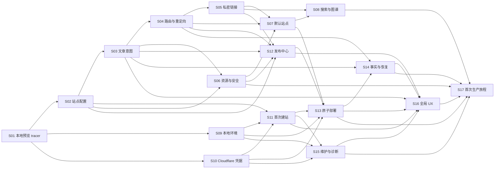

# Pages Publish 实现任务

> 状态：Ready for execution
>
> 组织方式：Tracer-bullet vertical slices
>
> 开发方式：每个 Slice 强制 TDD，并至少完成一轮独立 subagent review
>
> 更新日期：2026-07-31

## 1. 使用说明

本文件把 [`PRODUCT-SPEC.md`](./PRODUCT-SPEC.md) 拆成可以独立领取、实现、演示和验收的纵向 Slice。每个 Slice 都必须从用户可观察行为出发，贯穿所需的领域逻辑、边界适配、UI 和测试；不得把“先写所有底层、以后再接 UI”当成完成的 Slice。

状态约定：

- `[ ]` 未开始或未满足完成门禁。
- `[x]` 已完成，且 Slice Notes 中存在测试、review 与验收证据。
- `AFK`：实现与自动验证可以由 Agent 独立完成。
- `HITL`：Agent 可以完成实现，但指定的真实账号、视觉或人工验收需要用户参与。

执行约束：

1. 一个 Slice 使用一个独立分支/工作区和一个明确交付单元；默认分支前缀为 `codex/`。
2. 开始 Slice 前必须重读本文件、`PRODUCT-SPEC.md` 及其 Source Manifest 中与该 Slice 相关的原始来源。
3. 先实现一个最窄的端到端 tracer bullet，再逐个增加行为；禁止一次写完全部测试后再批量实现。
4. 测试通过公共接口验证行为，不测试私有方法或内部调用次数；只在 Cloudflare、Keychain、时间、文件系统等系统边界使用 fake/mock。
5. 每个 Slice 至少由一名未参与实现的 subagent 做一轮只读 review。reviewer 必须读取 Slice 目标、相关规格、实际 diff 和测试结果。
6. 所有 P0/P1 review 发现必须修复；P2 必须修复或记录明确处置理由。修复后重跑相关测试与回归测试。
7. 只有验收条件、TDD、subagent review 和证据记录全部完成后，才可勾选 Slice 总复选框。
8. Slice 若生成 PR、review 报告或 HAT 产物，必须重新读取工作流与交接策略，并保留 Source Manifest。

## 2. 全局 Definition of Done

以下清单适用于每个 Slice，不因 Slice 内重复的门禁而省略：

- [ ] 行为范围与公开接口在编码前明确，没有加入规格外能力。
- [ ] 第一个用户可观察行为先产生失败测试（RED），并记录失败命令/关键输出。
- [ ] 后续行为逐个执行 RED → GREEN，不进行横向批量测试/实现。
- [ ] 实现只满足当前失败测试，没有预先堆叠未来 Slice 能力。
- [ ] 所有测试为 GREEN 后才重构；每次重构后重跑相关测试。
- [ ] Slice 测试、受影响回归测试、类型检查和构建全部通过。
- [ ] 独立 subagent 完成至少一轮只读 review，记录 reviewer task/thread ID。
- [ ] P0/P1 finding 已清零，P2 finding 已修复或记录处置理由。
- [ ] AFK Slice 有自动验证证据；HITL Slice 同时记录待用户完成或已完成的人工步骤。
- [ ] 行为或决策变化已同步到产品/设计文档，且没有留下过期说明。
- [ ] Slice Notes 记录完成状态、验证命令、review 结论、未决风险和下一 Slice 入口。

## 3. Slice 总览

- [x] S01 — 插件壳与单篇本地预览 tracer bullet
- [x] S02 — 安全站点配置与内容范围
- [ ] S03 — 文章发布意图与当前文章面板
- [ ] S04 — URL、栏目索引与重定向
- [ ] S05 — 私密安全的笔记链接与嵌入
- [ ] S06 — 图片资源管线与内容安全
- [ ] S07 — 内置默认站点与核心 Markdown 体验
- [ ] S08 — 搜索、知识图谱与可见性 SEO
- [ ] S09 — Node/发布引擎与预览生命周期
- [ ] S10 — Cloudflare OAuth、Token 与 Keychain
- [ ] S11 — 首次建站、项目绑定与域名
- [ ] S12 — 发布中心、变化审阅与不可变快照
- [ ] S13 — Cloudflare 完整构建与原子部署
- [ ] S14 — 部署事实、下线与失败协调恢复
- [ ] S15 — 设置维护、日志与脱敏诊断
- [ ] S16 — 全局入口、反馈、响应式与可访问性
- [ ] S17 — 干净 Vault 到首次生产发布的候选版旅程

## 4. 依赖与执行波次



推荐执行波次：

| 波次 | 可并行 Slice | 说明 |
| --- | --- | --- |
| 0 | S01 | 建立唯一首条纵向链路 |
| 1 | S02、S09、S10 | 配置、环境与凭据边界可并行加深 |
| 2 | S03 | 完成文章发布意图与 Frontmatter 行为 |
| 3 | S04、S11 | 本地路由与远端首次建站可并行 |
| 4 | S05、S06、S15 | 链接、资源和维护能力可并行 |
| 5 | S07、S12 | 站点体验与发布审阅可并行 |
| 6 | S08、S13 | 搜索/图谱与首次真实部署可并行 |
| 7 | S14 | 完成跨本地/远端一致性与恢复 |
| 8 | S16 | 汇总全部领域状态到统一入口与反馈 |
| 9 | S17 | 运行干净 Vault 到首次生产发布的候选版旅程 |

## 5. Slice 详情

### S01 — 插件壳与单篇本地预览 tracer bullet

- Type：AFK
- Blocked by：None
- Covers：US-01、US-31、US-32；FR-1、FR-13、FR-16
- Outcome：用户可以安装开发版插件，从 Ribbon/命令进入 Pages Publish，并把真实 Test Vault 中一篇明确公开的 Markdown 通过最小完整链路渲染为本地预览。

#### Acceptance criteria

- [x] 建立可重复的安装、开发构建、类型检查和测试命令。
- [x] 插件加载/卸载不残留视图、命令或后台资源。
- [x] 未配置状态从 Ribbon 和命令面板进入首次设置空状态。
- [x] 一个真实 Test Vault 使用产品格式的最小 `site.yml` 和 public Markdown，即可从插件 UI 打开预览；不得依赖测试专用配置注入或 fixture 特判。
- [x] 核心领域逻辑不依赖 Obsidian 全局对象，可通过公开入口在测试中运行。
- [x] 预览明确标识为本地结果，且不会触发远端调用或 Frontmatter 写入。

#### TDD & review gate

- [x] TDD：为上方每条 Acceptance criterion 按顺序记录独立 RED → GREEN；当前 GREEN 后才开始下一条，最后在全绿状态重构。
- [x] TDD：先提交“未配置用户可进入设置”和“单篇可预览”的失败行为测试证据。
- [x] TDD：按一个测试一个最小实现推进，GREEN 后才整理宿主适配边界。
- [x] TDD：运行 Slice 测试、类型检查、插件构建和最小加载 smoke。
- [x] Review：独立 subagent 只读审查插件生命周期、核心/宿主边界、测试是否绑定实现细节。
- [x] Review：修复全部 P0/P1，记录 P2 处置并重跑验证。

#### Slice Notes

- [x] 记录分支/提交或 PR：分支 `codex/s01-local-preview`；S01 完成后创建本地提交，不创建远端 PR。
- [x] 记录 RED/GREEN/回归命令：逐行为 RED 证据包括缺失 preview/server/application/lifecycle/platform 模块、并发双端口、缺少本地标记、无效 schema 未拒绝和生命周期清理断言；最终 `npm test -- --run`（5 files / 8 tests）、`npm run lint`、`npm run build`、`npm audit --registry=https://registry.npmjs.org --omit=dev` 与 `npm pack --dry-run` 全部通过。
- [x] 记录 reviewer task/thread ID 与结论：独立 reviewer `/root/review_s01` 首轮发现 5 个 P1、1 个 P2；全部修复后复审为 `0 P0 / 0 P1 / 0 P2`，并独立重跑 8 tests、typecheck、lint 与生产构建。
- [x] 记录演示入口和遗留风险：Obsidian 1.13.4 隔离 Vault 中由 Ribbon/命令进入 `发布中心`，识别 `Smoke Wiki` 与 1 篇 public Markdown，浏览器预览显示“本地预览 · 尚未发布”；禁用插件后 Ribbon/View 消失，`127.0.0.1:60544` 立即拒绝连接。烟测 Vault 已移入废纸篓并从 Obsidian Vault 列表移除。S01 不包含远端部署、完整 schema 编辑 UI 或生产主题，这些由后续 Slice 交付。

### S02 — 安全站点配置与内容范围

- Type：AFK
- Blocked by：S01
- Covers：US-09、US-10、US-16、US-33、US-34；FR-2、FR-3、FR-4、FR-6；AC-2、AC-7
- Outcome：用户可以通过首次设置/设置页创建并安全编辑 `site.yml`，内容根与公开根的变化会经过校验、影响预览、原子保存和重新扫描。

#### Acceptance criteria

- [x] 支持 schema v1 的站点、首页布局、时区、内容根、资源排除、搜索/图谱和非密钥 Cloudflare 项目字段。
- [x] 拒绝重复/重叠内容根、冲突公开根、路径穿越和符号链接逃逸。
- [x] Vault 根选择显示强警告；内容根整体缺失产生防批量下线 Blocker。
- [x] 设置保存使用校验后的安全替换，失败时旧配置继续有效且用户输入不丢失。
- [x] 外部修改与未保存 UI 编辑冲突时禁止静默覆盖，并提供重载/比较入口。
- [x] 高于当前支持范围的 `site.yml` 版本可以只读展示，但必须阻止 UI 回写与发布。
- [x] 保存只重新扫描并刷新预览/状态，不自动发布。
- [x] 扫描覆盖插件加载、相关文件事件、配置保存、手动刷新、预览前和发布前触发；文件事件必须防抖并取消/丢弃过时任务。
- [x] 相同输入产生确定结果；扫描默认不联网、不写 Frontmatter，旧任务结果不得覆盖更新状态。

#### TDD & review gate

- [x] TDD：为上方每条 Acceptance criterion 按顺序记录独立 RED → GREEN；当前 GREEN 后才开始下一条，最后在全绿状态重构。
- [x] TDD：从“一个根映射一篇文章到公开路径”失败测试开始，再逐个加入冲突与故障行为。
- [x] TDD：文件系统只在边界替换；配置校验通过公开 load/validate/save 行为验证。
- [x] TDD：运行配置 fixture、原子写入故障、类型检查和 S01 回归。
- [x] Review：独立 subagent 只读审查 schema 契约、路径安全、冲突处理和配置/UI 双向一致性。
- [x] Review：修复全部 P0/P1，记录 P2 处置并重跑验证。

#### Slice Notes

- [x] 记录分支/提交或 PR：分支 `codex/s02-safe-site-config`；本地提交主题 `feat: add safe site configuration`，不创建远端 PR。
- [x] 记录 RED/GREEN/回归命令：按 schema、根映射、重叠/公开根冲突、穿越/symlink、缺失/不可读根、原子故障与晚到外部写入、dirty conflict/future readonly、全部扫描触发、防抖/取消/stale/dispose、确定性与无副作用逐项运行失败测试再最小实现；最终 `npm test -- --run`（10 files / 52 tests）、`npm run lint`、`npm run build`、`npm audit --registry=https://registry.npmjs.org --omit=dev` 与 `git diff --check` 全部通过。
- [x] 记录 reviewer task/thread ID 与结论：`/root/review_s02` 因服务流中断未形成结论；独立 reviewer `/root/review_s02_final` 首轮发现 5 个 P1、2 个 P2，连续复审补出 3 个及 1 个提交边界 P1；全部按 RED → GREEN 修复，最终复审为 `0 P0 / 0 P1 / 0 P2`。
- [x] 记录配置迁移/兼容风险：当前仅写 schema v1；高版本源文件保持原文只读并阻断回写/发布，不做隐式降级。原生 Setting Definitions API 将最低 Obsidian 版本提升到 1.13.0；文件系统 watcher 与 no-clobber 配置事务依赖首版限定的 macOS 本地文件系统。提交成功后的清理失败可能留下不影响权威 `site.yml` 的 `.previous-*`/`.tmp-*` 可恢复孤立文件，后续维护 Slice 负责诊断与清理。

### S03 — 文章发布意图与当前文章面板

- Type：AFK
- Blocked by：S01、S02
- Covers：US-11、US-12、US-17、US-18；FR-7、FR-8、FR-16；AC-3
- Outcome：用户可在当前文章上下文中查看有效发布属性及来源，编辑 public/unlisted/private 意图，并明确看到待发布状态与线上事实的区别。

#### Acceptance criteria

- [ ] 读取 `publication` schema v1，并按 title/summary/date/tags 等回退规则展示有效值与来源。
- [ ] 无显式可见性的新文章默认为 private；首次候选建议不自动写 Frontmatter。
- [ ] 用户明确编辑可见性或覆盖字段时安全写入 Frontmatter，但不修改部署事实。
- [ ] 已上线文章改为 private 前显示待下线确认。
- [ ] 当前文章面板覆盖活动文件、固定文件、非 Markdown、范围外、配置错误和文件丢失状态。
- [ ] 旧字段只读兼容并提供无损迁移预览；插件只写新 schema。

#### TDD & review gate

- [ ] TDD：为上方每条 Acceptance criterion 按顺序记录独立 RED → GREEN；当前 GREEN 后才开始下一条，最后在全绿状态重构。
- [ ] TDD：先验证“缺省 private”和“显式意图不等于线上事实”，再逐字段增加回退/覆盖测试。
- [ ] TDD：通过文章元数据公开接口和临时 Vault 验证，不断言 YAML 库内部行为。
- [ ] TDD：运行元数据 fixture、面板状态投影、类型检查和 S01–S02 回归。
- [ ] Review：独立 subagent 只读审查 Frontmatter 数据安全、回退/覆盖边界与 UI 状态歧义。
- [ ] Review：修复全部 P0/P1，记录 P2 处置并重跑验证。

#### Slice Notes

- [ ] 记录分支/提交或 PR：
- [ ] 记录 RED/GREEN/回归命令：
- [ ] 记录 reviewer task/thread ID 与结论：
- [ ] 记录旧字段迁移决策：

### S04 — URL、栏目索引与重定向

- Type：AFK
- Blocked by：S02、S03
- Covers：US-19、US-20；FR-9、FR-12；AC-4
- Outcome：文章与目录获得确定、唯一、支持 Unicode 的公开路由；用户修改已上线 URL 时可预见并保留正确重定向。

#### Acceptance criteria

- [ ] URL 由公开根、相对目录和显式/派生 slug 确定生成。
- [ ] 支持中文/Unicode，拒绝路径层级控制、穿越、查询和 fragment 字符。
- [ ] 全站页面、系统页和重定向路由冲突产生可定位 Blocker。
- [ ] `_index.md` 优先于 `index.md`；双文件时无额外 Warning，且不生成第二个目录索引页面。
- [ ] UI 修改已上线 URL 时自动记录旧地址；重定向压平且循环/缺失目标被阻止。
- [ ] 用户直接修改 slug 且无法可靠识别旧 URL 时产生 Warning，不自动猜测历史地址。
- [ ] 当前文章面板和预览同时显示待发布 URL、线上 URL 与重定向结果。

#### TDD & review gate

- [ ] TDD：为上方每条 Acceptance criterion 按顺序记录独立 RED → GREEN；当前 GREEN 后才开始下一条，最后在全绿状态重构。
- [ ] TDD：先写单根/单文档路由失败测试，再逐个加入 Unicode、索引、冲突和重定向行为。
- [ ] TDD：路由测试只依赖规划器公共结果，不快照内部中间对象。
- [ ] TDD：运行路由性质/fixture 测试、预览集成、类型检查和上游回归。
- [ ] Review：独立 subagent 只读审查 URL 规范化、路由安全、重定向循环和历史地址保留。
- [ ] Review：修复全部 P0/P1，记录 P2 处置并重跑验证。

#### Slice Notes

- [ ] 记录分支/提交或 PR：
- [ ] 记录 RED/GREEN/回归命令：
- [ ] 记录 reviewer task/thread ID 与结论：
- [ ] 记录 URL 兼容风险：

### S05 — 私密安全的笔记链接与嵌入

- Type：AFK
- Blocked by：S03、S04
- Covers：US-21、US-23、US-24；FR-8、FR-10、FR-12；AC-3
- Outcome：公开内容中的 Wiki 链接与 Markdown 嵌入按目标可见性安全解析，私密/范围外信息只保留作者写出的显示文本。

#### Acceptance criteria

- [ ] 指向 public/unlisted 的内部链接生成正确线上 URL。
- [ ] 指向 private、范围外或缺失文章的链接降级为不可点击显示文本。
- [ ] 降级产物不包含目标路径、推导标题、URL、悬浮内容或反向链接。
- [ ] private Markdown 嵌入降级为显示文本，不嵌入正文。
- [ ] 缺失目标产生 Warning；普通循环链接允许，循环嵌入不会无限递归。
- [ ] private 文章自身的内容问题降级为 dormant warning，不阻塞整站；被下一版内容依赖时重新按依赖规则判定。
- [ ] 问题显示源文件、精确行号、影响和定位入口。

#### TDD & review gate

- [ ] TDD：为上方每条 Acceptance criterion 按顺序记录独立 RED → GREEN；当前 GREEN 后才开始下一条，最后在全绿状态重构。
- [ ] TDD：以 public → private 链接不泄露为首个失败安全测试，再展开组合矩阵。
- [ ] TDD：使用完整渲染输出验证泄漏，不只检查内部依赖图标签。
- [ ] TDD：运行链接/嵌入 fixture、私密信息负向搜索、类型检查和上游回归。
- [ ] Review：独立 subagent 只读审查所有可见性组合、泄漏面与循环处理。
- [ ] Review：修复全部 P0/P1，记录 P2 处置并重跑验证。

#### Slice Notes

- [ ] 记录分支/提交或 PR：
- [ ] 记录 RED/GREEN/回归命令：
- [ ] 记录 reviewer task/thread ID 与结论：
- [ ] 记录隐私负向测试覆盖：

### S06 — 图片资源管线与内容安全

- Type：AFK
- Blocked by：S02、S03
- Covers：US-22、US-23、US-24；FR-10、FR-11；AC-3
- Outcome：只有被下一版文章引用且安全的本地图片进入预览/构建；不安全资源与 HTML 在发布前得到确定处理。

#### Acceptance criteria

- [ ] 支持 PNG、JPEG、WebP、GIF 与安全 SVG，并保持原文件内容/格式。
- [ ] 缺失、被排除、不可读、Vault 外或不安全 SVG 图片产生不可忽略 Blocker。
- [ ] 超过 5 MiB 的图片产生性能 Warning，但不阻塞。
- [ ] 本地 PDF、音视频和其他附件降级为显示文本并产生 Warning，不进入产物。
- [ ] 外部 HTTP(S) 资源保持外链且不被默认下载或探测。
- [ ] 原始 HTML 与 SVG 内容经过安全策略，产物没有脚本、事件处理器或危险协议。
- [ ] 外链默认只检查语法；用户主动运行外链检查时才访问网络，失败只产生临时 Warning。

#### TDD & review gate

- [ ] TDD：为上方每条 Acceptance criterion 按顺序记录独立 RED → GREEN；当前 GREEN 后才开始下一条，最后在全绿状态重构。
- [ ] TDD：以“只复制公开文章引用的一张图片”为 tracer test，再加入各类阻断/降级输入。
- [ ] TDD：通过最终构建目录和报告验证行为，安全边界可使用恶意 fixture。
- [ ] TDD：运行资源矩阵、安全 payload、私密信息负向搜索、类型检查和上游回归。
- [ ] Review：独立 subagent 只读进行安全审查，重点检查路径逃逸、SVG/HTML 注入和资源泄漏。
- [ ] Review：修复全部 P0/P1，记录 P2 处置并重跑验证。

#### Slice Notes

- [ ] 记录分支/提交或 PR：
- [ ] 记录 RED/GREEN/回归命令：
- [ ] 记录 reviewer task/thread ID 与结论：
- [ ] 记录安全 fixture 与剩余攻击面：

### S07 — 内置默认站点与核心 Markdown 体验

- Type：HITL（默认站点视觉验收）
- Blocked by：S04、S05、S06
- Covers：US-25、US-31；FR-11、FR-13；AC-5、AC-8
- Outcome：完整 Vault 快照可以生成具有首页、栏目、文章、404 和隐私说明的可用默认站点，并可靠呈现首版支持的 Markdown。

#### Acceptance criteria

- [ ] 内置主题生成首页、自动/自定义栏目页、文章页、404 和基础隐私说明。
- [ ] 首页支持 `sections` 与 `latest`，栏目按 order/发布日期规则排序。
- [ ] 支持 GFM 基础、表格、任务列表、代码块、Callout 和 Mermaid。
- [ ] Mermaid 使用受控渲染与 URL 安全策略，不允许脚本或危险协议进入页面。
- [ ] 不支持的 Obsidian 语法产生可定位 Warning，并可在预览中看到降级。
- [ ] 站点在桌面与窄屏可读，中文、长标题、长代码和图片不破坏布局。
- [ ] 用户完成一次默认站点视觉验收并记录结论；未通过时不勾选 Slice。

#### TDD & review gate

- [ ] TDD：为上方每条 Acceptance criterion 按顺序记录独立 RED → GREEN；当前 GREEN 后才开始下一条，最后在全绿状态重构。
- [ ] TDD：先以一篇文章和一个自动栏目页的语义输出为失败测试，再逐个加入页面类型/语法。
- [ ] TDD：断言可访问语义、路由和关键内容，不把整页像素快照作为唯一测试。
- [ ] TDD：运行构建 fixture、HTML 语义检查、类型检查和上游回归。
- [ ] Review：独立 subagent 只读审查站点信息架构、语法降级、可访问 HTML 和实现复杂度。
- [ ] Review：修复全部 P0/P1，记录 P2 处置并重跑验证。

#### HITL & Slice Notes

- [ ] 记录分支/提交或 PR：
- [ ] 记录 RED/GREEN/回归命令：
- [ ] 记录 reviewer task/thread ID 与结论：
- [ ] 记录人工视觉验收设备、截图与结论：

### S08 — 搜索、知识图谱与可见性 SEO

- Type：AFK
- Blocked by：S05、S07
- Covers：US-36；FR-8、FR-11；AC-3
- Outcome：默认站点为 public 内容提供搜索、知识图谱、导航和搜索引擎元数据，同时严格排除 unlisted/private 内容。

#### Acceptance criteria

- [ ] public 内容进入全文搜索、知识图谱、导航和站点地图。
- [ ] unlisted 页面可直链且带 `noindex`，不进入搜索、图谱、导航或站点地图。
- [ ] private 内容不生成页面，也不进入任何客户端索引或构建元数据。
- [ ] 搜索与图谱开关关闭后不生成对应入口和索引负载。
- [ ] public 页面生成 canonical 与必要基础 metadata。
- [ ] 构建测试对产物执行 private/unlisted 信息负向搜索。

#### TDD & review gate

- [ ] TDD：为上方每条 Acceptance criterion 按顺序记录独立 RED → GREEN；当前 GREEN 后才开始下一条，最后在全绿状态重构。
- [ ] TDD：先写三种可见性在搜索索引中的行为测试，再逐个增加图谱/SEO 输出。
- [ ] TDD：通过用户可下载的最终产物验证，不能只检查构建器内存状态。
- [ ] TDD：运行收录矩阵、负向泄漏、HTML metadata、类型检查和上游回归。
- [ ] Review：独立 subagent 只读审查所有公开索引面、noindex 语义和客户端数据泄漏。
- [ ] Review：修复全部 P0/P1，记录 P2 处置并重跑验证。

#### Slice Notes

- [ ] 记录分支/提交或 PR：
- [ ] 记录 RED/GREEN/回归命令：
- [ ] 记录 reviewer task/thread ID 与结论：
- [ ] 记录索引体积/隐私风险：

### S09 — Node/发布引擎与预览生命周期

- Type：AFK
- Blocked by：S01
- Covers：US-02、US-03、US-25、US-35；FR-1、FR-13、FR-17
- Outcome：普通用户无需管理工具链即可获得可修复、可观察且不影响系统 Node.js 的本地发布环境与预览服务。

#### Acceptance criteria

- [ ] 兼容系统 Node 可复用；不兼容或缺失时使用插件受管理运行时。
- [ ] 下载的运行时/引擎验证来源、版本和校验值；失败保留最后已验证版本。
- [ ] 发行源提供签名时同时验证签名；离线、校验失败和无可用回退版本时显示准确影响与下一步。
- [ ] 准备、修复和更新不修改系统 Node、npm、PATH 或全局包。
- [ ] 环境准备/修复显示真实阶段、失败原因、重试和详情入口。
- [ ] 预览服务可启动、停止、重启，插件卸载时安全释放资源。
- [ ] 设置页展示实际使用的运行时与引擎状态，不回显敏感路径/参数。

#### TDD & review gate

- [ ] TDD：为上方每条 Acceptance criterion 按顺序记录独立 RED → GREEN；当前 GREEN 后才开始下一条，最后在全绿状态重构。
- [ ] TDD：先验证“兼容则复用、否则选择受管理运行时”的失败决策测试，再接下载边界。
- [ ] TDD：时间、下载和进程使用边界 fake；不要 mock 自有环境决策模块。
- [ ] TDD：运行版本矩阵、校验失败、回退、进程生命周期、类型检查和 S01 回归。
- [ ] Review：独立 subagent 只读审查供应链安全、系统环境不变性和进程清理。
- [ ] Review：修复全部 P0/P1，记录 P2 处置并重跑验证。

#### Slice Notes

- [ ] 记录分支/提交或 PR：
- [ ] 记录 RED/GREEN/回归命令：
- [ ] 记录 reviewer task/thread ID 与结论：
- [ ] 记录版本范围/发行源风险：

### S10 — Cloudflare OAuth、Token 与 Keychain

- Type：HITL（真实授权验收）
- Blocked by：S01
- Covers：US-04、US-05、US-06、US-30；FR-5、FR-18；AC-6、AC-7
- Outcome：用户可以使用最小权限 OAuth 或高级 API Token 连接 Cloudflare，凭据只进入 Keychain，连接失效时得到安全恢复入口。

#### Acceptance criteria

- [ ] OAuth 是默认入口，申请范围仅覆盖首版 Pages 能力。
- [ ] API Token 位于高级入口，并在保存前验证权限与账号。
- [ ] OAuth/Token 只写 Keychain；Vault、配置、普通日志、诊断包和 UI 不出现明文。
- [ ] 支持多账号选择、连接状态、重新授权和更换账号。
- [ ] 授权失效时本地内容编辑/预览仍可用，发布和远端动作暂停。
- [ ] 真实 Cloudflare 测试账号完成 OAuth 回调与撤销/重授权验收。

#### TDD & review gate

- [ ] TDD：为上方每条 Acceptance criterion 按顺序记录独立 RED → GREEN；当前 GREEN 后才开始下一条，最后在全绿状态重构。
- [ ] TDD：先用 Cloudflare/Keychain 边界 fake 验证“成功连接但凭据不落盘”行为。
- [ ] TDD：逐个覆盖取消授权、过期、权限不足、Keychain 失败和账号切换。
- [ ] TDD：运行凭据负向搜索、适配器契约、类型检查和上游回归。
- [ ] Review：独立 subagent 只读安全审查权限范围、回调校验、Token 生命周期与脱敏。
- [ ] Review：修复全部 P0/P1，记录 P2 处置并重跑验证。

#### HITL & Slice Notes

- [ ] 记录分支/提交或 PR：
- [ ] 记录 RED/GREEN/回归命令：
- [ ] 记录 reviewer task/thread ID 与结论：
- [ ] 记录真实账号验收步骤与结果（不得记录密钥）：

### S11 — 首次建站、项目绑定与域名

- Type：HITL（真实 Cloudflare 项目/域名验收）
- Blocked by：S02、S09、S10
- Covers：US-01、US-06、US-07、US-08、US-11；FR-5、FR-16；AC-1
- Outcome：用户可完成四步向导，在最终确认后幂等创建或绑定 Pages 项目、选择默认/自定义域名，并进入未发布任何文章的发布中心。

#### Acceptance criteria

- [ ] 向导覆盖环境准备、站点信息、内容范围、Cloudflare 和最终确认。
- [ ] 最终确认前不写正式配置、不创建/绑定远端对象、不修改 Frontmatter。
- [ ] 支持创建新项目和绑定归属正确、兼容的已有项目。
- [ ] 失败重试复用匹配项目，不创建重复项目；现有绑定在失败时保持不变。
- [ ] `pages.dev` 与自定义域名展示待验证、有效和失败状态。
- [ ] 成功后进入发布中心，展示候选建议，并明确“尚未发布文章/未修改 Frontmatter”。

#### TDD & review gate

- [ ] TDD：为上方每条 Acceptance criterion 按顺序记录独立 RED → GREEN；当前 GREEN 后才开始下一条，最后在全绿状态重构。
- [ ] TDD：先用 fake adapter 验证“确认前零远端调用、确认后一次幂等创建”的失败测试。
- [ ] TDD：逐个覆盖绑定、部分成功、重试、域名状态和本地配置失败。
- [ ] TDD：运行向导状态机、Cloudflare 契约、类型检查和上游回归。
- [ ] Review：独立 subagent 只读审查副作用时机、幂等性、错误恢复和向导状态可恢复性。
- [ ] Review：修复全部 P0/P1，记录 P2 处置并重跑验证。

#### HITL & Slice Notes

- [ ] 记录分支/提交或 PR：
- [ ] 记录 RED/GREEN/回归命令：
- [ ] 记录 reviewer task/thread ID 与结论：
- [ ] 记录新建/绑定/域名人工验收结果：

### S12 — 发布中心、变化审阅与不可变快照

- Type：AFK
- Blocked by：S02、S03、S04、S05、S06
- Covers：US-13、US-14、US-15、US-16、US-18、US-23、US-24、US-26；FR-6、FR-12、FR-13、FR-14、FR-16；AC-2、AC-4、AC-5
- Outcome：用户可以在发布中心审阅整站变化和问题，确认下一版成员，预览同源构建，并生成不会被发布中编辑污染的不可变快照。

#### Acceptance criteria

- [ ] 发布中心展示站点身份、变化摘要、四个 Tab、文章表格、审阅抽屉和固定发布条。
- [ ] 变化相对最近成功部署分类为新增、更新、URL/可见性变化、待下线、无变化或未知。
- [ ] Checkbox 明确表示下一版成员；取消线上文章要求下线确认。
- [ ] Blocker 禁用发布，Warning 允许继续；每项问题可定位到源行。
- [ ] 最近部署清单缺失时仍可完整构建，但显示状态未知和完整输出规模。
- [ ] 预览/发布必须等待最新扫描完成或主动重扫；过时扫描结果不能生成可提交快照。
- [ ] 确认发布形成不可变快照；之后的 Vault 编辑保留为下一次变化。
- [ ] 当前文章预览、整站预览和发布准备复用同一解析/路由/渲染链路。

#### TDD & review gate

- [ ] TDD：为上方每条 Acceptance criterion 按顺序记录独立 RED → GREEN；当前 GREEN 后才开始下一条，最后在全绿状态重构。
- [ ] TDD：先以“一项本地更新显示在发布中心并形成快照”为 tracer test。
- [ ] TDD：逐个增加待下线、Blocker、Warning、未知状态和发布中编辑行为。
- [ ] TDD：运行扫描/差异/快照集成、UI 状态投影、类型检查和上游回归。
- [ ] Review：独立 subagent 只读审查 Checkbox 语义、变化基线、快照一致性和 UI 对事实/意图的区分。
- [ ] Review：修复全部 P0/P1，记录 P2 处置并重跑验证。

#### Slice Notes

- [ ] 记录分支/提交或 PR：
- [ ] 记录 RED/GREEN/回归命令：
- [ ] 记录 reviewer task/thread ID 与结论：
- [ ] 记录大 Vault/状态未知风险：

### S13 — Cloudflare 完整构建与原子部署

- Type：HITL（真实 Pages 部署验收）
- Blocked by：S07、S09、S10、S11、S12
- Covers：US-25、US-26、US-27；FR-5、FR-14；AC-5、AC-6
- Outcome：发布中心可以把不可变快照完整构建并作为新的 Cloudflare Pages 部署上传/激活，任何远端失败都不会破坏旧站点。

#### Acceptance criteria

- [ ] 发布前重新验证配置、内容根、授权、意图和 Blocker。
- [ ] 发布阶段严格为准备、构建与检查、上传、激活，不显示虚假百分比。
- [ ] 上传开始后不显示不可兑现的取消；关闭视图不丢失任务可观察性。
- [ ] 构建、上传或激活失败均不更新部署事实，旧站点继续可访问。
- [ ] 重试前重新扫描并生成新快照，不盲目使用陈旧构建目录。
- [ ] 使用隔离 Cloudflare 项目验证首次部署、更新部署和至少一种远端失败场景。

#### TDD & review gate

- [ ] TDD：为上方每条 Acceptance criterion 按顺序记录独立 RED → GREEN；当前 GREEN 后才开始下一条，最后在全绿状态重构。
- [ ] TDD：先用 fake adapter 验证“一篇文章完成四阶段且返回成功部署”的 tracer test。
- [ ] TDD：逐阶段注入失败并验证旧部署/本地事实不变，再覆盖并发发布保护。
- [ ] TDD：运行编排状态机、适配器契约、完整构建、类型检查和全量回归。
- [ ] Review：独立 subagent 只读审查原子语义、失败窗口、重试幂等和任务并发。
- [ ] Review：修复全部 P0/P1，记录 P2 处置并重跑验证。

#### HITL & Slice Notes

- [ ] 记录分支/提交或 PR：
- [ ] 记录 RED/GREEN/回归命令：
- [ ] 记录 reviewer task/thread ID 与结论：
- [ ] 记录真实 Pages 部署与旧站点保持证据：

### S14 — 部署事实、下线与失败协调恢复

- Type：AFK
- Blocked by：S03、S04、S13
- Covers：US-15、US-16、US-18、US-19、US-27、US-28、US-29；FR-4、FR-7、FR-12、FR-14、FR-15；AC-4、AC-6
- Outcome：成功部署可靠写回文章部署事实和最近站点清单；删除/移动/私密化内容会正确下线；远端成功但本地写回失败可以幂等恢复。

#### Acceptance criteria

- [ ] 仅在远端激活成功后写 `publication.deployment`、日期和最近部署清单。
- [ ] 构建/上传/激活失败不改变成功时间、URL、digest 或 deployment ID。
- [ ] 删除、明确移出范围、移动或 private 的线上文章在下一次成功完整部署后下线。
- [ ] 内容根暂时缺失继续按 Blocker 处理，不伪装成用户确认下线。
- [ ] 远端成功/本地多文件回写失败时写持久恢复收据，进入待协调状态并阻止新发布。
- [ ] 重启后可识别收据、验证远端 deployment ID 并幂等完成回写；完成后删除收据。
- [ ] 最近部署清单丢失不影响完整构建正确性，只降低精细变化展示。
- [ ] 清空插件本地数据、缓存和 Keychain 后，仅凭 Vault 内容与 `site.yml`，用户可重新授权、绑定原项目并构建语义等价站点。

#### TDD & review gate

- [ ] TDD：为上方每条 Acceptance criterion 按顺序记录独立 RED → GREEN；当前 GREEN 后才开始下一条，最后在全绿状态重构。
- [ ] TDD：先验证“成功写事实、失败不写事实”成对行为，再覆盖删除与协调失败。
- [ ] TDD：用 fake 远端、可注入文件系统/时间边界模拟每个故障窗口。
- [ ] TDD：运行恢复/重启、下线、日期时区、全量回归和类型检查。
- [ ] Review：独立 subagent 只读审查分布式一致性窗口、收据耐久性、重复回写和数据丢失风险。
- [ ] Review：修复全部 P0/P1，记录 P2 处置并重跑验证。

#### Slice Notes

- [ ] 记录分支/提交或 PR：
- [ ] 记录 RED/GREEN/回归命令：
- [ ] 记录 reviewer task/thread ID 与结论：
- [ ] 记录所有故障注入点和恢复证据：

### S15 — 设置维护、日志与脱敏诊断

- Type：AFK
- Blocked by：S02、S09、S10、S11
- Covers：US-30、US-33、US-34、US-35；FR-16、FR-17、FR-18；AC-7
- Outcome：已配置用户可以在原生设置页安全维护本地环境和 Cloudflare 绑定，并导出不包含密钥或私密内容的诊断信息。

#### Acceptance criteria

- [ ] 设置页形成站点、内容范围、Cloudflare、站点功能、本地环境的单页锚点结构。
- [ ] 本地设置保存、远端账号/项目/域名动作和缓存/诊断动作彼此隔离。
- [ ] 支持环境修复、清理可重建缓存、打开日志、启动预览和导出诊断包。
- [ ] 诊断包导出前展示包含/排除项，且不含凭据、Authorization header、正文、私密路径或构建产物。
- [ ] 日志、构建目录和恢复收据具有有界保留策略；成功协调后的恢复收据及时清理。
- [ ] 移除本地站点配置进入 Obsidian 回收站，不删除远端项目或线上内容。
- [ ] 远端动作失败时保留现有绑定并给出恢复入口。

#### TDD & review gate

- [ ] TDD：为上方每条 Acceptance criterion 按顺序记录独立 RED → GREEN；当前 GREEN 后才开始下一条，最后在全绿状态重构。
- [ ] TDD：先验证“保存普通设置绝不产生远端调用”，再逐个增加维护动作。
- [ ] TDD：通过导出文件和可观察状态验证脱敏，不断言日志 formatter 私有方法。
- [ ] TDD：运行设置集成、危险动作、脱敏负向搜索、类型检查和上游回归。
- [ ] Review：独立 subagent 只读审查远端副作用隔离、删除语义、日志保留与敏感数据暴露。
- [ ] Review：修复全部 P0/P1，记录 P2 处置并重跑验证。

#### Slice Notes

- [ ] 记录分支/提交或 PR：
- [ ] 记录 RED/GREEN/回归命令：
- [ ] 记录 reviewer task/thread ID 与结论：
- [ ] 记录诊断包样本与脱敏检查：

### S16 — 全局入口、反馈、响应式与可访问性

- Type：HITL（视觉、键盘与辅助功能验收）
- Blocked by：S03、S11、S12、S13、S14、S15
- Covers：US-31、US-32、US-35；FR-16；AC-8
- Outcome：用户从 Ribbon、命令、右键菜单和状态栏始终到达正确上下文，并能在明暗主题、窄容器和键盘模式完成核心流程。

#### Acceptance criteria

- [ ] 单一 Ribbon 图标按未配置、准备中、空闲、发布中和失败状态路由到正确界面。
- [ ] 命令面板与 Markdown 右键菜单只提供 `UI-SPEC.MD` 定义的安全动作。
- [ ] 状态栏空闲隐藏；扫描、待发布、Blocker、发布中和失败时显示并可导航。
- [ ] Notice 只用于主动操作结果、授权/配置重要变化和后台发布完成。
- [ ] 四个核心界面满足 DESIGN 的颜色、按钮、焦点、文案和容器响应式规则。
- [ ] 仅用键盘可完成首次设置、问题定位、预览、发布与失败重试。
- [ ] 完成明暗主题、左右侧栏、分屏、<640px 容器和 200% 缩放人工验收。

#### TDD & review gate

- [ ] TDD：为上方每条 Acceptance criterion 按顺序记录独立 RED → GREEN；当前 GREEN 后才开始下一条，最后在全绿状态重构。
- [ ] TDD：先验证统一状态投影到 Ribbon/状态栏的行为，再逐个接入命令、菜单和 Notice。
- [ ] TDD：对可访问语义和状态行为做自动测试，视觉验证保留独立截图/HAT 证据。
- [ ] TDD：运行 UI 状态、键盘、可访问性 smoke、类型检查和全量回归。
- [ ] Review：独立 subagent 只读审查状态一致性、危险入口、焦点/键盘、文案和响应式实现。
- [ ] Review：修复全部 P0/P1，记录 P2 处置并重跑验证。

#### HITL & Slice Notes

- [ ] 记录分支/提交或 PR：
- [ ] 记录 RED/GREEN/回归命令：
- [ ] 记录 reviewer task/thread ID 与结论：
- [ ] 记录主题/尺寸/键盘人工验收证据：

### S17 — 干净 Vault 到首次生产发布的候选版旅程

- Type：HITL（完整 HAT 与发布决策）
- Blocked by：S06、S08、S13、S14、S15、S16
- Covers：全部首版成功判据、AC-1 至 AC-8、PRODUCT-SPEC 发布门槛
- Outcome：从一台只有干净 Obsidian、一个真实 Vault 和 Cloudflare 账号的 macOS 开始，用户无需终端即可完成安装、首次设置、本地预览和第一次生产发布；该具体纵向旅程同时形成发布候选版的最终证据。

#### Acceptance criteria

- [ ] 固化最低 Obsidian 版本、兼容 Node 范围、引擎发行源和校验/回退机制。
- [ ] 使用大 Vault fixture 建立扫描、构建、内存与 UI 响应基准，并处理阻塞发布的问题。
- [ ] 完成 private/unlisted 全产物泄漏检查、路径逃逸、HTML/SVG/Mermaid 和凭据脱敏安全回归。
- [ ] 完成首次设置、首次发布、更新、URL 迁移、下线、各阶段失败和待协调恢复的完整验收。
- [ ] 完成真实 Cloudflare 新建/绑定/部署/域名状态验收，不在产物中保留密钥。
- [ ] 在不使用开发 fixture、测试注入或预置插件本地数据的干净环境中，完整走通安装 → 配置 → 授权 → 预览 → 首次生产发布 → 打开站点。
- [ ] 完成 Obsidian 明暗主题、窄容器、键盘和 200% 缩放 HAT。
- [ ] 生成可安装包，干净 Vault 安装/升级/卸载 smoke 通过。
- [ ] 所有 P0/P1 测试与 review finding 清零，P2 均有明确发布处置。

#### TDD & review gate

- [ ] TDD：为上方每条 Acceptance criterion 按顺序记录独立 RED → GREEN；当前 GREEN 后才开始下一条，最后在全绿状态重构。
- [ ] TDD：任何硬化发现先增加可复现失败测试，再修复；不得直接打补丁后补测试。
- [ ] TDD：运行全量自动测试、类型检查、构建、安装 smoke、安全负向测试和性能基准。
- [ ] TDD：重构或性能优化只在 GREEN 下进行，优化前后保持同一外部行为。
- [ ] Review：独立 subagent 对完整 diff/代码库做发布级只读 review；必要时可增加第二个安全专项 reviewer。
- [ ] Review：修复全部 P0/P1，记录 P2 发布处置并重跑完整验证。

#### HITL & Slice Notes

- [ ] 记录发布候选版本/提交或 PR：
- [ ] 记录全量验证与性能基准：
- [ ] 记录 reviewer task/thread ID、findings 与处置：
- [ ] 记录 HAT 产物、人工结论和最终发布决策：

## 6. Slice 执行模板

领取任一 Slice 时，将下面的检查项复制到实现任务或 PR 中，并在完成后回写本文件对应 Slice Notes：

```markdown
## Scope

- Slice: SXX — <title>
- Sources read: PRODUCT-SPEC / DESIGN / UI-SPEC / TASK Source Manifest
- Blockers verified: ...

## TDD log

- [ ] AC 1 / RED: behavior + command + expected failure
- [ ] AC 1 / GREEN: minimal behavior + command + passing result
- [ ] AC 2 / RED → GREEN: only after AC 1 is GREEN
- [ ] Repeat one RED → GREEN record for every Acceptance criterion
- [ ] HITL criterion: automated prerequisite + recorded manual fail/pass evidence
- [ ] Refactor while GREEN
- [ ] Slice tests
- [ ] Affected regression tests
- [ ] Typecheck and build

## Subagent review

- [ ] Independent reviewer assigned read-only task
- [ ] Reviewer task/thread ID recorded
- [ ] Relevant sources, diff and test output provided
- [ ] P0/P1 findings resolved
- [ ] P2 findings resolved or disposition recorded
- [ ] Verification rerun after fixes

## Evidence

- Demo/HAT entry:
- Commands and results:
- Remaining risks:
```

## 7. Review 统一要求

每轮 Slice review 的最小提示应要求 reviewer：

1. 只读审查，不直接修改实现。
2. 重读该 Slice 的产品需求、验收条件和 Source Manifest。
3. 检查实际 diff，而不是只读实现者摘要。
4. 检查测试是否先于行为、通过公共接口、覆盖失败语义，并避免 mock 内部模块。
5. 优先寻找隐私泄漏、路径逃逸、状态/事实混淆、远端副作用、竞态、恢复失败和误下线。
6. 按 P0/P1/P2 输出可定位 finding；没有 finding 时明确写“未发现可操作问题”。
7. review 结束后由实现者决定并执行修复，reviewer 保持只读独立性。

“已运行 reviewer”本身不等于通过。只有 findings 被处理并重新验证后，review gate 才能勾选。

## 8. 里程碑

### M1 — 本地可用

- [ ] S01–S06 完成：用户可安全配置内容、管理文章意图并预览无泄漏的本地输出。

### M2 — 站点可读

- [ ] S07–S08 完成：默认站点、搜索、图谱和 SEO 可见性语义完成。

### M3 — 可部署

- [ ] S09–S14 完成：环境、Cloudflare、发布中心、原子部署和协调恢复闭环完成。

### M4 — 可发布

- [ ] S15–S17 完成：维护、诊断、全局 UX、硬化与最终 HAT 完成。

## Source Manifest

### Sources

- [`PRODUCT-SPEC.md`](./PRODUCT-SPEC.md)：最终产品目标、36 条用户故事、FR-1 至 FR-18、状态模型、测试决策和 AC-1 至 AC-8。
- [`DESIGN.md`](./DESIGN.md)：插件 UI 设计规范、发布安全不变量、响应式与可访问性门槛。
- [`UI-SPEC.MD`](./UI-SPEC.MD)：四个核心界面、全局入口、状态矩阵与 ASCII 原型。
- [Obsidian 发布插件架构](thread://019fb7b2-bf37-7883-9334-53dac3a35ca1)：本地优先、Cloudflare、内容/资源边界和原子部署的原始决策。
- [规划_插件UI设计_2026-07-31](thread://019fb857-2600-7353-9f31-a9519017a003)：原型确认与当前任务上下文。
- 用户明确指令（2026-07-31）：拆分 Slice 与具体实现任务，使用 Checkbox；每个 Slice 使用 TDD，并至少完成一轮 subagent review；生成 `TASK.md`。
- `/Users/ivan/.agents/skills/to-issues/SKILL.md`：使用可独立领取、可演示的 tracer-bullet vertical slices 组织任务。
- `/Users/ivan/.agents/skills/tdd/SKILL.md` 及其测试、mock、深模块、接口与重构参考：逐行为 RED → GREEN → REFACTOR 和公共接口测试约束。
- `/Users/ivan/.agents/docs/agents/workflows.md` 与 `/Users/ivan/.agents/docs/agents/handoff-policy.md`：持续交付与 Source Manifest 要求。

### Produced artifacts

- `/Users/ivan/workspace/ai/obsidian-pages-plugin/TASK.md`
- `/Users/ivan/workspace/ai/obsidian-pages-plugin/package.json`、`manifest.json`、`versions.json`、构建/测试/类型检查配置与 `styles.css`
- `/Users/ivan/workspace/ai/obsidian-pages-plugin/src/`：S01 插件生命周期、核心预览与 loopback server；S02 schema v1 配置仓库、设置会话/UI、安全配置事务、内容扫描器与协调器
- `/Users/ivan/workspace/ai/obsidian-pages-plugin/tests/`：S01 公开行为、并发/清理和平台边界；S02 配置/扫描/冲突/故障/生命周期公开行为回归测试

### Key decisions

- 首版拆为 17 个纵向 Slice，而不是按 UI、数据、测试等水平层分包。
- S01 先打通“插件入口 → 配置/扫描 → 渲染 → 本地预览”的最小完整链路，后续 Slice 在真实路径上加深。
- Cloudflare 实机、默认站点视觉、全局可访问性和最终发布验收标记为 HITL；其余优先 AFK。
- 每个 Slice 的完成门禁都包含逐行为 TDD、全量受影响回归和独立只读 subagent review。
- reviewer 不修改代码；实现者处理 finding，P0/P1 必须清零，P2 必须有明确处置。
- S17 不是泛化的水平“收尾”，而是用干净环境完成安装到首次生产发布的具体端到端旅程。

### Verification evidence

- 已对照 PRODUCT-SPEC 的全部 36 条用户故事、FR-1 至 FR-18、AC-1 至 AC-8 和发布门槛分配 Slice。
- 已检查 Slice 依赖图无自循环，并为可并行任务给出执行波次。
- 使用结构检查验证 17 个 Slice 均包含 Acceptance criteria、TDD & review gate 和 Slice Notes。
- 独立规划 reviewer `/root/review_task_slices` 完成只读审查：0 个 P0、4 个 P1；已补齐逐 AC TDD、扫描竞态、Vault 重建旅程和首尾 Slice 纵向性，并处理相关 P2 覆盖/依赖问题。修订后 reviewer 复核确认 4 个 P1 均已解决，未引入新 P0/P1。
- S01 已完成实现、TDD、独立 subagent review、真实 Obsidian 加载/卸载 smoke 与完整本地验证；尚未创建远端 issue 或 PR。
- S02 已完成实现、逐行为 TDD、独立 subagent review 与真实 Obsidian 1.13.4 smoke：首次配置、时区固化、设置页、保存后只扫描、外部冲突比较/重载、缺失根 Blocker 和 future-version 只读均通过；烟测 Vault 已移入废纸篓并从 Obsidian Vault 列表移除。

### Open questions / risks

- S07 的公开站点默认主题尚无独立视觉原型，因此保留 HITL 设计验收。
- S10/S11/S13 需要隔离 Cloudflare 账号、OAuth 配置和测试域名，开始前应准备非生产资源。
- S17 需要依据实现后的依赖与基准固化最低 Obsidian/Node 版本和性能门槛。
- 17 个 Slice 是当前建议粒度；实现中若单个 Slice 无法在一个可审查交付单元内完成，应保持用户价值纵向完整后继续细分，不能退化为水平层任务。
