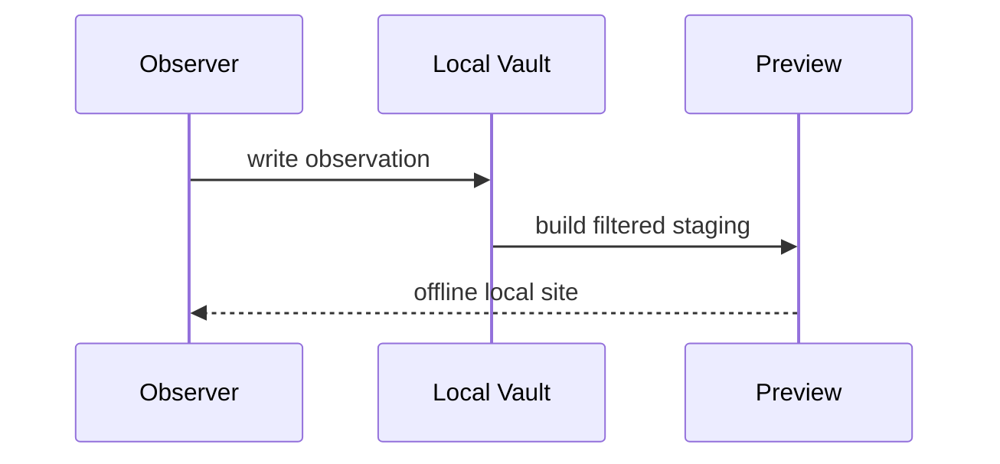

---
publication:
  visibility: public
  title: 山中夜站：离线观测
  slug: night-station
  tags: [fieldwork, mountain, code]
---
# 山中夜站：离线观测

网络在海拔 1,420 米处消失。记录没有停止，只是从同步系统退回到本地队列。

## 出发前清单

- [x] 本地地图和路线快照
- [x] 两组电池与纸质编号表
- [x] 主题资源离线可用
- [ ] 返回后核对气象站数据

## 一个很小的离线队列

```ts
type Observation = {
  recordedAt: string
  station: string
  value: number
}

const queue: Observation[] = []

export function record(item: Observation): void {
  queue.push(Object.freeze({ ...item }))
}
```

> [!example] 样本
> `record({ recordedAt: "23:17", station: "RIDGE-02", value: 6.4 })`

## 时序



### 返回路径

回到 [[field-guide/expeditions/index|远征索引]]，或对照 [[field-guide/expeditions/coastal/low-tide|低潮窗口]] 的图文密度。
