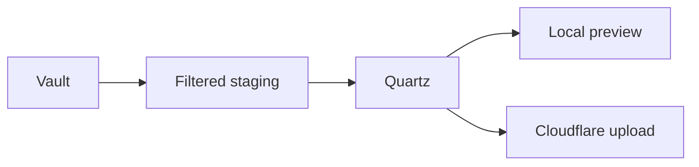

---
publication:
  visibility: public
  title: Markdown 全格式压力样本
  slug: markdown-kitchen-sink
  tags: [reference, markdown, stress-test]
---
# Markdown 全格式压力样本

普通文字，**粗体**，*斜体*，***粗斜体***，~~删除线~~，`inline code`，以及一个指向 [[notes/index|站点索引]] 的内部链接。

## 二级标题 / Lists

- 无序列表第一项
  - 第二层包含一段较长文字，用来观察换行后的缩进是否保持清楚。
    - 第三层使用 `monospace` 标记
- 最后一项

1. 有序列表第一步
2. 有序列表第二步
   1. 子步骤 A
   2. 子步骤 B

### 三级标题 / Quote & Callout

> 这是一段普通引用。
>
> 它包含第二段，以及 **强调内容**。

> [!success] 可发布
> public 内容进入首页、搜索、图谱与 sitemap。

> [!danger] 不可泄漏
> private canary 不得出现在 HTML、CSS、JS、JSON 或 XML 中。

#### 四级标题 / Table

| 左对齐 | 居中 | 右对齐 | 混合内容 |
| :--- | :---: | ---: | --- |
| Alpha | `READY` | 12 | **粗体**与普通文字 |
| 中文 | ✓ | 1,024 | 一段会换行的说明文字 |
| Emoji | 🧭 | 0 | [[field-guide/index\|内部链接]] |

##### 五级标题 / Code

```json
{
  "theme": "brutalist",
  "capabilities": ["layout", "components", "clientScripts"],
  "offline": true
}
```

```css
.field-note {
  border: 4px solid currentColor;
  box-shadow: 8px 8px 0 var(--accent);
}
```

###### 六级标题 / Math & Footnote

行内公式 $E = mc^2$，以及块级公式：

$$
H(X) = -\sum_{i=1}^{n} p(x_i) \log_2 p(x_i)
$$

脚注应当在文章末尾形成可返回的引用。[^source]

[^source]: 这是用于视觉验收的本地合成内容，不引用外部网页。

## Mermaid



## 分隔线与折叠内容

---

> [!note]- 展开一段补充说明
> 折叠区域使用 Obsidian callout 语法，用来观察主题边框、字体和 focus 状态是否协调，同时不引入被安全策略移除的 raw HTML。
