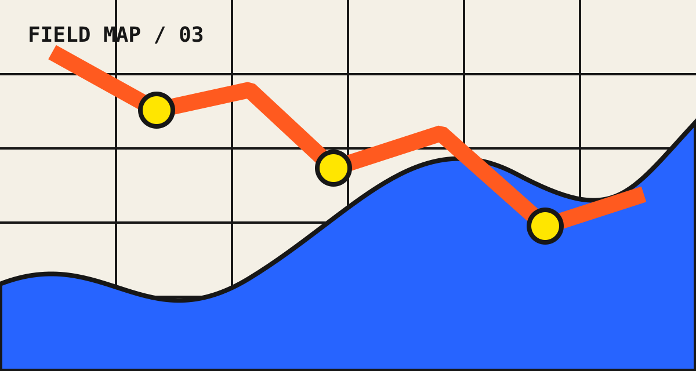
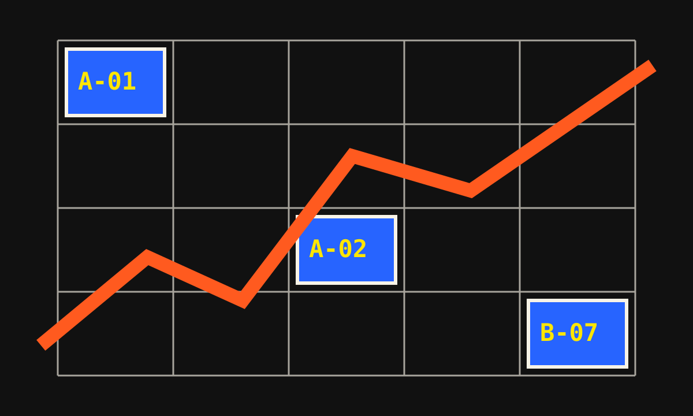
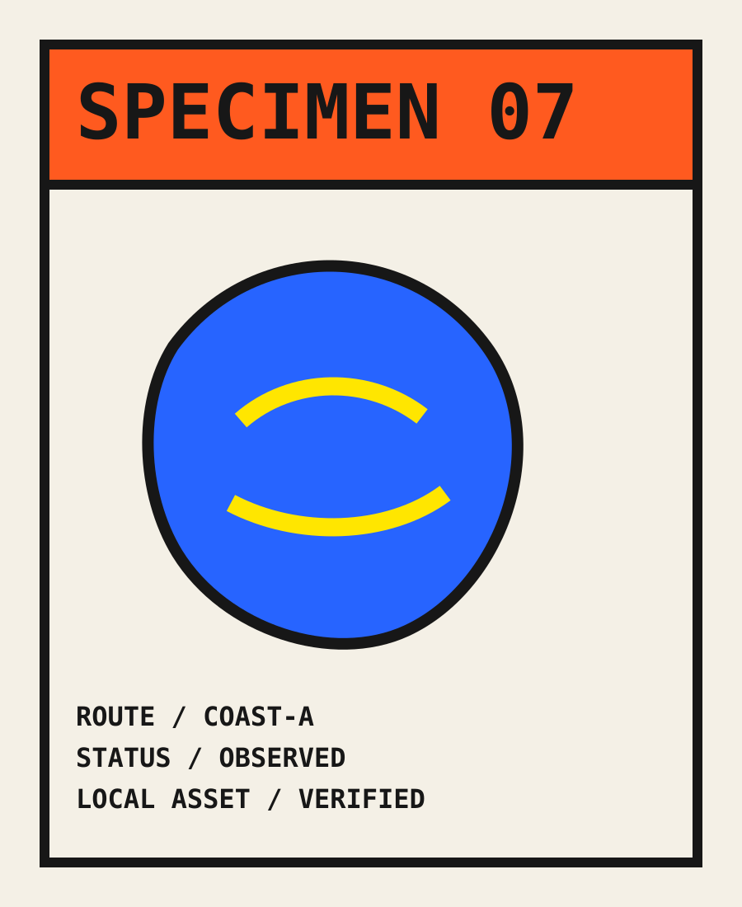

---
publication:
  visibility: public
  title: 图文混排与本地资源
  slug: media-layout
  tags: [reference, images, layout]
---
# 图文混排与本地资源

第一张是宽幅地图。它应随正文容器缩放，在 iPad 横竖屏切换时不产生横向滚动。

地图后紧跟短段落，验证图片、正文和下一个标题之间的垂直节奏。

## 两张不同密度的图

海岸网格使用高密度线条，缩小后仍应保持边框完整。下一张标本卡留有大量空白，用来观察浅色和暗色背景。

> [!note] 本地资源约束
> 三张 SVG 都随 Vault 进入受控 asset pipeline；页面没有远程图片、字体或脚本。

返回 [[reference/index|格式实验室]]。
