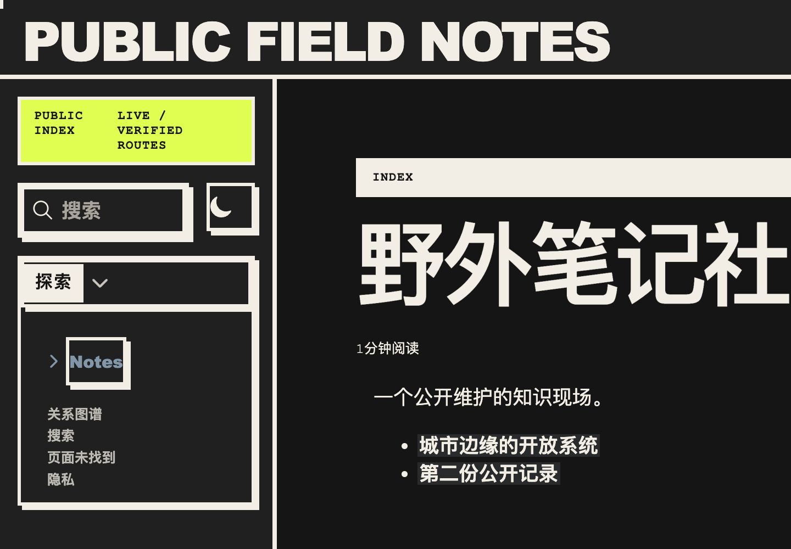
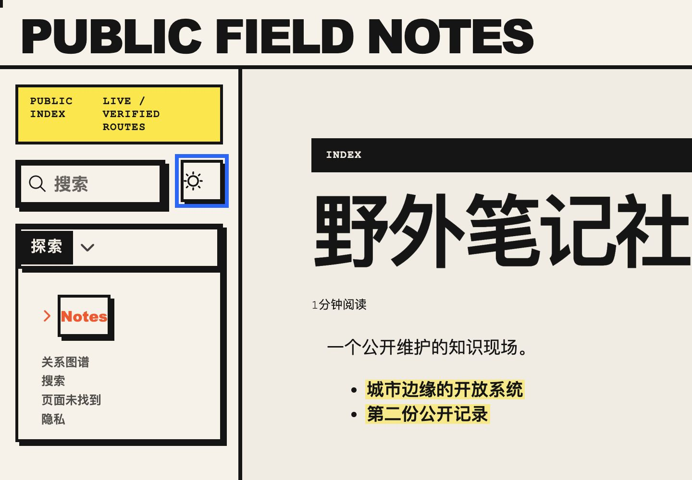
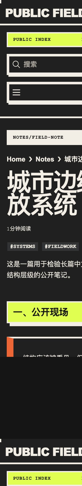

# 外部 Quartz 自定义主题 HAT 报告

- Run ID: `20260803-185611`
- Scope: `P0+P1`（P2 skipped）
- Mode: `blank`
- Overall: `MANUAL_REQUIRED`
- Prepare: `prepared`，本轮已执行 info 和 prepare；未执行 cleanup。

## 结论

自动可执行的关键路径均通过：三文件包隔离、Theme Contract/Store/Trust/Adapter、默认 Quartz 回归、外部 `.tgz` 真实 Quartz 构建、连续两次确定性输出、private/unlisted/route/CSP 审计、1440/768/390/320 reflow、浅深色、Search、Explorer、Graph 和键盘 Escape。

总状态为 `MANUAL_REQUIRED`，不是代码失败：P0 仍需要在 Obsidian 设置页人工确认一次执行信任与 clientScripts 风险文案。真实 npm 安装因包尚未发布而 blocked；Cloudflare Direct Upload 按安全边界未执行。

## 场景结果

| ID | 状态 | 关键结果 |
| --- | --- | --- |
| HAT-P0-001 | PASS | release 恰好 3 文件，未发现外部主题 payload。 |
| HAT-P0-002 | MANUAL | 契约/信任持久化自动测试通过；Obsidian 首次信任文案待人工确认。 |
| HAT-P0-003 | PASS | 打包 `.tgz` 经不变 SiteBuilder façade 构建；poster/editorial/client/assets/options 生效；两次输出相同。 |
| HAT-P0-004 | PASS | private 零泄漏；unlisted 直达 + noindex 且不进 discovery；CSP 和本地 Graph vendor 通过。 |
| HAT-P1-001 | PASS | 1440/768/390/320 无横向溢出；Search 320px 全屏自动聚焦；Graph canvas 加载；按钮 44×44。 |
| HAT-P1-002 | MANUAL | 320px reflow、焦点、Escape、reduced-motion CSS 已通过；200% 与完整 Tab 顺序待人工判断。 |
| HAT-P1-003 | MANUAL | inventory/Repair/rollback/active uninstall 自动测试通过；Obsidian Notice 流程待人工确认。 |
| HAT-P1-004 | BLOCKED | npm package 尚未发布；official registry exact/integrity/no-install 单元测试通过。 |
| HAT-P2-001 | SKIPPED | 未获专用 Cloudflare 项目写入授权。 |

## 视觉证据

### 桌面暗色首页

### 桌面浅色首页

### 390px 暗色文章

### 320px 搜索 overlay

# HUMAN MANUAL

1. `HAT-P0-002`：在 Obsidian 中恢复默认主题后重新导入 HAT `.tgz`，先取消一次，再确认执行信任；核对 package/version/integrity/capabilities 和 clientScripts 风险文案。
2. `HAT-P1-002`：浏览器 200% 缩放，完整 Tab/Shift+Tab/Enter/Space/Escape，启用系统 reduced motion 后主观确认无陷阱和晕动风险。
3. `HAT-P1-003`：在设置页人工确认 Repair、active theme 卸载拦截、恢复默认主题后的卸载 Notice。
4. `HAT-P1-004`：npm 发布后执行官方 registry 安装与物理断网缓存复用。
5. `HAT-P2-001`：只有在用户明确授权专用 Cloudflare Pages 项目后执行。

## HAT-friendly 改造建议

- 在设置页增加只读 `window.__hat` 或内部诊断投影，暴露当前主题 identity、trust、cache、draft/saved 差异和 operation idle；可让后续验收无需读取实现细节。
- 给预览宿主提供“模拟离线”验收开关并显示所有运行时资源 origin 汇总，降低真实断网验证成本。
- 为主题设置区增加稳定的语义状态元素（例如 `role=status` + 精确 operation code），便于验证取消、Repair 与回滚。

## Source Manifest

### Sources

- [`../../guide.md`](../../guide.md)
- [`../../../../CUSTOM-QUARTZ-THEME-SPEC.md`](../../../../CUSTOM-QUARTZ-THEME-SPEC.md)
- [`../../../../BRUTALIST-QUARTZ-THEME-DESIGN.md`](../../../../BRUTALIST-QUARTZ-THEME-DESIGN.md)
- [`../../../../tests/brutalist-theme-real.test.ts`](../../../../tests/brutalist-theme-real.test.ts)

### Produced artifacts

- [`summary.md`](./summary.md)
- [`results.json`](./results.json)
- [`logs.md`](./logs.md)
- [`artifacts/`](./artifacts/)

### Key decisions

- 只执行 P0+P1 的本地安全部分；不 npm 发布、不 Cloudflare 写入、不 cleanup。
- P0 信任文案保留人工确认，因此 overall 按规则折算为 `MANUAL_REQUIRED`。

### Verification evidence

- 全套：82 files，673 passed / 8 skipped；typecheck 与 lint 通过。
- 信任候选会显示 source、package/version/integrity、capabilities、clientScripts 风险和 registry 发布者；发布者明确标为信息而非信任根。
- 真实引擎：3 files，5 tests passed；包含默认与外部主题。
- 外部主题自身：3 tests passed。
- package boundary、四张浏览器截图和 DOM 尺寸/焦点断言均已记录。

### Open questions / risks

- npm/Cloudflare 外部场景未执行，原因见 `# HUMAN MANUAL`。
- 200% 与完整键盘顺序仍需人类主观确认。
